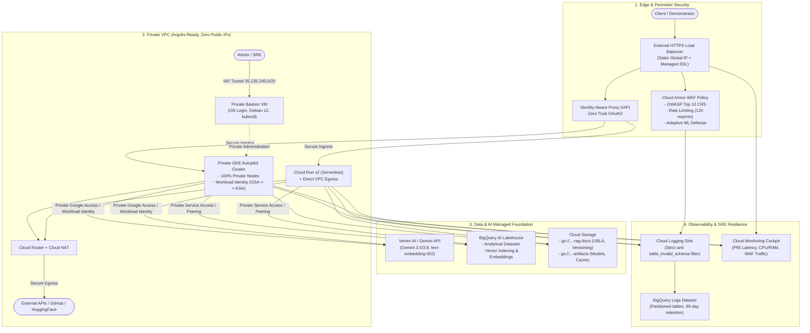

> 🇫🇷 **[Version Française](README.md)** | 🇬🇧 **[English Version](README-EN.md)**
>
> 🔗 **EMEA SPARK Ecosystem & Companion Applications:**
> This repository provides the **Enterprise Infrastructure Foundation (IaC Landing Zone)**. To explore companion applications running on top of this foundation:
> - **[RAG Comparison Demo (cloud-gtm/app-rag-comparison)](https://github.com/cloud-gtm/app-rag-comparison)**: Lexical Search vs Hybrid Grounded RAG (Embeddings 002 + BM25), SSE streaming, and Vertex AI Autorater GenAI evaluation.
> - **[CivicLens (cloud-gtm/civiclens)](https://github.com/cloud-gtm/civiclens)**: Public finance analytics platform (GKE Autopilot, Cloud SQL pgvector, multimodal Gemini).

# GCP AI Foundation Blueprint

[](https://www.terraform.io/)
[](https://registry.terraform.io/providers/hashicorp/google/latest)
[](docs/ARCHITECTURE.md)
[](LICENSE)

Modular Terraform infrastructure foundation for deploying Artificial Intelligence applications and GenAI workloads on Google Cloud Platform.

This blueprint provides a production-grade reference architecture aligned with **Google Cloud Well-Architected Framework** guidelines and strict **Google Cloud Argolis** governance rules (zero public IPs on compute workloads, IAP tunnel administration, Google-managed encryption, and least-privilege IAM).

---

## Architecture Overview

Review the interactive architectural diagram in GCP Draw format in [docs/architecture-gcpdraw.md](docs/architecture-gcpdraw.md).



---

## Module Catalog

The blueprint consists of 9 decoupled, composable Terraform modules:

| Module | Directory | Description & Key Resources |
| :--- | :--- | :--- |
| **Networking** | `modules/networking` | Custom VPC, primary subnet (`10.10.0.0/20`), secondary ranges for Pods (`10.20.0.0/16`) and Services (`10.30.0.0/20`), Cloud Router, Cloud NAT, and Private Service Access (PSA). |
| **Security & WAF** | `modules/security-waf` | Cloud Armor WAF policy with OWASP Top 10 CRS rules (SQLi, XSS, RCE), client rate limiting, L7 adaptive protection, reserved static global IP, and Google-managed SSL. |
| **Compute GKE** | `modules/compute-gke` | Private GKE Autopilot cluster, Workload Identity configuration, Backup for GKE plan, and scoped IAM roles (`roles/aiplatform.user`, `roles/storage.objectUser`). |
| **Compute Cloud Run** | `modules/compute-cloudrun` | Serverless Cloud Run v2 service with Direct VPC Egress, 0-to-5 autoscaling, `no-cpu-throttling`, 300s timeout, and dedicated Service Account. |
| **Data & AI Foundation** | `modules/data-ai-foundation` | Vertex AI and BigQuery API enablement, BigQuery Lakehouse dataset, Cloud Storage RAG bucket (`versioning`, `UBLA`), and model artifacts bucket. |
| **Bastion Host** | `modules/bastion` | Debian 12 Compute Engine VM with zero external IPs, accessible exclusively via IAP tunnel, pre-configured with `kubectl`, `gke-gcloud-auth-plugin`, `tinyproxy`, and OS Login. |
| **SRE Observability** | `modules/observability` | Cloud Logging sink with polymorphic schema exclusion filter (preventing `table_invalid_schema` errors), partitioned BigQuery dataset, and Cloud Monitoring dashboard. |
| **FinOps Budget** | `modules/finops-budget` | Cloud Billing budget alert with thresholds at 50%, 75%, 90%, 100% actual, and 100% forecasted spend, with direct email notifications. |
| **Backup & DR** | `modules/backup-dr` | Immutable WORM vaults for operational and geo-redundant retention, and Backup for GKE integration for application manifests and persistent volumes. |

---

## Root Configuration Variables

The root module (`main.tf`) exposes the following primary parameters:

| Variable | Type | Default | Description |
| :--- | :--- | :--- | :--- |
| `project_id` | String | *Required* | Target Google Cloud project identifier. |
| `region` | String | `europe-west1` | Primary region for resource provisioning. |
| `resource_prefix` | String | `ai-demo` | Prefix applied to all provisioned GCP resources. |
| `enable_gke` | Boolean | `true` | Enables or disables the private GKE Autopilot cluster. |
| `enable_cloudrun` | Boolean | `true` | Enables or disables the Cloud Run v2 service. |
| `enable_waf` | Boolean | `true` | Enables Cloud Armor WAF security policy and external Load Balancer. |
| `enable_bastion` | Boolean | `true` | Provisions the private IAP administrative bastion VM. |
| `enable_observability` | Boolean | `true` | Creates the BigQuery logging sink and Cloud Monitoring dashboard. |
| `billing_account` | String | `""` | Billing account ID (required when `enable_finops_budget` is active). |
| `budget_amount` | Number | `100` | Target monthly spend cap in project currency. |

---

## Root Outputs

Outputs exported by the root module facilitate direct integration with client applications:

| Output | Description |
| :--- | :--- |
| `vpc_network_name` | Name of the provisioned private VPC (`{prefix}-vpc`). |
| `subnet_id` | Primary subnet resource ID (`{prefix}-subnet`). |
| `external_ip` | Reserved global static IP address for the HTTPS Load Balancer. |
| `waf_policy_id` | Cloud Armor security policy resource ID. |
| `lakehouse_dataset_id` | BigQuery AI Lakehouse dataset ID. |
| `rag_bucket_name` | Cloud Storage bucket name for RAG persistence (`{project_id}-{prefix}-rag-docs`). |
| `rag_bucket_url` | Cloud Storage bucket `gs://` URL for RAG documents. |
| `gke_cluster_name` | GKE Autopilot cluster name. |
| `gke_app_service_account_email` | Google Service Account email configured for GKE Workload Identity. |
| `cloudrun_service_uri` | HTTPS endpoint URI for the Cloud Run v2 service. |
| `bastion_ssh_command` | gcloud CLI command to initiate an authenticated IAP SSH session to the bastion. |

---

## Quickstart

### 1. Prerequisites
- Authenticated `gcloud` CLI (`gcloud auth login` and `gcloud auth application-default login`).
- `terraform` version 1.5.0 or higher.
- `roles/owner` or `roles/editor` on the target Google Cloud project.

### 2. Project Bootstrap
Run the bootstrap script to enable required APIs and provision the remote state bucket:

```bash
./scripts/bootstrap.sh <YOUR_PROJECT_ID> europe-west1
```

### 3. Configuration & Deployment

```bash
# 1. Copy the example variables template
cp terraform.tfvars.example terraform.tfvars

# 2. Fill in project_id and admin_email in terraform.tfvars

# 3. Initialize providers and modules
terraform init

# 4. Review execution plan
terraform plan

# 5. Apply infrastructure
terraform apply
```

### 4. Deploying Applications on this Foundation
Once the foundation is provisioned, deploy compatible applications:
- To deploy the RAG comparison demo:
  ```bash
  cd ../app-rag-comparison
  ./scripts/deploy-to-blueprint.sh --blueprint-dir=../gcp-ai-foundation-blueprint
  ```
- Refer to the [Application Integration Guide](docs/APPLICATION_INTEGRATION-EN.md) for custom architectures.

---

## Security & Argolis Compliance

- **Zero compute public IPs**: No GKE nodes, bastion VMs, or serverless containers bind public IP addresses (`constraints/compute.vmExternalIpAccess`).
- **Controlled egress**: Outbound connections (dependency downloads, model weights) are routed exclusively through Cloud NAT.
- **IAP zero-trust administration**: Administrative SSH connections to the bastion VM are restricted to the Google IAP IP range `35.235.240.0/20`.
- **Domain-restricted authorization**: In Cloudtop or developer environments where ADC is subject to domain restrictions, export a temporary access token before running Terraform:
  ```bash
  export GOOGLE_OAUTH_ACCESS_TOKEN=$(gcloud auth print-access-token --account=user@your-domain.altostrat.com)
  terraform apply
  ```

---

## License

This project is licensed under the Apache License 2.0. See [LICENSE](LICENSE) for details.
