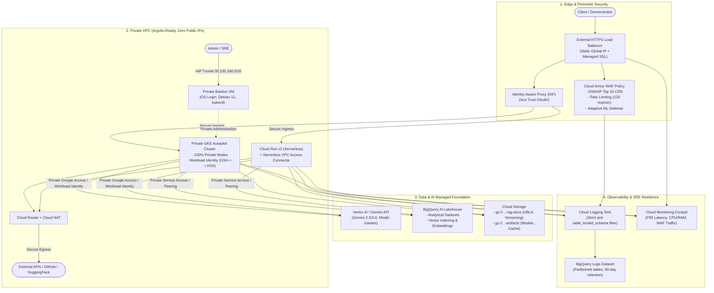

# GCP AI Foundation Blueprint 🏛️⚡

> **Modular, secure, and reusable Terraform infrastructure baseline for all Artificial Intelligence demonstrations on Google Cloud (Elevate & Spark Programs).**

This repository provides an enterprise-ready, application-agnostic **Landing Zone & Baseline**. It adheres to **Google Cloud Well-Architected** best practices, strictly complies with **Argolis governance constraints**, and enforces enterprise security standards (**Zero Trust, WAF, Least Privilege, SRE schema resilience**).

---

## 🎯 Purpose

During customer demonstrations, proofs of concept (POCs), or acceleration programs (Elevate, Spark, Hackathons), rebuilding networking, NAT gateways, Kubernetes clusters, Cloud Armor WAF rules, and logging pipelines wastes valuable time and introduces configuration drift and security vulnerabilities.

This blueprint solves that challenge by providing:
1. **Standardized Modular Architecture**: Independent, composable modules for Networking, WAF, Compute (GKE / Cloud Run), Bastion, Data/AI Foundation, and Observability.
2. **100% Argolis Ready**: Zero public IPs on compute instances or Kubernetes nodes, private egress via Cloud NAT, and secure administration via Identity-Aware Proxy (IAP).
3. **Native Enterprise Edge Security**: Cloud Armor WAF configured with the OWASP Top 10 Core Rule Set (SQLi, XSS, RCE...), adaptive rate limiting (120 req/min), and Layer 7 ML threat detection.
4. **Data & AI Stack Baseline**: BigQuery Lakehouse, secure Cloud Storage buckets (UBLA, versioning) for RAG documents and models, and Workload Identity pre-configured with `roles/aiplatform.user` and `roles/bigquery.dataEditor`.
5. **Hardened Observability**: Cloud Logging sink to BigQuery protected against schema drift (`table_invalid_schema`) caused by system pods, paired with a unified Cloud Monitoring cockpit.

---

## 🏗️ Architecture Overview



---

## 📁 Repository Structure

```text
.
├── GEMINI.md                     # Development directives & Git synchronization cadence
├── README.md                     # Comprehensive documentation (French)
├── README-EN.md                  # Comprehensive documentation (English)
├── main.tf                       # Root module orchestrating the baseline
├── variables.tf                  # Configuration variables (region, prefix, feature flags)
├── outputs.tf                    # Endpoints, IPs, and resource identifiers
├── versions.tf                   # Minimal Terraform & Google Cloud provider versions
├── terraform.tfvars.example      # Example values template
│
├── modules/
│   ├── networking/               # VPC, Subnet, Secondary Ranges, Cloud NAT, PSA, Firewall
│   ├── security-waf/             # Cloud Armor WAF (OWASP Top 10, Rate Limiting), IP, Managed SSL
│   ├── compute-gke/              # Private GKE Autopilot, Workload Identity, Least-Privilege IAM
│   ├── compute-cloudrun/         # Cloud Run v2, Serverless VPC Access Connector, Dedicated SA
│   ├── bastion/                  # Private Debian 12 Bastion VM, IAP, OS Login, kubectl
│   ├── data-ai-foundation/       # Vertex AI, BigQuery Lakehouse, GCS RAG & Artifacts Buckets
│   └── observability/            # Logging Sink to BigQuery (schema resilience), Dashboard
│
├── examples/
│   ├── 01-minimal-cloudrun-ai/   # Fast (<3 min) Serverless Cloud Run + WAF prototype
│   └── 02-enterprise-gke-rag/    # Enterprise Landing Zone: GKE Autopilot + Bastion + RAG + SRE
│
├── scripts/
│   ├── bootstrap.sh              # GCP API enablement and Terraform state bucket creation
│   └── sync-gtm.sh               # Git synchronization to official cloud-gtm repository
│
└── .github/workflows/
    └── terraform-lint.yml        # CI/CD: syntax check, formatting, and validation
```

---

## 🚀 Quick Start

### 1. Prerequisites
- `gcloud` CLI authenticated (`gcloud auth login` and `gcloud auth application-default login`).
- `terraform` (v1.5.0 or higher).
- `roles/owner` or `roles/editor` on target GCP project (Argolis or Sandbox).

### 2. Project Bootstrap
Run the bootstrap script to automatically enable required APIs and provision the GCS state bucket:

```bash
./scripts/bootstrap.sh <YOUR_PROJECT_ID> europe-west1
```

### 3. Configure Variables
Copy the example variables template:

```bash
cp terraform.tfvars.example terraform.tfvars
```

Edit `terraform.tfvars` with your `project_id` and administrator email for IAP access.

### 4. Deploy

```bash
# Initialize Terraform
terraform init

# Review execution plan
terraform plan

# Apply deployment
terraform apply
```

---

## 🧩 Detailed Module Guide

### 1. Networking (`modules/networking`)
- **VPC & Subnets**: Primary subnet with secondary ranges for GKE Pods (`10.20.0.0/16`) and Services (`10.30.0.0/20`).
- **Private Google Access**: Enabled by default to allow private resources to communicate with Google APIs without public IPs.
- **Cloud NAT & Cloud Router**: Automatic egress IP allocation for outbound Internet traffic.
- **Private Service Access (PSA)**: Dedicated internal IP block and peering for Cloud SQL or Vertex AI private endpoints.

### 2. Security & WAF (`modules/security-waf`)
- **OWASP Top 10 Rules**: Pre-configured protection against SQL injection, XSS, LFI, RFI, RCE, scanners, and protocol attacks.
- **Adaptive Rate Limiting**: Throttles requests per client IP (e.g. 120 req/min) and issues temporary bans (HTTP 429).
- **Layer 7 ML Defense**: Google Cloud Armor Adaptive Protection against application DDoS.
- **Global External Static IP** and Google-managed SSL Certificate.

### 3. Compute GKE (`modules/compute-gke`)
- **Autopilot Mode**: Fully managed node provisioning, scaling, and auto-repair.
- **Private Cluster**: Nodes have zero public IPs (`enable_private_nodes = true`).
- **Workload Identity**: Cryptographic binding between Kubernetes Service Account and Google Service Account (`roles/aiplatform.user`, `roles/bigquery.dataEditor`, `roles/storage.objectViewer`).

### 4. Compute Cloud Run (`modules/compute-cloudrun`)
- Serverless container option for lightweight AI services and rapid prototypes.
- Connected to private VPC via **Serverless VPC Access Connector**.
- Dedicated Service Account with least-privilege Vertex AI and BigQuery permissions.

### 5. Bastion Host (`modules/bastion`)
- Debian 12 virtual machine with zero external IPs.
- SSH access exclusively through IAP tunnel (`gcloud compute ssh ... --tunnel-through-iap`).
- Pre-installed with `kubectl`, `gke-gcloud-auth-plugin`, `tinyproxy` (port 8888), and `jq`.

### 6. Data & AI Foundation (`modules/data-ai-foundation`)
- **BigQuery Lakehouse**: Dataset configured for analytical queries and vector search (`VECTOR_SEARCH`).
- **Cloud Storage RAG Documents**: Bucket with Uniform Bucket-Level Access (UBLA), versioning, and CORS support.
- **Cloud Storage Artifacts**: Bucket for model adapters, evaluation traces, and cache.

### 7. Observability (`modules/observability`)
- **BigQuery Schema Resilience**: Filter excludes polymorphic system logs (`kube-system`, `gke-gmp-system`, `jsonPayload.address`) to prevent `table_invalid_schema` failures.
- **SRE Alert Policy**: Triggers notifications when HTTP 5xx error rates exceed 5% over 5 minutes.
- **Unified Cockpit**: Cloud Monitoring dashboard displaying GKE CPU/RAM, Cloud Run invocations, WAF blocks, and GCS storage volume.

---

## 🔒 Argolis Compliance & Best Practices

- **Policy `compute.vmExternalIpAccess`**: Zero compute instances or Kubernetes nodes attempt to bind public IPs.
- **Zero Trust IAP**: Administrative entry is gated through `roles/iap.tunnelResourceAccessor`.
- **Least Privilege**: Default compute service accounts and broad roles (`roles/owner`, `roles/editor`) are never assigned to workloads.

---

## 🤝 Git Lifecycle & PR Synchronization (GTM)

This repository follows a dual-remote workflow:
- **Personal Workspace (`github`)**: `https://github.com/hoffmannw-hjkl/gcp-ai-foundation-blueprint` (direct push to `main`).
- **Official Enterprise Repository (`gtm`)**: `https://github.com/cloud-gtm/gcp-ai-foundation-blueprint`.

The `./scripts/sync-gtm.sh` script automates batching commits (~5 commits) into Pull Requests on the official repository:

```bash
# Force immediate synchronization
./scripts/sync-gtm.sh --force
```

---

## 📄 License
Apache License 2.0. See [LICENSE](LICENSE) for details.
