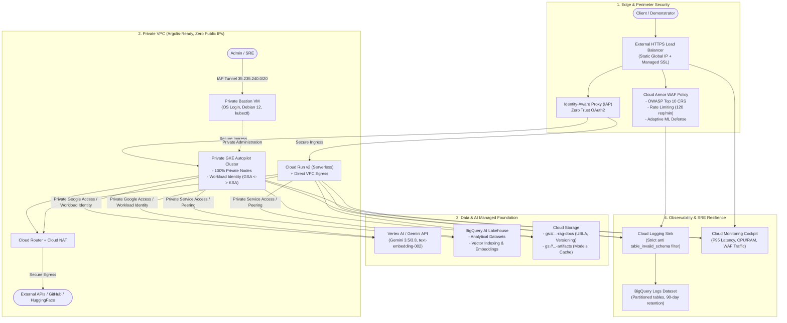
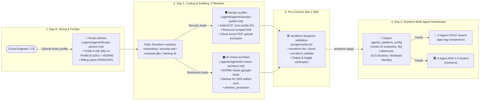

> 🇫🇷 **[Version Française](README.md)** | 🇬🇧 **[English Version](README-EN.md)** | 🎬 **[Step-by-Step Demo Playbook (DEMO_PLAYBOOK-EN.md)](docs/DEMO_PLAYBOOK-EN.md)** | 🗺️ **[Dendrite v3.3 & Draw.io Diagrams](docs/architecture-gcpdraw.md)**

> 🗺️ **Executive Architecture Diagrams (Dendrite v3.3 Bento 16:9 & Draw.io)**: [**🎨 Launch in Dendrite Studio (1-Click) ↗**](https://dendrite-758054785671.cr.gclb.goog/#code=cmVuZGVyT3JkZXI6IG5vZGVzLWZpcnN0CmRpcmVjdGlvbjogZG93bgoKY29uc3QgR2NwQmx1ZSA9ICIjMWE3M2U4Igpjb25zdCBHY3BHcmVlbiA9ICIjMWU4ZTNlIgpjb25zdCBFbWVyYWxkVGVhbCA9ICIjMGQ5NDg4Igpjb25zdCBEYXJrU2xhdGUgPSAiIzIwMjEyNCIKY29uc3QgU3ViVGV4dCA9ICIjNWY2MzY4Igpjb25zdCBDYXJkQm9yZGVyID0gIiNkYWRjZTAiCmNvbnN0IEJ1c1N0cm9rZSA9ICIjMzM0MTU1Igpjb25zdCBTdXJmYWNlV2hpdGUgPSAiI2ZmZmZmZiIKClN0eWxlIEBHaG9zdCB7CiAgZmlsbDogdHJhbnNwYXJlbnQsIHN0cm9rZVdpZHRoOiAwLCBmb250Q29sb3I6IHRyYW5zcGFyZW50LCBwYWRkaW5nOiAwCn0KU3R5bGUgQEFyY2hpdGVjdHVyZVJvb3QgewogIGZpbGw6ICIjZjhmYWZkIiwgc3Ryb2tlQ29sb3I6ICIjYzJkN2Y1Iiwgc3Ryb2tlV2lkdGg6IDEuNSwgYm9yZGVyUmFkaXVzOiAxNiwKICBwYWRkaW5nOiAyMiwgZ2FwOiAxOCwgZm9udENvbG9yOiAiIzNjNDA0MyIsIGZvbnRTaXplOiAyMiwgbGFiZWxXZWlnaHQ6IGJvbGQsCiAgaWNvbjogIkdvb2dsZUNsb3VkIiwgaWNvblNpemU6IDI4Cn0KU3R5bGUgQFBlcmltZXRlclpvbmUgewogIGZpbGw6ICIjZThmMGZlIiwgc3Ryb2tlQ29sb3I6ICIjOGFiNGY4Iiwgc3Ryb2tlV2lkdGg6IDEuNSwgYm9yZGVyUmFkaXVzOiAxMiwKICBwYWRkaW5nOiAxNiwgZ2FwOiAxNiwgZm9udENvbG9yOiAkRGFya1NsYXRlLCBmb250U2l6ZTogMTUsIGxhYmVsV2VpZ2h0OiBib2xkCn0KU3R5bGUgQEV4ZWN1dGlvblpvbmUgewogIGZpbGw6ICIjZmNlOGU2Iiwgc3Ryb2tlQ29sb3I6ICIjZjZhZWE5Iiwgc3Ryb2tlV2lkdGg6IDEuNSwgYm9yZGVyUmFkaXVzOiAxMiwKICBwYWRkaW5nOiAxNiwgZ2FwOiAxNiwgZm9udENvbG9yOiAkRGFya1NsYXRlLCBmb250U2l6ZTogMTUsIGxhYmVsV2VpZ2h0OiBib2xkCn0KU3R5bGUgQEdvdmVybmFuY2Vab25lIHsKICBmaWxsOiAiI2U2ZjRlYSIsIHN0cm9rZUNvbG9yOiAiIzgxYzk5NSIsIHN0cm9rZVdpZHRoOiAxLjUsIGJvcmRlclJhZGl1czogMTIsCiAgcGFkZGluZzogMTYsIGdhcDogMTQsIGZvbnRDb2xvcjogJERhcmtTbGF0ZSwgZm9udFNpemU6IDE1LCBsYWJlbFdlaWdodDogYm9sZAp9ClN0eWxlIEBSZXNvdXJjZVpvbmUgewogIGZpbGw6ICIjZmVmN2UwIiwgc3Ryb2tlQ29sb3I6ICIjZmRlMjkzIiwgc3Ryb2tlV2lkdGg6IDEuNSwgYm9yZGVyUmFkaXVzOiAxMiwKICBwYWRkaW5nOiAxNiwgZ2FwOiAxNiwgZm9udENvbG9yOiAkRGFya1NsYXRlLCBmb250U2l6ZTogMTUsIGxhYmVsV2VpZ2h0OiBib2xkCn0KU3R5bGUgQFBlYWNoU3ViR3JvdXAgewogIGZpbGw6ICIjZjhkM2M4Iiwgc3Ryb2tlQ29sb3I6IGRhcmtlbigiI2Y4ZDNjOCIsIDEyKSwgc3Ryb2tlV2lkdGg6IDEsIGJvcmRlclJhZGl1czogMTAsCiAgcGFkZGluZzogMTIsIGdhcDogMTAsIGZvbnRDb2xvcjogJERhcmtTbGF0ZSwgZm9udFNpemU6IDEzLCBsYWJlbFdlaWdodDogYm9sZAp9ClN0eWxlIEBHcmVlblN1Ykdyb3VwIHsKICBmaWxsOiAiI2NlZWFkNiIsIHN0cm9rZUNvbG9yOiBkYXJrZW4oIiNjZWVhZDYiLCAxNCksIHN0cm9rZVdpZHRoOiAxLCBib3JkZXJSYWRpdXM6IDEwLAogIHBhZGRpbmc6IDEwLCBnYXA6IDcsIGZvbnRDb2xvcjogJERhcmtTbGF0ZSwgZm9udFNpemU6IDEzLCBsYWJlbFdlaWdodDogYm9sZAp9ClN0eWxlIEBBbWJlclN1Ykdyb3VwIHsKICBmaWxsOiAiI2Y5ZTRhNyIsIHN0cm9rZUNvbG9yOiBkYXJrZW4oIiNmOWU0YTciLCAxNCksIHN0cm9rZVdpZHRoOiAxLCBib3JkZXJSYWRpdXM6IDEwLAogIHBhZGRpbmc6IDEyLCBnYXA6IDEyLCBmb250Q29sb3I6ICREYXJrU2xhdGUsIGZvbnRTaXplOiAxMywgbGFiZWxXZWlnaHQ6IGJvbGQKfQpTdHlsZSBAQWN0b3JDYXJkIHsKICB3aWR0aDogMTgwLCBoZWlnaHQ6IDU2LAogIGZpbGw6ICRTdXJmYWNlV2hpdGUsIHN0cm9rZUNvbG9yOiAkQ2FyZEJvcmRlciwgc3Ryb2tlV2lkdGg6IDEsIGJvcmRlclJhZGl1czogOCwKICBmb250Q29sb3I6ICREYXJrU2xhdGUsIHN1YkZvbnRDb2xvcjogJFN1YlRleHQsCiAgZm9udFNpemU6IDE0LCBzdWJGb250U2l6ZTogMTEsIGxhYmVsV2VpZ2h0OiBib2xkLAogIHRleHRBbGlnbjogImxlZnQiLCB0ZXh0VkFsaWduOiAibWlkZGxlIiwKICBpY29uUG9zaXRpb246ICJsZWZ0IiwgaWNvblNpemU6IDI4LCBwYWRkaW5nOiAxMCwgc2hhZG93OiB0cnVlCn0KU3R5bGUgQFByb2R1Y3RDYXJkIHsKICB3aWR0aDogMTY4LCBoZWlnaHQ6IDU4LAogIGZpbGw6ICRTdXJmYWNlV2hpdGUsIHN0cm9rZUNvbG9yOiAkQ2FyZEJvcmRlciwgc3Ryb2tlV2lkdGg6IDEsIGJvcmRlclJhZGl1czogOCwKICBmb250Q29sb3I6ICREYXJrU2xhdGUsIHN1YkZvbnRDb2xvcjogJFN1YlRleHQsCiAgZm9udFNpemU6IDEzLjUsIHN1YkZvbnRTaXplOiAxMSwgbGFiZWxXZWlnaHQ6IGJvbGQsCiAgdGV4dEFsaWduOiAibGVmdCIsIHRleHRWQWxpZ246ICJtaWRkbGUiLAogIGljb25Qb3NpdGlvbjogImxlZnQiLCBpY29uU2l6ZTogMjgsIHBhZGRpbmc6IDEwLCBzaGFkb3c6IHRydWUKfQpTdHlsZSBAR2F0ZXdheUh1YkNhcmQgewogIGJhc2U6IEBQcm9kdWN0Q2FyZCwKICB3aWR0aDogMTk2LCBoZWlnaHQ6IDY2LCBzdHJva2VDb2xvcjogJEdjcEJsdWUsIHN0cm9rZVdpZHRoOiAyLAogIGZvbnRTaXplOiAxNC41LCBzdWJGb250U2l6ZTogMTEsIGljb25TaXplOiAzMCwgcGFkZGluZzogMTIKfQpTdHlsZSBAUG9saWN5UGlsbCB7CiAgd2lkdGg6IDIyOCwgaGVpZ2h0OiAzMiwKICBmaWxsOiAkU3VyZmFjZVdoaXRlLCBzdHJva2VDb2xvcjogIiM5YWEwYTYiLCBzdHJva2VXaWR0aDogMSwgYm9yZGVyUmFkaXVzOiAxNiwKICBmb250Q29sb3I6ICREYXJrU2xhdGUsIGZvbnRTaXplOiAxMi41LCBsYWJlbFdlaWdodDogYm9sZCwKICB0ZXh0QWxpZ246ICJsZWZ0IiwgdGV4dFZBbGlnbjogIm1pZGRsZSIsCiAgaWNvblBvc2l0aW9uOiAibGVmdCIsIGljb25TaXplOiAxNiwgcGFkZGluZzogMTAsIHNoYWRvdzogdHJ1ZQp9Cgpab25lIEBHQ1BfQUlfRm91bmRhdGlvbl9CbHVlcHJpbnQgewogIHRpdGxlOiAiR0NQIEFJIEZvdW5kYXRpb24gQmx1ZXByaW50IOKAlCBFbnRlcnByaXNlIExhbmRpbmcgWm9uZSAoZXVyb3BlLXdlc3QxKSIKICBzdHlsZTogQEFyY2hpdGVjdHVyZVJvb3QKICBsYXlvdXQ6IG1hdHJpeAogIGFyZWFzOiBbCiAgICAiejEgejEgejEgejEgejEiLAogICAgInozIHozIHoyIHoyIHoyIiwKICAgICJ6NCB6NCB6NCB6NCB6NCIKICBdCiAgc2l6ZXM6IFsiMS4wNWZyIiwgIjEuMDVmciIsICIwLjk2ZnIiLCAiMC45NmZyIiwgIjAuOTZmciJdCiAgZ2FwOiAyMAoKICBab25lIEBab25lMV9QZXJpbWV0ZXIgewogICAgYXJlYTogInoxIgogICAgdGl0bGU6ICIxLiBaZXJvLVRydXN0IEVkZ2UgUGVyaW1ldGVyICYgSW5ncmVzcyAobW9kdWxlcy9zZWN1cml0eS13YWYgJiBuZXR3b3JraW5nKSIKICAgIHN0eWxlOiBAUGVyaW1ldGVyWm9uZQogICAgbGF5b3V0OiByb3csIGdhcDogMTgsIGFsaWduOiBjZW50ZXIsIGp1c3RpZnk6IGNlbnRlcgogICAgW2VudGVycHJpc2VfdXNlcnM6ICJFbnRlcnByaXNlIFVzZXJzIiB8ICJIVFRQUyBDbGllbnRzIl0geyBzdHlsZTogQEFjdG9yQ2FyZCwgaWNvbjogIlVzZXJzIiB9CiAgICBbY2xvdWRfYXJtb3Jfd2FmOiAiQ2xvdWQgQXJtb3IgV0FGIiB8ICJPV0FTUCBUb3AgMTAgJiBERG9TIl0geyBzdHlsZTogQFByb2R1Y3RDYXJkLCB3aWR0aDogMTg2LCBpY29uOiAiQ2xvdWRBcm1vciIgfQogICAgW2dsb2JhbF9sYjogIkdsb2JhbCBIVFRQUyBMQiIgfCAiQW55Y2FzdCAmIE1hbmFnZWQgU1NMIl0geyBzdHlsZTogQFByb2R1Y3RDYXJkLCB3aWR0aDogMTg2LCBpY29uOiAiQ2xvdWRMb2FkQmFsYW5jaW5nIiB9CiAgICBbaWFwX3Byb3h5OiAiSWRlbnRpdHktQXdhcmUgUHJveHkiIHwgIlplcm8tVHJ1c3QgT0lEQyBBdXRoIl0geyBzdHlsZTogQFByb2R1Y3RDYXJkLCB3aWR0aDogMTg4LCBpY29uOiAiR29vZ2xlSWRlbnRpdHkiIH0KICAgIFtpYXBfYmFzdGlvbjogIklBUCBBZG1pbiBCYXN0aW9uIiB8ICJTaGllbGRlZCBWTSAoTm8gUHVibGljIElQKSJdIHsgc3R5bGU6IEBQcm9kdWN0Q2FyZCwgd2lkdGg6IDE5NCwgaWNvbjogIkdjcENvbXB1dGUiIH0KICB9CgogIFpvbmUgQFpvbmUzX0NvbXB1dGUgewogICAgYXJlYTogInozIgogICAgdGl0bGU6ICIyLiBQcml2YXRlIENvbXB1dGUgUnVudGltZXMgKFZQQyBFZ3Jlc3MgJiBXb3JrbG9hZCBJZGVudGl0eSkiCiAgICBzdHlsZTogQEV4ZWN1dGlvblpvbmUKICAgIGxheW91dDogcm93LCBnYXA6IDM2LCBhbGlnbjogY2VudGVyLCBqdXN0aWZ5OiBjZW50ZXIKCiAgICBbdnBjX3JvdXRlcl9uYXQ6ICJQcml2YXRlIEFJIFZQQ1xuJiBDbG91ZCBOQVQiIHwgIkRpcmVjdCBWUEMgRWdyZXNzIC8gUFNBIl0gewogICAgICBzdHlsZTogQEdhdGV3YXlIdWJDYXJkLCBpY29uOiAiVmlydHVhbFByaXZhdGVDbG91ZCIsCiAgICAgIGRlc2NyaXB0aW9uOiAiQ3VzdG9tIFZQQyB3aXRoIFByaXZhdGUgR29vZ2xlIEFjY2VzcywgUHJpdmF0ZSBTZXJ2aWNlIENvbm5lY3QsIGFuZCBDbG91ZCBOQVQiCiAgICB9CgogICAgWm9uZSBAQ29tcHV0ZVByb2ZpbGVzQ29sIHsKICAgICAgc3R5bGU6IEBHaG9zdCwgbGF5b3V0OiBjb2x1bW4sIGdhcDogMTQsIGFsaWduOiBzdHJldGNoCgogICAgICBab25lIEBTZXJ2ZXJsZXNzUHJvZmlsZSB7CiAgICAgICAgdGl0bGU6ICJQcm9maWxlIEE6IFNlcnZlcmxlc3MgQ29tcHV0ZSAoZW5hYmxlX2Nsb3VkcnVuKSIKICAgICAgICBzdHlsZTogQFBlYWNoU3ViR3JvdXAsIHdpZHRoOiAzNDQsIGxheW91dDogcm93LCBnYXA6IDEwLCBhbGlnbjogY2VudGVyLCBqdXN0aWZ5OiBjZW50ZXIKICAgICAgICBbY2xvdWRfcnVuX3YyOiAiQ2xvdWQgUnVuIHYyIiB8ICJEaXJlY3QgVlBDIEVncmVzcyJdIHsgc3R5bGU6IEBQcm9kdWN0Q2FyZCwgd2lkdGg6IDE1NCwgaWNvbjogIkdjcENsb3VkUnVuIiB9CiAgICAgICAgW2FydGlmYWN0X3JlZzogIkFydGlmYWN0IFJlZ2lzdHJ5IiB8ICJDb250YWluZXIgSW1hZ2VzIl0geyBzdHlsZTogQFByb2R1Y3RDYXJkLCB3aWR0aDogMTU0LCBpY29uOiAiQXJ0aWZhY3RSZWdpc3RyeSIgfQogICAgICB9CgogICAgICBab25lIEBLdWJlcm5ldGVzUHJvZmlsZSB7CiAgICAgICAgdGl0bGU6ICJQcm9maWxlIEI6IEVudGVycHJpc2UgSzhzIChlbmFibGVfZ2tlKSIKICAgICAgICBzdHlsZTogQFBlYWNoU3ViR3JvdXAsIGRhc2hlZDogdHJ1ZSwgd2lkdGg6IDM0NCwgbGF5b3V0OiByb3csIGdhcDogMTAsIGFsaWduOiBjZW50ZXIsIGp1c3RpZnk6IGNlbnRlcgogICAgICAgIFtna2VfYXV0b3BpbG90OiAiR0tFIEF1dG9waWxvdCIgfCAiUHJpdmF0ZSBOb2RlcyArIFdJIl0geyBzdHlsZTogQFByb2R1Y3RDYXJkLCB3aWR0aDogMTU0LCBpY29uOiAiR0tFIiB9CiAgICAgICAgW3dvcmtsb2FkX2lkOiAiV29ya2xvYWQgSWRlbnRpdHkiIHwgIktleWxlc3MgT0lEQyBJQU0iXSB7IHN0eWxlOiBAUHJvZHVjdENhcmQsIHdpZHRoOiAxNTQsIGljb246ICJHY3BMb2NrIiB9CiAgICAgIH0KICAgIH0KICB9CgogIFpvbmUgQFpvbmUyX0dvdmVybmFuY2UgewogICAgYXJlYTogInoyIgogICAgdGl0bGU6ICIzLiBTZWN1cml0eSwgRmluT3BzLCBPYnNlcnZhYmlsaXR5ICYgQWdlbnRpYyBHYXRla2VlcGVyIgogICAgc3R5bGU6IEBHb3Zlcm5hbmNlWm9uZQogICAgbGF5b3V0OiByb3csIGdhcDogMjQsIGFsaWduOiBjZW50ZXIsIGp1c3RpZnk6IGNlbnRlcgoKICAgIFpvbmUgQFNyZUFuZEZpbm9wc0NvbCB7CiAgICAgIHN0eWxlOiBAR2hvc3QsIGxheW91dDogY29sdW1uLCBnYXA6IDEyLCBhbGlnbjogY2VudGVyCiAgICAgIFtjbG91ZF9tb25pdG9yaW5nOiAiQ2xvdWQgTW9uaXRvcmluZyIgfCAiU0xPcyAmIExhdGVuY3kgQWxlcnRzIl0geyBzdHlsZTogQFByb2R1Y3RDYXJkLCB3aWR0aDogMTgyLCBpY29uOiAiQ2xvdWRNb25pdG9yaW5nIiB9CiAgICAgIFtjbG91ZF9sb2dnaW5nOiAiQ2xvdWQgTG9nZ2luZyIgfCAiQXVkaXQgU2luayB0byBCaWdRdWVyeSJdIHsgc3R5bGU6IEBQcm9kdWN0Q2FyZCwgd2lkdGg6IDE4MiwgaWNvbjogIkNsb3VkTG9nZ2luZyIgfQogICAgICBbZmlub3BzX2J1ZGdldDogIkNsb3VkIEJpbGxpbmcgRmluT3BzIiB8ICJBbGVydHMgNTAlIC8gOTAlIC8gMTAwJSJdIHsgc3R5bGU6IEBQcm9kdWN0Q2FyZCwgd2lkdGg6IDE4MiwgaWNvbjogIkNsb3VkQmlsbGluZyIgfQogICAgfQoKICAgIFpvbmUgQFNvdmVyZWlnbkd1YXJkcmFpbHMgewogICAgICB0aXRsZTogIlNvdmVyZWlnbiBDb250cm9scyAmIE0xTDEgR2F0ZWtlZXBlciIKICAgICAgc3R5bGU6IEBHcmVlblN1Ykdyb3VwLCBsYXlvdXQ6IGNvbHVtbiwgZ2FwOiA4LCBhbGlnbjogY2VudGVyCiAgICAgIFtndWFyZF9pYW06ICJSZXNvdXJjZS1TY29wZWQgSUFNIE9ubHkiXSB7IHN0eWxlOiBAUG9saWN5UGlsbCwgaWNvbjogIlNoaWVsZENoZWNrIiB9CiAgICAgIFtndWFyZF9jbWVrOiAiQ2xvdWQgS01TIENNRUsgKDkwZCBSb3RhdGlvbikiXSB7IHN0eWxlOiBAUG9saWN5UGlsbCwgaWNvbjogIktNUyIgfQogICAgICBbZ3VhcmRfd29ybTogIldPUk0gQmFja3VwIExvY2sgKGVuZm9yY2U9dHJ1ZSkiXSB7IHN0eWxlOiBAUG9saWN5UGlsbCwgaWNvbjogIkxvY2siIH0KICAgICAgW2d1YXJkX20xbDE6ICJNMUwxIHZlcmlmeS5zaCAmIFN1YmFnZW50cyJdIHsgc3R5bGU6IEBQb2xpY3lQaWxsLCBpY29uOiAiQm90IiB9CiAgICB9CiAgfQoKICBab25lIEBab25lNF9EYXRhQUkgewogICAgYXJlYTogIno0IgogICAgdGl0bGU6ICI0LiBEYXRhIExha2Vob3VzZSwgVmVydGV4IEFJICYgSW1tdXRhYmxlIFJlc2lsaWVuY2UgKG1vZHVsZXMvZGF0YS1haS1mb3VuZGF0aW9uICYgYmFja3VwLWRyKSIKICAgIHN0eWxlOiBAUmVzb3VyY2Vab25lCiAgICBsYXlvdXQ6IG1hdHJpeCwgY29sczogMywgc2l6ZXM6IFsiMS4wNWZyIiwgIjEuMTVmciIsICIwLjk1ZnIiXSwgZ2FwOiAxOCwgYWxpZ246IGNlbnRlcgoKICAgIFpvbmUgQFN0b3JhZ2VBbmRMYWtlaG91c2UgewogICAgICB0aXRsZTogIkVuY3J5cHRlZCBEYXRhICYgQ29ycHVzIFN0b3JhZ2UiCiAgICAgIHN0eWxlOiBAQW1iZXJTdWJHcm91cCwgbGF5b3V0OiByb3csIGdhcDogMTIsIGFsaWduOiBjZW50ZXIsIGp1c3RpZnk6IGNlbnRlcgogICAgICBbZ2NzX3JhZ19idWNrZXQ6ICJDbG91ZCBTdG9yYWdlIiB8ICJVQkxBICsgVmVyc2lvbmluZyJdIHsgc3R5bGU6IEBQcm9kdWN0Q2FyZCwgd2lkdGg6IDE2OCwgaWNvbjogIkdjcFN0b3JhZ2VCdWNrZXQiIH0KICAgICAgW2JpZ3F1ZXJ5X2xha2U6ICJCaWdRdWVyeSBMYWtlaG91c2UiIHwgIlBhcnRpdGlvbmVkIEFuYWx5dGljcyJdIHsgc3R5bGU6IEBQcm9kdWN0Q2FyZCwgd2lkdGg6IDE3NCwgaWNvbjogIkJpZ1F1ZXJ5IiB9CiAgICB9CgogICAgWm9uZSBAVmVydGV4QWlQbGF0Zm9ybSB7CiAgICAgIHRpdGxlOiAiTWFuYWdlZCBHZW5BSSAmIEVtYmVkZGluZ3MgKGV1cm9wZS13ZXN0MSkiCiAgICAgIHN0eWxlOiBAQW1iZXJTdWJHcm91cCwgbGF5b3V0OiByb3csIGdhcDogMTIsIGFsaWduOiBjZW50ZXIsIGp1c3RpZnk6IGNlbnRlcgogICAgICBbdmVydGV4X2dlbWluaTogIlZlcnRleCBBSSBHZW1pbmkiIHwgIkdlbWluaSAzLjUgRmxhc2ggLyBQcm8iXSB7IHN0eWxlOiBAUHJvZHVjdENhcmQsIHdpZHRoOiAxNzYsIGljb246ICJWZXJ0ZXhBSSIgfQogICAgICBbdmVydGV4X2VtYmVkOiAiVmVydGV4IEVtYmVkZGluZ3MiIHwgInRleHQtZW1iZWRkaW5nLTAwNCAoNzY4ZCkiXSB7IHN0eWxlOiBAUHJvZHVjdENhcmQsIHdpZHRoOiAxODQsIGljb246ICJBSVBsYXRmb3JtIiB9CiAgICB9CgogICAgWm9uZSBAUmVzaWxpZW5jZUFuZEttcyB7CiAgICAgIHRpdGxlOiAiQ3J5cHRvICYgRGlzYXN0ZXIgUmVjb3ZlcnkiCiAgICAgIHN0eWxlOiBAQW1iZXJTdWJHcm91cCwgbGF5b3V0OiByb3csIGdhcDogMTIsIGFsaWduOiBjZW50ZXIsIGp1c3RpZnk6IGNlbnRlcgogICAgICBbY2xvdWRfa21zOiAiQ2xvdWQgS01TIENNRUsiIHwgIjkwLURheSBLZXkgUm90YXRpb24iXSB7IHN0eWxlOiBAUHJvZHVjdENhcmQsIHdpZHRoOiAxNjgsIGljb246ICJLTVMiIH0KICAgICAgW2JhY2t1cF9kcl93b3JtOiAiQmFja3VwICYgRFIgVmF1bHQiIHwgIkltbXV0YWJsZSBXT1JNIExvY2siXSB7IHN0eWxlOiBAUHJvZHVjdENhcmQsIHdpZHRoOiAxNzQsIGljb246ICJTZWN1cml0eUNvbW1hbmRDZW50ZXIiIH0KICAgIH0KICB9Cn0KCltlbnRlcnByaXNlX3VzZXJzXSAtLT4gW2Nsb3VkX2FybW9yX3dhZl0geyBjb2xvcjogJEdjcEJsdWUsIHN0cm9rZVdpZHRoOiAyLCBzb3VyY2VBbmNob3I6ICJyaWdodCIsIHRhcmdldEFuY2hvcjogImxlZnQiLCBjdXJ2ZTogInN0ZXAiLCBzZXF1ZW5jZUJhZGdlOiAiMSIsIGJhZGdlRmlsbDogJEdjcEJsdWUsIGJhZGdlRm9udENvbG9yOiAkU3VyZmFjZVdoaXRlIH0KW2Nsb3VkX2FybW9yX3dhZl0gLS0+IFtnbG9iYWxfbGJdIHsgY29sb3I6ICRHY3BCbHVlLCBzdHJva2VXaWR0aDogMiwgc291cmNlQW5jaG9yOiAicmlnaHQiLCB0YXJnZXRBbmNob3I6ICJsZWZ0IiwgY3VydmU6ICJzdGVwIiB9CltnbG9iYWxfbGJdIC0tPiBbaWFwX3Byb3h5XSB7IGNvbG9yOiAkR2NwQmx1ZSwgc3Ryb2tlV2lkdGg6IDIsIHNvdXJjZUFuY2hvcjogInJpZ2h0IiwgdGFyZ2V0QW5jaG9yOiAibGVmdCIsIGN1cnZlOiAic3RlcCIgfQpbWm9uZTFfUGVyaW1ldGVyXSAtLT4gW3ZwY19yb3V0ZXJfbmF0XSB7IGNvbG9yOiAkR2NwQmx1ZSwgc3Ryb2tlV2lkdGg6IDIsIHNvdXJjZUFuY2hvcjogImJvdHRvbSIsIHRhcmdldEFuY2hvcjogInRvcCIsIGN1cnZlOiAic3RlcCIsIGxhYmVsOiAiWmVyby1UcnVzdCIsIHNlcXVlbmNlQmFkZ2U6ICIyIiwgYmFkZ2VGaWxsOiAkR2NwQmx1ZSwgYmFkZ2VGb250Q29sb3I6ICRTdXJmYWNlV2hpdGUgfQpbdnBjX3JvdXRlcl9uYXRdIC0tPiBbU2VydmVybGVzc1Byb2ZpbGVdIHsgY29sb3I6ICRHY3BCbHVlLCBzdHJva2VXaWR0aDogMiwgc291cmNlQW5jaG9yOiAicmlnaHQiLCB0YXJnZXRBbmNob3I6ICJsZWZ0IiwgY3VydmU6ICJzdGVwIiB9Clt2cGNfcm91dGVyX25hdF0gLS0+IFtLdWJlcm5ldGVzUHJvZmlsZV0geyBjb2xvcjogJEdjcEJsdWUsIHN0cm9rZVdpZHRoOiAyLCBzb3VyY2VBbmNob3I6ICJyaWdodCIsIHRhcmdldEFuY2hvcjogImxlZnQiLCBjdXJ2ZTogInN0ZXAiIH0KW0NvbXB1dGVQcm9maWxlc0NvbF0gLS0+IFtTcmVBbmRGaW5vcHNDb2xdIHsgY29sb3I6ICRCdXNTdHJva2UsIHN0cm9rZVdpZHRoOiAxLjgsIGRhc2hlZDogdHJ1ZSwgc291cmNlQW5jaG9yOiAicmlnaHQiLCB0YXJnZXRBbmNob3I6ICJsZWZ0IiwgY3VydmU6ICJzdGVwIiwgbGFiZWw6ICJUZWxlbWV0cnkiIH0KW1NyZUFuZEZpbm9wc0NvbF0gLS0+IFtTb3ZlcmVpZ25HdWFyZHJhaWxzXSB7IGNvbG9yOiAkR2NwR3JlZW4sIHN0cm9rZVdpZHRoOiAxLjgsIHNvdXJjZUFuY2hvcjogInJpZ2h0IiwgdGFyZ2V0QW5jaG9yOiAibGVmdCIsIGN1cnZlOiAic3RlcCIgfQpbWm9uZTNfQ29tcHV0ZV0gLS0+IFtTdG9yYWdlQW5kTGFrZWhvdXNlXSB7IGNvbG9yOiAkRW1lcmFsZFRlYWwsIHN0cm9rZVdpZHRoOiAyLCBzb3VyY2VBbmNob3I6ICJib3R0b20iLCB0YXJnZXRBbmNob3I6ICJ0b3AiLCBjdXJ2ZTogInN0ZXAiLCBsYWJlbDogIlN0b3JhZ2UgQVBJIiwgc2VxdWVuY2VCYWRnZTogIjMiLCBiYWRnZUZpbGw6ICRFbWVyYWxkVGVhbCwgYmFkZ2VGb250Q29sb3I6ICRTdXJmYWNlV2hpdGUgfQpbWm9uZTNfQ29tcHV0ZV0gLS0+IFtWZXJ0ZXhBaVBsYXRmb3JtXSB7IGNvbG9yOiAkR2NwQmx1ZSwgc3Ryb2tlV2lkdGg6IDIsIHNvdXJjZUFuY2hvcjogImJvdHRvbSIsIHRhcmdldEFuY2hvcjogInRvcCIsIGN1cnZlOiAic3RlcCIsIGxhYmVsOiAiVmVydGV4IEFEQyIsIHNlcXVlbmNlQmFkZ2U6ICI0IiwgYmFkZ2VGaWxsOiAkR2NwQmx1ZSwgYmFkZ2VGb250Q29sb3I6ICRTdXJmYWNlV2hpdGUgfQpbWm9uZTJfR292ZXJuYW5jZV0gLS0+IFtSZXNpbGllbmNlQW5kS21zXSB7IGNvbG9yOiAkR2NwR3JlZW4sIHN0cm9rZVdpZHRoOiAxLjgsIGRhc2hlZDogdHJ1ZSwgc291cmNlQW5jaG9yOiAiYm90dG9tIiwgdGFyZ2V0QW5jaG9yOiAidG9wIiwgY3VydmU6ICJzdGVwIiwgbGFiZWw6ICJDTUVLICYgV09STSIgfQo=) · [`docs/diagrams/foundation_blueprint_v3.dendrite`](docs/diagrams/foundation_blueprint_v3.dendrite) · [`docs/diagrams/foundation_blueprint_v3.drawio`](docs/diagrams/foundation_blueprint_v3.drawio) · [`docs/architecture-gcpdraw.md`](docs/architecture-gcpdraw.md)
>
> 🔗 **EMEA SPARK Ecosystem & Companion Applications:**
> This repository provides the **Enterprise Infrastructure Foundation (IaC Landing Zone)**. To explore companion applications running on top of this foundation:
> - **[RAG Comparison Demo (cloud-gtm/app-rag-comparison)](https://github.com/cloud-gtm/app-rag-comparison)**: Lexical Search vs Hybrid Grounded RAG (Embeddings + BM25 RRF), **4-Subagent CRAG Swarm (`🤖 Agentic RAG`)**, SSE streaming, and Vertex AI Autorater GenAI evaluation.
> - **[CivicLens (cloud-gtm/civiclens)](https://github.com/cloud-gtm/civiclens)**: Municipal public finance M57 analytics platform (GKE Autopilot, Cloud SQL `pgvector`, **Google ADK 2.0 Multi-Agent Swarm**, and multimodal Gemini).

# GCP AI Foundation Blueprint

[](https://www.terraform.io/)
[](https://registry.terraform.io/providers/hashicorp/google/latest)
[](docs/ARCHITECTURE.md)
[](LICENSE)

Modular Terraform infrastructure foundation for deploying Artificial Intelligence applications and GenAI workloads on Google Cloud Platform.

This blueprint provides a production-grade reference architecture aligned with **Google Cloud Well-Architected Framework** guidelines and strict **Google Cloud Argolis** governance rules (zero public IPs on compute workloads, IAP tunnel administration, Google-managed encryption, and least-privilege IAM).

---

## Architecture Overview

Review the interactive architectural diagram in GCP Draw format in [docs/architecture-gcpdraw.md](docs/architecture-gcpdraw.md).


```mermaid
flowchart TD
    subgraph Internet_Edge ["1. Edge & Perimeter Security"]
        User(["Client / Demonstrator"]) --> LB["External HTTPS Load Balancer\n(Static Global IP + Managed SSL)"]
        LB --> WAF["Cloud Armor WAF Policy\n- OWASP Top 10 CRS\n- Rate Limiting (120 req/min)\n- Adaptive ML Defense"]
        LB --> IAP["Identity-Aware Proxy (IAP)\nZero Trust OAuth2"]
    end

    subgraph VPC ["2. Private VPC (Argolis-Ready, Zero Public IPs)"]
        IAP -->|Secure Ingress| GKE["Private GKE Autopilot Cluster\n- 100% Private Nodes\n- Workload Identity (GSA <-> KSA)"]
        IAP -->|Secure Ingress| CR["Cloud Run v2 (Serverless)\n+ Direct VPC Egress"]
        
        Admin(["Admin / SRE"]) -->|IAP Tunnel 35.235.240.0/20| Bastion["Private Bastion VM\n(OS Login, Debian 12, kubectl)"]
        Bastion -.->|Private Administration| GKE

        GKE --> NAT["Cloud Router + Cloud NAT"]
        CR --> NAT
        NAT -->|Secure Egress| EgressNet(["External APIs / GitHub / HuggingFace"])
    end

    subgraph Data_AI ["3. Data & AI Managed Foundation"]
        GKE & CR -->|Private Google Access / Workload Identity| VertexAI["Vertex AI / Gemini API\n(Gemini 3.5/3.8, text-embedding-002)"]
        GKE & CR -->|Private Service Access / Peering| BQ["BigQuery AI Lakehouse\n- Analytical Datasets\n- Vector Indexing & Embeddings"]
        GKE & CR --> GCS["Cloud Storage\n- gs://...-rag-docs (UBLA, Versioning)\n- gs://...-artifacts (Models, Cache)"]
    end

    subgraph SRE_Observability ["4. Observability & SRE Resilience"]
        GKE & CR & WAF --> Sink["Cloud Logging Sink\n(Strict anti table_invalid_schema filter)"]
        Sink --> BQLogs["BigQuery Logs Dataset\n(Partitioned tables, 90-day retention)"]
        GKE & CR & LB --> Dash["Cloud Monitoring Cockpit\n(P95 Latency, CPU/RAM, WAF Traffic)"]
    end
```

---

## Module Catalog

The blueprint consists of 9 decoupled, composable Terraform modules:

| Module | Directory | Description & Key Resources |
| :--- | :--- | :--- |
| **Networking** | `modules/networking` | Custom VPC, primary subnet (`10.10.0.0/20`), secondary ranges for Pods (`10.20.0.0/16`) and Services (`10.30.0.0/20`), Cloud Router, Cloud NAT, and Private Service Access (PSA). |
| **Security & WAF** | `modules/security-waf` | Cloud Armor WAF policy with OWASP Top 10 CRS rules (SQLi, XSS, RCE), client rate limiting, L7 adaptive protection, reserved static global IP, and Google-managed SSL. |
| **Compute GKE** | `modules/compute-gke` | Private GKE Autopilot cluster, Workload Identity configuration, Backup for GKE plan, and scoped IAM roles (`roles/aiplatform.user`, `roles/storage.objectUser`). |
| **Compute Cloud Run** | `modules/compute-cloudrun` | Serverless Cloud Run v2 service with Direct VPC Egress, 0-to-5 autoscaling, `no-cpu-throttling`, 300s timeout, and dedicated Service Account. |
| **Data & AI Foundation** | `modules/data-ai-foundation` | Vertex AI and BigQuery API enablement, BigQuery Lakehouse dataset, Cloud Storage RAG bucket (`versioning`, `UBLA`), and model artifacts bucket. |
| **Bastion Host** | `modules/bastion` | Debian 12 Compute Engine VM with zero external IPs, accessible exclusively via IAP tunnel, pre-configured with `kubectl`, `gke-gcloud-auth-plugin`, `tinyproxy`, and OS Login. |
| **SRE Observability** | `modules/observability` | Cloud Logging sink with polymorphic schema exclusion filter (preventing `table_invalid_schema` errors), partitioned BigQuery dataset, and Cloud Monitoring dashboard. |
| **FinOps Budget** | `modules/finops-budget` | Cloud Billing budget alert with thresholds at 50%, 75%, 90%, 100% actual, and 100% forecasted spend, with direct email notifications. |
| **Backup & DR** | `modules/backup-dr` | Immutable WORM vaults for operational and geo-redundant retention, and Backup for GKE integration for application manifests and persistent volumes. |

---

## Turnkey Architecture Profiles (Reusability)

To streamline reuse across different environments (rapid demonstrations vs sovereign enterprise production), [`terraform.tfvars.example`](file:///usr/local/google/home/hoffmannw/gcp-ai-foundation-blueprint/terraform.tfvars.example) provides two pre-configured profiles:

| Profile | Target Use Case | Compute & Security Configuration | Provisioning Time & Cost |
| :--- | :--- | :--- | :--- |
| **Profile A: Lightweight Serverless Demo** | Fast demos (`app-rag-comparison`), agile PoCs, ephemeral sandboxes. | `enable_cloudrun = true`, `enable_gke = false`, `enable_bastion = false`, `enable_waf = false`, `force_destroy = true`. | **~2 min** / Near-zero idle cost (*scale-to-zero*). |
| **Profile B: Sovereign Enterprise Production** | Enterprise workloads (`app-civiclens`), sensitive data, SecOps/DORA compliance. | `enable_gke = true`, `enable_waf = true`, `enable_bastion = true`, `enable_backup_dr = true`, `deletion_protection = true`. | **~15 min** / Multi-zone HA & WORM retention. |

---

## Root Configuration Variables (`variables.tf`)

The root module exposes 27 strongly typed and validated variables (`validation {}`):

| Variable | Type | Default | Description |
| :--- | :--- | :--- | :--- |
| `project_id` | `string` | *Required* | Target Google Cloud project identifier (regex validated). |
| `region` | `string` | `"europe-west1"` | Primary GCP region for networking, compute, and data resources. |
| `zone` | `string` | `"europe-west1-b"` | Primary GCP zone for the Bastion VM. |
| `resource_prefix` | `string` | `"ai-base"` | Naming prefix applied to all provisioned GCP resources. |
| `enable_random_suffix` | `bool` | `true` | Appends a collision-resistant random suffix to resources and GCS buckets. |
| `random_suffix_length` | `number` | `4` | Length of the random suffix (between 2 and 8 characters). |
| `enable_gke` | `bool` | `true` | Provisions the private GKE Autopilot cluster. |
| `enable_cloudrun` | `bool` | `false` | Provisions the serverless Cloud Run v2 service with Direct VPC Egress. |
| `enable_bastion` | `bool` | `true` | Provisions the private IAP administrative bastion VM. |
| `enable_waf` | `bool` | `true` | Provisions the Cloud Armor WAF policy (OWASP Top 10 + Rate Limiting). |
| `excluded_upload_paths` | `list(string)` | `["/api/documents/upload"]` | URL path prefixes excluded from OWASP body inspection (prevents HTTP 403 false positives during PDF/document uploads). |
| `domain_name` | `string` | `""` | Custom domain name for Google-managed SSL certificate (leave empty to skip). |
| `admin_email` | `string` | `""` | Administrator email granted Zero-Trust IAP access (`roles/iap.httpsResourceAccessor`). |
| `enable_observability` | `bool` | `true` | Creates the Cloud Logging BigQuery sink and Cloud Monitoring dashboard. |
| `alert_email` | `string` | `""` | Recipient email address for SRE Cloud Monitoring and FinOps budget alerts. |
| `billing_account` | `string` | `""` | Cloud Billing account ID (enables automated monthly budget alerts). |
| `budget_amount` | `number` | `100` | Target monthly spend cap in project currency (must be > 0). |
| `budget_currency` | `string` | `"USD"` | Currency code for budget alerts (`USD`, `EUR`, etc.). |
| `enable_backup_dr` | `bool` | `false` | Enables the Backup & DR module (WORM vaults and GKE workload backups). |
| `dr_region` | `string` | `"europe-west4"` | Secondary GCP region for geo-redundant DR vaults. |
| `backup_daily_retention_days` | `number` | `7` | Retention duration for daily operational backups (in days). |
| `backup_weekly_retention_weeks` | `number` | `4` | Retention duration for weekly geo-redundant DR backups (in weeks). |
| `enable_geo_dr_vault` | `bool` | `true` | Provisions the secondary cross-region backup vault in `dr_region`. |
| `deletion_protection` | `bool` | `false` | Enables deletion protection on GKE and Cloud Run. Set `true` in production. |
| `force_destroy` | `bool` | `false` | Allows deleting non-empty GCS buckets and BigQuery datasets during `terraform destroy` (useful for demo teardowns). |
| `kms_key_name` | `string` | `""` | Optional Cloud KMS CryptoKey ID (CMEK) for customer-managed encryption on BigQuery and GCS. |
| `labels` | `map(string)` | `{...}` | FinOps labels applied uniformly to all resources via `default_labels`. |

---

## Plug-and-Play Outputs (`outputs.tf`)

Outputs are designed to be injected directly into downstream application deployment scripts (`terraform output -raw <name>`) without manual string parsing:

| Output | Description & Downstream Usage |
| :--- | :--- |
| `vpc_network_name` / `subnet_name` | Short names of the VPC and subnet (for `--network` and `--subnet` with Cloud Run Direct VPC Egress). |
| `external_ip` / `external_ip_name` | External IPv4 address and its resource name (for Kubernetes `ingress.global-static-ip-name` annotation). |
| `waf_policy_id` / `waf_policy_name` | Full URI and short name of the Cloud Armor WAF policy (for GKE `BackendConfig`). |
| `ssl_certificate_name` | Managed SSL certificate name (for Kubernetes `ingress.gcp.kubernetes.io/pre-shared-cert` annotation). |
| `lakehouse_dataset_id` | BigQuery AI Lakehouse dataset ID (`{prefix}_lakehouse`). |
| `rag_bucket_name` / `rag_bucket_url` | Name and `gs://` URL of the Cloud Storage bucket for RAG documents. |
| `artifacts_bucket_name` / `artifacts_bucket_url` | Name and `gs://` URL of the Cloud Storage bucket for AI artifacts and model caches. |
| `gke_cluster_name` / `gke_cluster_endpoint` | Name and private endpoint of the GKE Autopilot cluster. |
| `gke_get_credentials_command` | Ready-to-run `gcloud container clusters get-credentials ... --internal-ip` command. |
| `gke_app_service_account_email` | Google Service Account email configured for GKE Workload Identity. |
| `workload_identity_pool` | Project Workload Identity Pool (`{project_id}.svc.id.goog`). |
| `cloudrun_service_name` / `cloudrun_service_uri` | Name and HTTPS endpoint URI for the Cloud Run v2 service. |
| `cloudrun_service_account_email` | Dedicated Service Account email for the Cloud Run service. |
| `bastion_ssh_command` | `gcloud compute ssh ... --tunnel-through-iap` command to connect to the private bastion. |
| `bastion_name` / `bastion_zone` | Short name of the Bastion VM and target deployment zone (for IAP automation scripts). |
| `project_id` / `region` | Google Cloud project ID and primary deployment region. |
| `agentic_platform_config` | Structured JSON object (Vertex AI endpoints, BigQuery Lakehouse dataset, GCS buckets, and Workload Identity bindings) consumed by downstream **Google ADK 2.0** (`civiclens`) and **CRAG** (`app-rag-comparison`) multi-agent swarms. |


---

## Quickstart

### 1. Prerequisites
- Authenticated `gcloud` CLI (`gcloud auth login` and `gcloud auth application-default login`).
- `terraform` version 1.5.0 or higher.
- `roles/owner` or `roles/editor` on the target Google Cloud project.

### 2. Project Bootstrap
Run the bootstrap script to enable required APIs and provision the remote state bucket:

```bash
./scripts/bootstrap.sh <YOUR_PROJECT_ID> europe-west1
```

### 3. Configuration & Deployment

```bash
# 1. Copy the example variables template
cp terraform.tfvars.example terraform.tfvars

# 2. Fill in project_id and admin_email in terraform.tfvars

# 3. Initialize providers and modules
terraform init

# 4. Review execution plan
terraform plan

# 5. Apply infrastructure
terraform apply
```

### 4. Deploying Applications on this Foundation
Once the foundation is provisioned, deploy compatible applications:
- To deploy the RAG comparison demo:
  ```bash
  cd ../app-rag-comparison
  ./scripts/deploy-to-blueprint.sh --blueprint-dir=../gcp-ai-foundation-blueprint
  ```
- Refer to the [Application Integration Guide](docs/APPLICATION_INTEGRATION-EN.md) for custom architectures.

---

## Security & Argolis Compliance

- **Zero compute public IPs**: No GKE nodes, bastion VMs, or serverless containers bind public IP addresses (`constraints/compute.vmExternalIpAccess`).
- **Controlled egress**: Outbound connections (dependency downloads, model weights) are routed exclusively through Cloud NAT.
- **IAP zero-trust administration**: Administrative SSH connections to the bastion VM are restricted to the Google IAP IP range `35.235.240.0/20`.
- **Domain-restricted authorization**: In Cloudtop or developer environments where ADC is subject to domain restrictions, export a temporary access token before running Terraform:
  ```bash
  export GOOGLE_OAUTH_ACCESS_TOKEN=$(gcloud auth print-access-token --account=user@your-domain.altostrat.com)
  terraform apply
  ```

---

## 🤖 Agentic Architecture & Embedded Skills (`M1L1 Skills Framework`)

This repository implements a **Dual-Layer AI-Native Engineering Architecture** aligned with the **Google Cloud M1L1 Skills Framework** (*Tool Wrapper*, *Auth Recipe*, *Generator / Experience Before Theory*, *Reviewer Checklist*, and *Workflow*).

### 🔄 Agent-Assisted IaC Lifecycle: Where and When Each Agent Enters into Action

Unlike a standard web application, a Terraform Landing Zone mobilizes its specialized agents throughout the **Infrastructure Engineering Lifecycle (Day-0 ➔ Day-1 ➔ Day-2)** before feeding its **`agentic_platform_config` output** into downstream production multi-agent swarms:


```mermaid
flowchart LR
    subgraph Day0 ["1. Day-0: Sizing & FinOps"]
        Dev(["Cloud Engineer / CE"]) -->|Selects tfvars profile| FinOps["🤖 finops-advisor\n(.agents/agents/finops-advisor.md)\n• Profile A (0€ idle) vs\n  Profile B (GKE + WORM)\n• Billing alerts 50/90/100%"]
    end

    subgraph Day1 ["2. Day-1: Coding & Auditing .tf Modules"]
        FinOps --> TFCode["Edits Terraform modules\nnetworking / security-waf /\ncompute-gke / backup-dr"]
        TFCode -->|Security Audit| SecOps["🛡️ secops-auditor\n(.agents/agents/secops-auditor.md)\n• SaferGCP: Zero public IPs\n• Resource-scoped IAM\n• Cloud Armor PDF upload exclusion"]
        TFCode -->|Resilience Audit| DR["🌪️ dr-chaos-architect\n(.agents/agents/dr-chaos-architect.md)\n• WORM Vaults (google-beta)\n• Backup for GKE addon sync\n• deletion_protection"]
    end

    subgraph Gatekeeper ["3. Pre-Commit: M1L1 Skill"]
        SecOps & DR --> Skill["🛠️ terraform-blueprint-validation\n(scripts/verify.sh)\n• terraform fmt -check\n• terraform validate\n• Output & toggle verification"]
    end

    subgraph Day2 ["4. Day-2: Runtime Multi-Agent Handshake"]
        Skill -->|terraform apply| Output["⚡ Output: agentic_platform_config\n(Vertex AI endpoints, BQ Lakehouse,\nGCS Buckets, Workload Identity)"]
        Output -->|Feeds| AppRAG["🤖 4-Agent CRAG Swarm\n(app-rag-comparison)"]
        Output -->|Feeds| AppCivic["🏛️ 4-Agent ADK 2.0 Swarm\n(civiclens)"]
    end
```

### 📊 Agent & Skill Trigger Matrix

| Agent / Skill | Layer | Where does it run? | When does it enter into action? (Trigger) | What it verifies / produces |
| :--- | :--- | :--- | :--- | :--- |
| **[`finops-advisor`](.agents/agents/finops-advisor.md)** | **Layer 1** *(Build-Time)* | IDE / CLI *(Jetski, Antigravity, Gemini CLI)* | When creating or modifying `terraform.tfvars` or `modules/finops-budget/`. | Compares monthly spend between **Profile A** (Cloud Run *scale-to-zero* + Direct VPC Egress with zero fixed NAT VM cost) vs **Profile B** (GKE Autopilot + WORM), checks GCS lifecycle rules (`Nearline`/`Archive`), and validates budget alerts. |
| **[`secops-auditor`](.agents/agents/secops-auditor.md)** | **Layer 1** *(Build-Time)* | IDE / CLI *(Jetski, Antigravity, Gemini CLI)* | Before committing changes to `modules/security-waf/`, `modules/networking/`, or IAM bindings. | Audits resource-scoped IAM bindings, verifies `enable_private_nodes = true`, and ensures Cloud Armor excludes `/api/documents/upload` from OWASP L7 body inspection (preventing HTTP 403 false positives on PDF uploads). |
| **[`dr-chaos-architect`](.agents/agents/dr-chaos-architect.md)** | **Layer 1** *(Build-Time)* | IDE / CLI *(Jetski, Antigravity, Gemini CLI)* | When enabling `enable_backup_dr = true` or modifying `modules/compute-gke/`. | Verifies `google-beta` provider usage on `google_backup_dr_backup_vault`, checks synchronization between the GKE backup plan and `gke_backup_agent_config`, and enforces `deletion_protection`. |
| **[`terraform-blueprint-validation`](.agents/skills/terraform-blueprint-validation/SKILL.md)** | **Layer 1** *(Gatekeeper)* | Local terminal or CI/CD (`scripts/verify.sh`) | Before every `git commit` or Pull Request. | Executes the 4-stage verification gate: `terraform fmt -check -recursive`, `terraform validate`, `enable_*` toggle presence, and `agentic_platform_config` output checks. |
| **`agentic_platform_config`** | **Layer 2** *(Runtime Bridge)* | Terraform Root Output (`outputs.tf`) | After `terraform apply`, during `app-rag-comparison` or `civiclens` deployment. | Automatically injects BigQuery Lakehouse dataset IDs, GCS RAG buckets, and Workload Identity bindings into downstream **CRAG** and **Google ADK 2.0** multi-agent swarms. |

### 🎬 Live Demo Playbook: 3 Step-by-Step Scenarios (IDE / Gemini CLI / Jetski)

During a live customer demonstration or architecture workshop, copy-paste these 3 prompts or commands to showcase how the embedded agents safeguard the Terraform Landing Zone in real time:

1. **Scenario 1 — Showcase SecOps & Cloud Armor WAF Auditing (`secops-auditor`)**:
   > 💬 *Copy-paste prompt for Jetski / Antigravity / Gemini CLI:*
   > `"Invoke the secops-auditor subagent to audit modules/security-waf/main.tf and explain how PDF uploads on /api/documents/upload avoid HTTP 403 false positives under Cloud Armor OWASP SQLi/XSS inspection."`
   - **What it demonstrates**: The agent inspects the Cloud Armor rule priority, highlights the targeted `request.path.matches('/api/documents/upload')` exclusion (*Experience Before Theory* pattern), and verifies zero-public-IP compliance.

2. **Scenario 2 — Showcase FinOps Serverless vs Enterprise Sizing (`finops-advisor`)**:
   > 💬 *Copy-paste prompt for Jetski / Antigravity / Gemini CLI:*
   > `"Invoke the finops-advisor subagent to compare idle monthly costs between Profile A (Serverless Cloud Run with Direct VPC Egress) and Profile B (GKE Autopilot + WORM Backup DR) in terraform.tfvars.example."`
   - **What it demonstrates**: The agent explains how `Direct VPC Egress` eliminates fixed 24/7 `e2-micro` VPC Connector instance costs and verifies Cloud Billing alert thresholds (`50% / 90% / 100%`).

3. **Scenario 3 — Run the Automated M1L1 Gatekeeper (`verify.sh`)**:
   ```bash
   ./.agents/skills/terraform-blueprint-validation/scripts/verify.sh
   ```
   - **What it demonstrates**: Runs all 4 deterministic gates in under 5 seconds (`terraform fmt`, `terraform validate`, `enable_*` toggles, and `agentic_platform_config` output verification).

---

## License

This project is licensed under the Apache License 2.0. See [LICENSE](LICENSE) for details.


