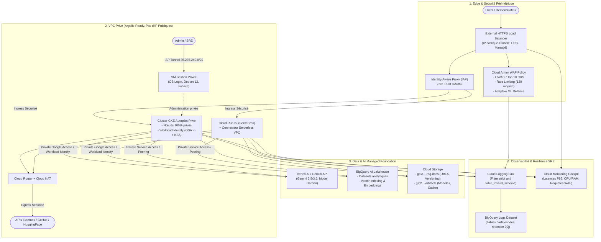

# GCP AI Foundation Blueprint 🏛️⚡

> **Socle d'Infrastructure Terraform modulaire, sécurisé et réutilisable pour toutes les démonstrations d'Intelligence Artificielle sur Google Cloud (Programmes Elevate & Spark).**

Ce référentiel fournit une **Landing Zone / Baseline** prête à l'emploi et agnostique du code applicatif. Il implémente les meilleures pratiques **Google Cloud Well-Architected**, respecte strictement les contraintes de gouvernance **Argolis** et applique les standards de sécurité d'entreprise les plus stricts (**Zero Trust, WAF, Least Privilege, résilience d'observabilité**).

---

## 🎯 Pourquoi ce Blueprint ?

Lors de démonstrations client, POCs ou programmes d'accélération (Elevate, Spark, Hackathons), recréer à chaque fois les réseaux, les passerelles NAT, les clusters Kubernetes, les politiques Cloud Armor WAF et la tuyauterie de logs fait perdre un temps précieux et introduit des failles de sécurité.

Ce blueprint résout ce problème en offrant :
1. **Un découpage modulaire standardisé** : Réseau, WAF, Compute (GKE / Cloud Run), Bastion, Data/AI et Observabilité.
2. **100% Argolis-Ready** : Zéro IP publique sur les VMs et nœuds, sortie Internet via Cloud NAT, administration sécurisée via Identity-Aware Proxy (IAP).
3. **Sécurité Edge & Zero Trust native** : Cloud Armor configuré avec le jeu de règles CRS OWASP Top 10 (SQLi, XSS, RCE...), limitation de débit (Rate Limiting) et protection adaptative Layer 7.
4. **Data & AI Stack Baseline** : BigQuery Lakehouse, Buckets GCS sécurisés (UBLA, versioning) pour les documents RAG et modèles, Workload Identity préconfiguré avec `roles/aiplatform.user` et `roles/bigquery.dataEditor`.
5. **Observabilité SRE durcie** : Sink Cloud Logging vers BigQuery protégé contre les dérives de schéma (`table_invalid_schema`) causées par les conteneurs système, tableau de bord Cloud Monitoring unifié.

---

## 🏗️ Architecture Globale



---

## 📁 Structure du Répertoire

```text
.
├── GEMINI.md                     # Directives de développement & cadence de synchronisation Git
├── README.md                     # Documentation officielle en français
├── README-EN.md                  # Documentation officielle en anglais
├── main.tf                       # Module racine orchestrant l'ensemble de la baseline
├── variables.tf                  # Variables paramétrables (région, préfixe, flags d'activation)
├── outputs.tf                    # Points de terminaison, IPs et identifiants générés
├── versions.tf                   # Versions minimales Terraform et provider Google Cloud
├── terraform.tfvars.example      # Fichier de valeurs d'exemple
│
├── modules/
│   ├── networking/               # VPC, Subnet, Secondary Ranges, Cloud NAT, PSA, Firewall
│   ├── security-waf/             # Cloud Armor WAF (OWASP Top 10, Rate Limiting), IP, Cert SSL
│   ├── compute-gke/              # GKE Autopilot privé, Workload Identity, Least-Privilege IAM
│   ├── compute-cloudrun/         # Cloud Run v2, Connecteur Serverless VPC, SA dédié
│   ├── bastion/                  # VM Bastion Debian 12 privée, IAP, OS Login, kubectl
│   ├── data-ai-foundation/       # Vertex AI, BigQuery Lakehouse, Buckets GCS RAG & Artifacts
│   ├── finops-budget/            # Alerte budgétaire Cloud Billing (FinOps, seuils 50/75/90/100%)
│   └── observability/            # Logging Sink vers BigQuery (résilience schéma), Dashboard
│
├── examples/
│   ├── 01-minimal-cloudrun-ai/   # Déploiement ultra-rapide (<3 min) Serverless Cloud Run + WAF
│   └── 02-enterprise-gke-rag/    # Landing Zone complète GKE Autopilot + Bastion + RAG + SRE
│
├── scripts/
│   ├── bootstrap.sh              # Activation des APIs GCP et création du bucket de state GCS
│   └── sync-gtm.sh               # Synchronisation Git vers le dépôt officiel cloud-gtm
│
└── .github/workflows/
    └── terraform-lint.yml        # CI/CD: vérification de syntaxe, fmt et validation Terraform
```

---

## 🚀 Démarrage Rapide

### 1. Prérequis
- `gcloud` CLI authentifié (`gcloud auth login` et `gcloud auth application-default login`).
- `terraform` (v1.5.0 ou supérieur).
- Droits `roles/owner` ou `roles/editor` sur votre projet GCP cible (Argolis ou Sandbox).

### 2. Initialisation du Projet GCP
Exécutez le script de bootstrap pour activer automatiquement toutes les APIs requises et créer le bucket de stockage de l'état Terraform :

```bash
./scripts/bootstrap.sh <VOTRE_PROJECT_ID> europe-west1
```

### 3. Configuration des Variables
Créez votre fichier `terraform.tfvars` à partir du modèle fourni :

```bash
cp terraform.tfvars.example terraform.tfvars
```

Éditez `terraform.tfvars` avec votre `project_id` et votre adresse email pour les accès d'administration IAP.

### 4. Déploiement

```bash
# Initialiser Terraform
terraform init

# Vérifier le plan d'exécution
terraform plan

# Appliquer le déploiement
terraform apply
```

### 5. Déployer Votre Application IA sur cette Infrastructure
Une fois l'infrastructure prête, vous pouvez déployer votre propre application (API REST, agent GenAI, UI Streamlit, pipeline RAG) :
- Consultez le guide complet pas-à-pas : [**Guide d'Intégration Applicative**](docs/APPLICATION_INTEGRATION.md).
- Utilisez les manifests prêts à l'emploi : [**Templates Kubernetes**](examples/03-sample-app-manifests/).

---

## 🧩 Les Modules en Détail

### 1. Networking (`modules/networking`)
- **VPC & Subnet** : Sous-réseau primaire avec plages secondaires pour les Pods GKE (`10.20.0.0/16`) et Services (`10.30.0.0/20`).
- **Private Google Access** : Activé par défaut pour permettre aux ressources privées d'appeler les APIs Google sans IP publique.
- **Cloud NAT & Cloud Router** : Allocation automatique d'IPs de sortie pour le trafic Internet sortant.
- **Private Service Access (PSA)** : Bloc d'adresses internes réservé et peering automatique pour Cloud SQL ou les endpoints privés Vertex AI.

### 2. Security & WAF (`modules/security-waf`)
- **Règles OWASP Top 10** : Protection contre l'injection SQL (`sqli-v33-stable`), XSS (`xss-v33-stable`), LFI, RFI, RCE, scanners et violations de protocoles.
- **Rate Limiting** : Plafonne les requêtes par client IP (ex: 120 req/minute) avec bannissement temporaire en cas de dépassement (HTTP 429).
- **Adaptive Protection** : Détection des anomalies Layer 7 par Machine Learning Google.
- **Adresse IP externe globale** et certificat SSL managé Google (si un nom de domaine est fourni).

### 3. Compute GKE (`modules/compute-gke`)
- **Mode Autopilot** : Gestion entièrement automatisée des nœuds et du dimensionnement.
- **Nœuds Privés** : Aucun nœud Kubernetes n'a d'adresse IP externe (`enable_private_nodes = true`).
- **Workload Identity** : Établit un lien sécurisé entre le Service Account Kubernetes et le Google Service Account, avec les rôles `roles/aiplatform.user`, `roles/bigquery.dataEditor`, et `roles/storage.objectViewer`.

### 4. Compute Cloud Run (`modules/compute-cloudrun`)
- Alternative serverless idéale pour les prototypes rapides ou les microservices de démo.
- Connecté au VPC via un **Serverless VPC Access Connector**, lui permettant d'accéder aux données privées et de sortir par le Cloud NAT.
- Compte de service dédié avec permissions Vertex AI et BigQuery préconfigurées.

### 5. Bastion Host (`modules/bastion`)
- Machine virtuelle Debian 12 sans aucune adresse IP externe.
- Connexion SSH sécurisée par tunnel IAP (`gcloud compute ssh ... --tunnel-through-iap`).
- **OS Login** activé.
- Préinstallé avec `kubectl`, `gke-gcloud-auth-plugin`, `tinyproxy` (port 8888), `git` et `jq`.

### 6. Data & AI Foundation (`modules/data-ai-foundation`)
- **BigQuery Lakehouse** : Dataset dédié pour le stockage analytique, l'entraînement et l'indexation de vecteurs.
- **Cloud Storage RAG Documents** : Bucket sécurisé avec Uniform Bucket-Level Access (UBLA), versioning et règles de cycle de vie.
- **Cloud Storage Artifacts** : Bucket pour les poids de modèles affinés, résultats d'évaluation et caches de prompts.

### 7. Observabilité SRE (`modules/observability`)
- **Résilience Schéma BigQuery** : Filtre d'exclusion strict éliminant les logs des conteneurs système (`kube-system`, `gke-gmp-system`) et les payloads hétérogènes (`jsonPayload.address`), évitant ainsi l'erreur fréquente `table_invalid_schema`.
- **Politique d'Alerte** : Notification en cas d'augmentation anormale du taux d'erreurs HTTP 5xx.
- **Cockpit Unifié** : Tableau de bord Cloud Monitoring visualisant en temps réel le CPU/RAM GKE, le volume d'appels Cloud Run, les requêtes bloquées par le WAF et le stockage GCS.

### 8. FinOps Budget Alert (`modules/finops-budget`)
- **Plafond Mensuel Paramétrable** : Montant cible défini par `budget_amount` (ex: 100 USD / EUR).
- **Seuils Graduels Automatisés** : Déclenchement d'alertes à 50%, 75%, 90% et 100% de la consommation réelle, ainsi qu'à 100% de la prévision de dépenses (*forecasted spend*).
- **Canal de Notification** : Envoi direct des alertes par email au responsable du projet.

---

## 🔒 Conformité Argolis & Bonnes Pratiques

Ce blueprint respecte scrupuleusement les contraintes de l'environnement Google Cloud Argolis :
- **Contrainte `compute.vmExternalIpAccess`** : Aucune VM ou nœud Kubernetes ne tente d'allouer d'adresse IP externe.
- **Administration IAP** : L'accès d'administration s'effectue exclusivement via `roles/iap.tunnelResourceAccessor` et le port 22/8888.
- **Moindre Privilège** : Aucun compte de service n'utilise les rôles permissifs `roles/editor` ou `roles/owner`. Chaque composant dispose uniquement des rôles nécessaires à sa mission.
- **Authentification Développeur / Argolis** : Dans un environnement Cloudtop ou multi-comptes où l'ADC local (`gcloud auth application-default`) pointe vers un compte `@google.com` bloqué par la contrainte `constraints/iam.allowedPolicyMemberDomains`, injecter le token d'accès du compte Argolis :
  ```bash
  export GOOGLE_OAUTH_ACCESS_TOKEN=$(gcloud auth print-access-token --account=user@votre-domaine.altostrat.com)
  terraform apply
  ```

---

## 🤝 Cycle de Vie Git & Synchronisation (GTM)

Ce dépôt est configuré pour une double publication :
- **Dépôt de travail / individuel (`github`)** : `https://github.com/hoffmannw-hjkl/gcp-ai-foundation-blueprint` (push direct sur `main`).
- **Dépôt officiel Google Cloud (`gtm`)** : `https://github.com/cloud-gtm/gcp-ai-foundation-blueprint`.

Le script automatisé `./scripts/sync-gtm.sh` regroupe les commits par lot (~5 commits) et crée une Pull Request sur le dépôt officiel :

```bash
# Pour synchroniser manuellement à tout moment
./scripts/sync-gtm.sh --force
```

---

## 📄 Licence
Apache License 2.0. Voir [LICENSE](LICENSE) pour plus d'informations.
