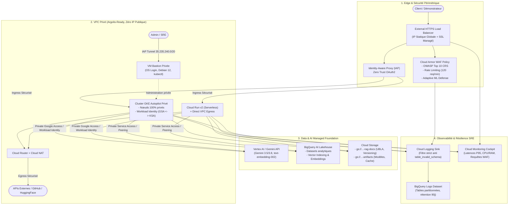

> 🇫🇷 **[Version Française](README.md)** | 🇬🇧 **[English Version](README-EN.md)**
>
> 🔗 **Écosystème EMEA SPARK & Applications Compagnons :**
> Ce référentiel fournit le **socle d'infrastructure d'entreprise (Landing Zone IaC)**. Pour explorer les applications déployées sur ce socle :
> - **[RAG Comparison Demo (cloud-gtm/app-rag-comparison)](https://github.com/cloud-gtm/app-rag-comparison)** : Comparateur Recherche Lexicale vs RAG Hybride (Embeddings 002 + BM25), streaming SSE et évaluation GenAI par Autorater Vertex AI.
> - **[CivicLens (cloud-gtm/civiclens)](https://github.com/cloud-gtm/civiclens)** : Plateforme analytique de finances publiques (GKE Autopilot, Cloud SQL pgvector, Gemini multimodal).

# GCP AI Foundation Blueprint

[](https://www.terraform.io/)
[](https://registry.terraform.io/providers/hashicorp/google/latest)
[](docs/ARCHITECTURE.md)
[](LICENSE)

Socle d'infrastructure Terraform modulaire pour le déploiement d'applications d'Intelligence Artificielle et de charges de travail GenAI sur Google Cloud Platform.

Le blueprint fournit une architecture de référence conforme aux recommandations du **Google Cloud Well-Architected Framework** et aux contraintes de gouvernance **Google Cloud Argolis** (aucune adresse IP publique, administration par tunnel IAP, chiffrement Google-managed et principe du moindre privilège).

---

## Architecture Globale

Consultez le schéma interactif officiel au format GCP Draw dans [docs/architecture-gcpdraw.md](docs/architecture-gcpdraw.md).



---

## Catalogue des Modules

Le blueprint est décomposé en 9 modules Terraform autonomes et composables :

| Module | Répertoire | Description & Ressources Clés |
| :--- | :--- | :--- |
| **Networking** | `modules/networking` | VPC custom, sous-réseau primaire (`10.10.0.0/20`), plages secondaires Pods (`10.20.0.0/16`) et Services (`10.30.0.0/20`), Cloud Router, Cloud NAT et Private Service Access (PSA). |
| **Security & WAF** | `modules/security-waf` | Stratégie Cloud Armor WAF avec règles CRS OWASP Top 10 (SQLi, XSS, RCE), rate limiting, protection adaptative L7, IP externe statique et certificat SSL. |
| **Compute GKE** | `modules/compute-gke` | Cluster GKE Autopilot 100 % privé, configuration Workload Identity, plan de sauvegarde Backup for GKE et permissions IAM ciblées (`roles/aiplatform.user`, `roles/storage.objectUser`). |
| **Compute Cloud Run** | `modules/compute-cloudrun` | Service Cloud Run v2 serverless avec Direct VPC Egress, auto-scaling de 0 à 5 instances, `no-cpu-throttling`, timeout de 300s et Service Account dédié. |
| **Data & AI Foundation** | `modules/data-ai-foundation` | Activation des APIs Vertex AI et BigQuery, dataset BigQuery Lakehouse, bucket GCS RAG documents (`versioning`, `UBLA`) et bucket d'artefacts. |
| **Bastion Host** | `modules/bastion` | Instance Compute Engine Debian 12 sans IP publique, connectable exclusivement par tunnel IAP, avec `kubectl`, `gke-gcloud-auth-plugin`, `tinyproxy` et `OS Login`. |
| **Observabilité SRE** | `modules/observability` | Sink Cloud Logging avec filtre d'exclusion des namespaces système (prévention de l'erreur `table_invalid_schema`), dataset BigQuery partitionné et Dashboard Cloud Monitoring. |
| **FinOps Budget** | `modules/finops-budget` | Alerte budgétaire Cloud Billing avec seuils à 50 %, 75 %, 90 %, 100 % réel et 100 % prévisionnel, canal de notification par email. |
| **Backup & DR** | `modules/backup-dr` | Coffres-forts immuables WORM pour la rétention opérationnelle et géo-redondante, intégration Backup for GKE pour l'état applicatif et les volumes persistants. |

---

## Profils d'Architecture Clés en Main (Réutilisabilité)

Pour faciliter la réutilisation selon le contexte (démonstration rapide vs production souveraine), le fichier [`terraform.tfvars.example`](file:///usr/local/google/home/hoffmannw/gcp-ai-foundation-blueprint/terraform.tfvars.example) propose deux profils préconfigurés :

| Profil | Cas d'usage cible | Configuration Compute & Sécurité | Temps & Coût |
| :--- | :--- | :--- | :--- |
| **Profil A : Démo Légère & Serverless** | Démos rapides (`app-rag-comparison`), PoCs agiles, environnements éphémères. | `enable_cloudrun = true`, `enable_gke = false`, `enable_bastion = false`, `enable_waf = false`, `force_destroy = true`. | **~2 min** / Coût quasi nul au repos (*scale-to-zero*). |
| **Profil B : Production Enterprise Souveraine** | Déploiements d'entreprise (`app-civiclens`), données sensibles, conformité SecOps/DORA. | `enable_gke = true`, `enable_waf = true`, `enable_bastion = true`, `enable_backup_dr = true`, `deletion_protection = true`. | **~15 min** / Haute disponibilité multi-zones & WORM. |

---

## Variables Principales (`variables.tf`)

Le module racine expose 27 variables typées et validées (`validation {}`) :

| Variable | Type | Valeur par défaut | Description |
| :--- | :--- | :--- | :--- |
| `project_id` | `string` | *Requis* | Identifiant du projet Google Cloud cible (validé par regex). |
| `region` | `string` | `"europe-west1"` | Région GCP principale pour le réseau, le compute et les données. |
| `zone` | `string` | `"europe-west1-b"` | Zone GCP principale pour la VM Bastion. |
| `resource_prefix` | `string` | `"ai-base"` | Préfixe de nommage appliqué à toutes les ressources créées. |
| `enable_random_suffix` | `bool` | `true` | Ajoute un suffixe aléatoire anti-collision aux ressources et buckets GCS. |
| `random_suffix_length` | `number` | `4` | Longueur du suffixe aléatoire (entre 2 et 8 caractères). |
| `enable_gke` | `bool` | `true` | Provisionne le cluster privé GKE Autopilot. |
| `enable_cloudrun` | `bool` | `false` | Provisionne le service serverless Cloud Run v2 avec Direct VPC Egress. |
| `enable_bastion` | `bool` | `true` | Provisionne la VM Bastion privée accessible uniquement via tunnel IAP. |
| `enable_waf` | `bool` | `true` | Provisionne la politique Cloud Armor WAF (OWASP Top 10 + Rate Limiting). |
| `excluded_upload_paths` | `list(string)` | `["/api/documents/upload"]` | Chemins URL exclus de l'inspection OWASP sur le corps de requête (évite les faux positifs 403 lors de l'upload de fichiers PDF). |
| `domain_name` | `string` | `""` | Nom de domaine pour le certificat SSL managé (laisser vide pour ignorer). |
| `admin_email` | `string` | `""` | Email de l'administrateur autorisé sur IAP (`roles/iap.httpsResourceAccessor`). |
| `enable_observability` | `bool` | `true` | Crée le sink Cloud Logging vers BigQuery et le cockpit Cloud Monitoring. |
| `alert_email` | `string` | `""` | Adresse email destinataire des alertes SRE Cloud Monitoring et FinOps. |
| `billing_account` | `string` | `""` | ID du compte de facturation Cloud Billing (active le module budget). |
| `budget_amount` | `number` | `100` | Montant mensuel cible du budget FinOps (doit être > 0). |
| `budget_currency` | `string` | `"USD"` | Devise du budget FinOps (`USD`, `EUR`, etc.). |
| `enable_backup_dr` | `bool` | `false` | Active le module Backup & DR (coffres WORM et sauvegarde GKE). |
| `dr_region` | `string` | `"europe-west4"` | Région secondaire pour le coffre de sauvegarde géo-redondant. |
| `backup_daily_retention_days` | `number` | `7` | Durée de rétention des sauvegardes quotidiennes (en jours). |
| `backup_weekly_retention_weeks` | `number` | `4` | Durée de rétention des sauvegardes hebdomadaires DR (en semaines). |
| `enable_geo_dr_vault` | `bool` | `true` | Provisionne le coffre-fort secondaire dans `dr_region`. |
| `deletion_protection` | `bool` | `false` | Protection contre la suppression accidentelle (GKE, Cloud Run). Mettre à `true` en production. |
| `force_destroy` | `bool` | `false` | Autorise la suppression des buckets GCS et datasets BigQuery non vides lors d'un `terraform destroy` (utile en démo). |
| `kms_key_name` | `string` | `""` | Identifiant de clé Cloud KMS (CMEK) optionnelle pour chiffrer BigQuery et GCS. |
| `labels` | `map(string)` | `{...}` | Labels FinOps appliqués uniformément à toutes les ressources via `default_labels`. |

---

## Outputs Plug-and-Play (`outputs.tf`)

Les sorties sont conçues pour être injectées directement dans les scripts de déploiement des applications clientes (`terraform output -raw <nom>`) sans nécessiter de parsing manuel :

| Output | Description & Utilisation Aval |
| :--- | :--- |
| `vpc_network_name` / `subnet_name` | Noms courts du VPC et du sous-réseau (pour `--network` et `--subnet` avec Cloud Run Direct VPC Egress). |
| `external_ip` / `external_ip_name` | Adresse IPv4 externe et son nom court (pour l'annotation Kubernetes `ingress.global-static-ip-name`). |
| `waf_policy_id` / `waf_policy_name` | URI complet et nom court de la stratégie Cloud Armor WAF (pour l'objet `BackendConfig` GKE). |
| `ssl_certificate_name` | Nom du certificat SSL managé (pour l'annotation Kubernetes `ingress.gcp.kubernetes.io/pre-shared-cert`). |
| `lakehouse_dataset_id` | Identifiant du dataset BigQuery Lakehouse (`{prefix}_lakehouse`). |
| `rag_bucket_name` / `rag_bucket_url` | Nom et URL `gs://` du bucket Cloud Storage dédié aux documents RAG. |
| `artifacts_bucket_name` / `artifacts_bucket_url` | Nom et URL `gs://` du bucket Cloud Storage dédié aux artefacts et caches d'évaluation IA. |
| `gke_cluster_name` / `gke_cluster_endpoint` | Nom et endpoint privé du cluster GKE Autopilot. |
| `gke_get_credentials_command` | Commande `gcloud container clusters get-credentials ... --internal-ip` prête à exécuter. |
| `gke_app_service_account_email` | Email du Google Service Account pour GKE Workload Identity. |
| `workload_identity_pool` | Pool Workload Identity du projet (`{project_id}.svc.id.goog`). |
| `cloudrun_service_name` / `cloudrun_service_uri` | Nom et URL HTTPS du service Cloud Run v2. |
| `cloudrun_service_account_email` | Email du Service Account dédié au service Cloud Run. |
| `bastion_ssh_command` | Commande `gcloud compute ssh ... --tunnel-through-iap` pour se connecter au bastion privé. |


---

## Démarrage Rapide

### 1. Prérequis
- `gcloud` CLI authentifié (`gcloud auth login` et `gcloud auth application-default login`).
- `terraform` version 1.5.0 ou supérieure.
- Rôle `roles/owner` ou `roles/editor` sur le projet GCP cible.

### 2. Initialisation du Projet
Exécutez le script d'initialisation pour activer les APIs requises et créer le bucket d'état distant :

```bash
./scripts/bootstrap.sh <VOTRE_PROJECT_ID> europe-west1
```

### 3. Configuration & Déploiement

```bash
# 1. Copier le fichier d'exemple des variables
cp terraform.tfvars.example terraform.tfvars

# 2. Renseigner au minimum project_id et admin_email dans terraform.tfvars

# 3. Initialiser les providers et modules
terraform init

# 4. Valider le plan d'exécution
terraform plan

# 5. Appliquer l'infrastructure
terraform apply
```

### 4. Déploiement d'une Application sur ce Socle
Une fois l'infrastructure provisionnée, déployez l'une des applications compatibles :
- Pour déployer le chatbot de comparaison RAG :
  ```bash
  cd ../app-rag-comparison
  ./scripts/deploy-to-blueprint.sh --blueprint-dir=../gcp-ai-foundation-blueprint
  ```
- Consultez le [Guide d'Intégration Applicative](docs/APPLICATION_INTEGRATION.md) pour les architectures personnalisées.

---

## Sécurité & Conformité Argolis

- **Zéro IP publique Compute** : Aucun nœud Kubernetes, VM Bastion ou conteneur ne possède d'adresse IP externe (`constraints/compute.vmExternalIpAccess`).
- **Trafic Egress maîtrisé** : Toutes les connexions sortantes (téléchargement de dépendances, modèles HuggingFace) transitent par Cloud NAT.
- **Accès d'administration IAP** : L'accès SSH au bastion utilise le tunnel Identity-Aware Proxy sur la plage réseau `35.235.240.0/20`.
- **Authentification par token temporaire** : Si vous travaillez depuis un environnement Cloudtop avec un compte `@google.com` soumis à restriction de domaine, exportez un jeton valide avant d'appliquer Terraform :
  ```bash
  export GOOGLE_OAUTH_ACCESS_TOKEN=$(gcloud auth print-access-token --account=user@votre-domaine.altostrat.com)
  terraform apply
  ```

---

## Licence

Ce projet est distribué sous licence Apache 2.0. Consultez le fichier [LICENSE](LICENSE) pour plus d'informations.
