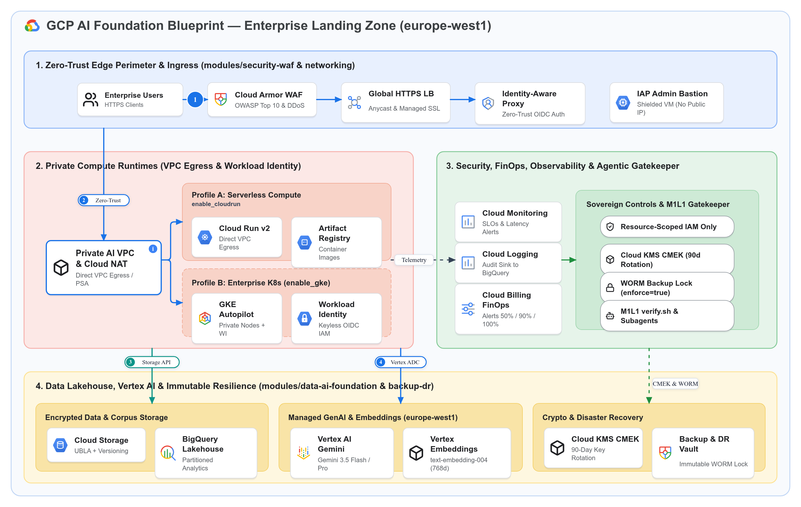
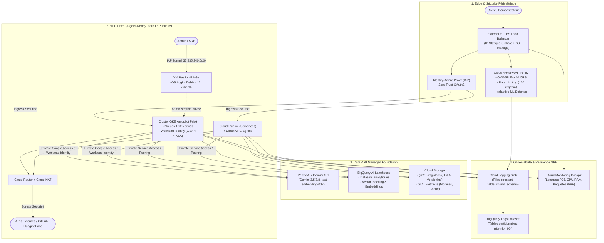
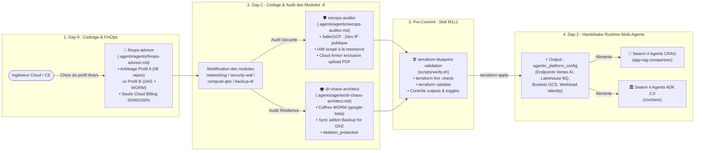

> 🇫🇷 **[Version Française](README.md)** | 🇬🇧 **[English Version](README-EN.md)** | 🎬 **[Guide de Démo Pas-à-Pas (DEMO_PLAYBOOK.md)](docs/DEMO_PLAYBOOK.md)** | 🗺️ **[Schémas Dendrite v3.3 & Draw.io](docs/architecture-gcpdraw.md)**

> 🗺️ **Schémas d'Architecture Exécutifs (Dendrite v3.3 Bento 16:9 & Draw.io)** : [**🎨 Ouvrir dans Dendrite Studio (1-Click) ↗**](https://dendrite-758054785671.cr.gclb.goog/#code=cmVuZGVyT3JkZXI6IG5vZGVzLWZpcnN0CmRpcmVjdGlvbjogZG93bgoKY29uc3QgR2NwQmx1ZSA9ICIjMWE3M2U4Igpjb25zdCBHY3BHcmVlbiA9ICIjMWU4ZTNlIgpjb25zdCBFbWVyYWxkVGVhbCA9ICIjMGQ5NDg4Igpjb25zdCBEYXJrU2xhdGUgPSAiIzIwMjEyNCIKY29uc3QgU3ViVGV4dCA9ICIjNWY2MzY4Igpjb25zdCBDYXJkQm9yZGVyID0gIiNkYWRjZTAiCmNvbnN0IEJ1c1N0cm9rZSA9ICIjMzM0MTU1Igpjb25zdCBTdXJmYWNlV2hpdGUgPSAiI2ZmZmZmZiIKClN0eWxlIEBHaG9zdCB7CiAgZmlsbDogdHJhbnNwYXJlbnQsIHN0cm9rZVdpZHRoOiAwLCBmb250Q29sb3I6IHRyYW5zcGFyZW50LCBwYWRkaW5nOiAwCn0KU3R5bGUgQEFyY2hpdGVjdHVyZVJvb3QgewogIGZpbGw6ICIjZjhmYWZkIiwgc3Ryb2tlQ29sb3I6ICIjYzJkN2Y1Iiwgc3Ryb2tlV2lkdGg6IDEuNSwgYm9yZGVyUmFkaXVzOiAxNiwKICBwYWRkaW5nOiAyMiwgZ2FwOiAxOCwgZm9udENvbG9yOiAiIzNjNDA0MyIsIGZvbnRTaXplOiAyMiwgbGFiZWxXZWlnaHQ6IGJvbGQsCiAgaWNvbjogIkdvb2dsZUNsb3VkIiwgaWNvblNpemU6IDI4Cn0KU3R5bGUgQFBlcmltZXRlclpvbmUgewogIGZpbGw6ICIjZThmMGZlIiwgc3Ryb2tlQ29sb3I6ICIjOGFiNGY4Iiwgc3Ryb2tlV2lkdGg6IDEuNSwgYm9yZGVyUmFkaXVzOiAxMiwKICBwYWRkaW5nOiAyMCwgZ2FwOiAxOCwgZm9udENvbG9yOiAkRGFya1NsYXRlLCBmb250U2l6ZTogMTUsIGxhYmVsV2VpZ2h0OiBib2xkCn0KU3R5bGUgQEV4ZWN1dGlvblpvbmUgewogIGZpbGw6ICIjZmNlOGU2Iiwgc3Ryb2tlQ29sb3I6ICIjZjZhZWE5Iiwgc3Ryb2tlV2lkdGg6IDEuNSwgYm9yZGVyUmFkaXVzOiAxMiwKICBwYWRkaW5nOiAyMCwgZ2FwOiAxOCwgZm9udENvbG9yOiAkRGFya1NsYXRlLCBmb250U2l6ZTogMTUsIGxhYmVsV2VpZ2h0OiBib2xkCn0KU3R5bGUgQEdvdmVybmFuY2Vab25lIHsKICBmaWxsOiAiI2U2ZjRlYSIsIHN0cm9rZUNvbG9yOiAiIzgxYzk5NSIsIHN0cm9rZVdpZHRoOiAxLjUsIGJvcmRlclJhZGl1czogMTIsCiAgcGFkZGluZzogMTYsIGdhcDogMTQsIGZvbnRDb2xvcjogJERhcmtTbGF0ZSwgZm9udFNpemU6IDE1LCBsYWJlbFdlaWdodDogYm9sZAp9ClN0eWxlIEBSZXNvdXJjZVpvbmUgewogIGZpbGw6ICIjZmVmN2UwIiwgc3Ryb2tlQ29sb3I6ICIjZmRlMjkzIiwgc3Ryb2tlV2lkdGg6IDEuNSwgYm9yZGVyUmFkaXVzOiAxMiwKICBwYWRkaW5nOiAyMCwgZ2FwOiAxOCwgZm9udENvbG9yOiAkRGFya1NsYXRlLCBmb250U2l6ZTogMTUsIGxhYmVsV2VpZ2h0OiBib2xkCn0KU3R5bGUgQFBlYWNoU3ViR3JvdXAgewogIGZpbGw6ICIjZjhkM2M4Iiwgc3Ryb2tlQ29sb3I6IGRhcmtlbigiI2Y4ZDNjOCIsIDEyKSwgc3Ryb2tlV2lkdGg6IDEsIGJvcmRlclJhZGl1czogMTAsCiAgcGFkZGluZzogMTYsIGdhcDogMTIsIGZvbnRDb2xvcjogJERhcmtTbGF0ZSwgZm9udFNpemU6IDEzLCBsYWJlbFdlaWdodDogYm9sZAp9ClN0eWxlIEBHcmVlblN1Ykdyb3VwIHsKICBmaWxsOiAiI2NlZWFkNiIsIHN0cm9rZUNvbG9yOiBkYXJrZW4oIiNjZWVhZDYiLCAxNCksIHN0cm9rZVdpZHRoOiAxLCBib3JkZXJSYWRpdXM6IDEwLAogIHBhZGRpbmc6IDEwLCBnYXA6IDcsIGZvbnRDb2xvcjogJERhcmtTbGF0ZSwgZm9udFNpemU6IDEzLCBsYWJlbFdlaWdodDogYm9sZAp9ClN0eWxlIEBBbWJlclN1Ykdyb3VwIHsKICBmaWxsOiAiI2Y5ZTRhNyIsIHN0cm9rZUNvbG9yOiBkYXJrZW4oIiNmOWU0YTciLCAxNCksIHN0cm9rZVdpZHRoOiAxLCBib3JkZXJSYWRpdXM6IDEwLAogIHBhZGRpbmc6IDE2LCBnYXA6IDEyLCBmb250Q29sb3I6ICREYXJrU2xhdGUsIGZvbnRTaXplOiAxMywgbGFiZWxXZWlnaHQ6IGJvbGQKfQpTdHlsZSBAQWN0b3JDYXJkIHsKICB3aWR0aDogMTgwLCBoZWlnaHQ6IDU2LAogIGZpbGw6ICRTdXJmYWNlV2hpdGUsIHN0cm9rZUNvbG9yOiAkQ2FyZEJvcmRlciwgc3Ryb2tlV2lkdGg6IDEsIGJvcmRlclJhZGl1czogOCwKICBmb250Q29sb3I6ICREYXJrU2xhdGUsIHN1YkZvbnRDb2xvcjogJFN1YlRleHQsCiAgZm9udFNpemU6IDEyLjUsIHN1YkZvbnRTaXplOiAxMCwgbGFiZWxXZWlnaHQ6IGJvbGQsCiAgdGV4dEFsaWduOiAibGVmdCIsIHRleHRWQWxpZ246ICJtaWRkbGUiLAogIGljb25Qb3NpdGlvbjogImxlZnQiLCBpY29uU2l6ZTogMjgsIHBhZGRpbmc6IDEwLCBzaGFkb3c6IHRydWUKfQpTdHlsZSBAUHJvZHVjdENhcmQgewogIHdpZHRoOiAxNjgsIGhlaWdodDogNTgsCiAgZmlsbDogJFN1cmZhY2VXaGl0ZSwgc3Ryb2tlQ29sb3I6ICRDYXJkQm9yZGVyLCBzdHJva2VXaWR0aDogMSwgYm9yZGVyUmFkaXVzOiA4LAogIGZvbnRDb2xvcjogJERhcmtTbGF0ZSwgc3ViRm9udENvbG9yOiAkU3ViVGV4dCwKICBmb250U2l6ZTogMTMuNSwgc3ViRm9udFNpemU6IDExLCBsYWJlbFdlaWdodDogYm9sZCwKICB0ZXh0QWxpZ246ICJsZWZ0IiwgdGV4dFZBbGlnbjogIm1pZGRsZSIsCiAgaWNvblBvc2l0aW9uOiAibGVmdCIsIGljb25TaXplOiAyOCwgcGFkZGluZzogMTAsIHNoYWRvdzogdHJ1ZQp9ClN0eWxlIEBHYXRld2F5SHViQ2FyZCB7CiAgYmFzZTogQFByb2R1Y3RDYXJkLAogIHdpZHRoOiAxOTYsIGhlaWdodDogNjYsIHN0cm9rZUNvbG9yOiAkR2NwQmx1ZSwgc3Ryb2tlV2lkdGg6IDIsCiAgZm9udFNpemU6IDE0LjUsIHN1YkZvbnRTaXplOiAxMSwgaWNvblNpemU6IDMwLCBwYWRkaW5nOiAxMgp9ClN0eWxlIEBQb2xpY3lQaWxsIHsKICB3aWR0aDogMjI4LCBoZWlnaHQ6IDMyLAogIGZpbGw6ICRTdXJmYWNlV2hpdGUsIHN0cm9rZUNvbG9yOiAiIzlhYTBhNiIsIHN0cm9rZVdpZHRoOiAxLCBib3JkZXJSYWRpdXM6IDE2LAogIGZvbnRDb2xvcjogJERhcmtTbGF0ZSwgZm9udFNpemU6IDEyLjUsIGxhYmVsV2VpZ2h0OiBib2xkLAogIHRleHRBbGlnbjogImxlZnQiLCB0ZXh0VkFsaWduOiAibWlkZGxlIiwKICBpY29uUG9zaXRpb246ICJsZWZ0IiwgaWNvblNpemU6IDE2LCBwYWRkaW5nOiAxMCwgc2hhZG93OiB0cnVlCn0KClpvbmUgQEdDUF9BSV9Gb3VuZGF0aW9uX0JsdWVwcmludCB7CiAgdGl0bGU6ICJHQ1AgQUkgRm91bmRhdGlvbiBCbHVlcHJpbnQg4oCUIEVudGVycHJpc2UgTGFuZGluZyBab25lIChldXJvcGUtd2VzdDEpIgogIHN0eWxlOiBAQXJjaGl0ZWN0dXJlUm9vdAogIGxheW91dDogbWF0cml4CiAgYXJlYXM6IFsKICAgICJ6MSB6MSB6MSB6MSB6MSIsCiAgICAiejMgejMgejIgejIgejIiLAogICAgIno0IHo0IHo0IHo0IHo0IgogIF0KICBzaXplczogWyIxLjA1ZnIiLCAiMS4wNWZyIiwgIjAuOTZmciIsICIwLjk2ZnIiLCAiMC45NmZyIl0KICBnYXA6IDIwCgogIFpvbmUgQFpvbmUxX1BlcmltZXRlciB7CiAgICBhcmVhOiAiejEiCiAgICB0aXRsZTogIjEuIFplcm8tVHJ1c3QgRWRnZSBQZXJpbWV0ZXIgJiBJbmdyZXNzIChtb2R1bGVzL3NlY3VyaXR5LXdhZiAmIG5ldHdvcmtpbmcpIgogICAgc3R5bGU6IEBQZXJpbWV0ZXJab25lCiAgICBsYXlvdXQ6IHJvdywgZ2FwOiAxOCwgYWxpZ246IGNlbnRlciwganVzdGlmeTogY2VudGVyCiAgICBbZW50ZXJwcmlzZV91c2VyczogIkVudGVycHJpc2UgVXNlcnMiIHwgIkhUVFBTIENsaWVudHMiXSB7IHN0eWxlOiBAQWN0b3JDYXJkLCBpY29uOiAiVXNlcnMiIH0KICAgIFtjbG91ZF9hcm1vcl93YWY6ICJDbG91ZCBBcm1vciBXQUYiIHwgIk9XQVNQIFRvcCAxMCAmIEREb1MiXSB7IHN0eWxlOiBAUHJvZHVjdENhcmQsIHdpZHRoOiAxODYsIGljb246ICJDbG91ZEFybW9yIiB9CiAgICBbZ2xvYmFsX2xiOiAiR2xvYmFsIEhUVFBTIExCIiB8ICJBbnljYXN0ICYgTWFuYWdlZCBTU0wiXSB7IHN0eWxlOiBAUHJvZHVjdENhcmQsIHdpZHRoOiAxODYsIGljb246ICJDbG91ZExvYWRCYWxhbmNpbmciIH0KICAgIFtpYXBfcHJveHk6ICJJZGVudGl0eS1Bd2FyZSBQcm94eSIgfCAiWmVyby1UcnVzdCBPSURDIEF1dGgiXSB7IHN0eWxlOiBAUHJvZHVjdENhcmQsIHdpZHRoOiAxODgsIGljb246ICJHb29nbGVJZGVudGl0eSIgfQogICAgW2lhcF9iYXN0aW9uOiAiSUFQIEFkbWluIEJhc3Rpb24iIHwgIlNoaWVsZGVkIFZNIChObyBQdWJsaWMgSVApIl0geyBzdHlsZTogQFByb2R1Y3RDYXJkLCB3aWR0aDogMTk0LCBpY29uOiAiR2NwQ29tcHV0ZSIgfQogIH0KCiAgWm9uZSBAWm9uZTNfQ29tcHV0ZSB7CiAgICBhcmVhOiAiejMiCiAgICB0aXRsZTogIjIuIFByaXZhdGUgQ29tcHV0ZSBSdW50aW1lcyAoVlBDIEVncmVzcyAmIFdvcmtsb2FkIElkZW50aXR5KSIKICAgIHN0eWxlOiBARXhlY3V0aW9uWm9uZQogICAgbGF5b3V0OiByb3csIGdhcDogMzYsIGFsaWduOiBjZW50ZXIsIGp1c3RpZnk6IGNlbnRlcgoKICAgIFt2cGNfcm91dGVyX25hdDogIlByaXZhdGUgQUkgVlBDXG4mIENsb3VkIE5BVCIgfCAiRGlyZWN0IFZQQyBFZ3Jlc3MgLyBQU0EiXSB7CiAgICAgIHN0eWxlOiBAR2F0ZXdheUh1YkNhcmQsIGljb246ICJWaXJ0dWFsUHJpdmF0ZUNsb3VkIiwKICAgICAgZGVzY3JpcHRpb246ICJDdXN0b20gVlBDIHdpdGggUHJpdmF0ZSBHb29nbGUgQWNjZXNzLCBQcml2YXRlIFNlcnZpY2UgQ29ubmVjdCwgYW5kIENsb3VkIE5BVCIKICAgIH0KCiAgICBab25lIEBDb21wdXRlUHJvZmlsZXNDb2wgewogICAgICBzdHlsZTogQEdob3N0LCBsYXlvdXQ6IGNvbHVtbiwgZ2FwOiAxNCwgYWxpZ246IHN0cmV0Y2gKCiAgICAgIFpvbmUgQFNlcnZlcmxlc3NQcm9maWxlIHsKICAgICAgICB0aXRsZTogIlByb2ZpbGUgQTogU2VydmVybGVzcyBDb21wdXRlIChlbmFibGVfY2xvdWRydW4pIgogICAgICAgIHN0eWxlOiBAUGVhY2hTdWJHcm91cCwgd2lkdGg6IDM0NCwgbGF5b3V0OiByb3csIGdhcDogMTAsIGFsaWduOiBjZW50ZXIsIGp1c3RpZnk6IGNlbnRlcgogICAgICAgIFtjbG91ZF9ydW5fdjI6ICJDbG91ZCBSdW4gdjIiIHwgIkRpcmVjdCBWUEMgRWdyZXNzIl0geyBzdHlsZTogQFByb2R1Y3RDYXJkLCB3aWR0aDogMTU0LCBpY29uOiAiR2NwQ2xvdWRSdW4iIH0KICAgICAgICBbYXJ0aWZhY3RfcmVnOiAiQXJ0aWZhY3QgUmVnaXN0cnkiIHwgIkNvbnRhaW5lciBJbWFnZXMiXSB7IHN0eWxlOiBAUHJvZHVjdENhcmQsIHdpZHRoOiAxNTQsIGljb246ICJBcnRpZmFjdFJlZ2lzdHJ5IiB9CiAgICAgIH0KCiAgICAgIFpvbmUgQEt1YmVybmV0ZXNQcm9maWxlIHsKICAgICAgICB0aXRsZTogIlByb2ZpbGUgQjogRW50ZXJwcmlzZSBLOHMgKGVuYWJsZV9na2UpIgogICAgICAgIHN0eWxlOiBAUGVhY2hTdWJHcm91cCwgZGFzaGVkOiB0cnVlLCB3aWR0aDogMzQ0LCBsYXlvdXQ6IHJvdywgZ2FwOiAxMCwgYWxpZ246IGNlbnRlciwganVzdGlmeTogY2VudGVyCiAgICAgICAgW2drZV9hdXRvcGlsb3Q6ICJHS0UgQXV0b3BpbG90IiB8ICJQcml2YXRlIE5vZGVzICsgV0kiXSB7IHN0eWxlOiBAUHJvZHVjdENhcmQsIHdpZHRoOiAxNTQsIGljb246ICJHS0UiIH0KICAgICAgICBbd29ya2xvYWRfaWQ6ICJXb3JrbG9hZCBJZGVudGl0eSIgfCAiS2V5bGVzcyBPSURDIElBTSJdIHsgc3R5bGU6IEBQcm9kdWN0Q2FyZCwgd2lkdGg6IDE1NCwgaWNvbjogIkdjcExvY2siIH0KICAgICAgfQogICAgfQogIH0KCiAgWm9uZSBAWm9uZTJfR292ZXJuYW5jZSB7CiAgICBhcmVhOiAiejIiCiAgICB0aXRsZTogIjMuIFNlY3VyaXR5LCBGaW5PcHMsIE9ic2VydmFiaWxpdHkgJiBBZ2VudGljIEdhdGVrZWVwZXIiCiAgICBzdHlsZTogQEdvdmVybmFuY2Vab25lCiAgICBsYXlvdXQ6IHJvdywgZ2FwOiAyNCwgYWxpZ246IGNlbnRlciwganVzdGlmeTogY2VudGVyCgogICAgWm9uZSBAU3JlQW5kRmlub3BzQ29sIHsKICAgICAgc3R5bGU6IEBHaG9zdCwgbGF5b3V0OiBjb2x1bW4sIGdhcDogMTIsIGFsaWduOiBjZW50ZXIKICAgICAgW2Nsb3VkX21vbml0b3Jpbmc6ICJDbG91ZCBNb25pdG9yaW5nIiB8ICJTTE9zICYgTGF0ZW5jeSBBbGVydHMiXSB7IHN0eWxlOiBAUHJvZHVjdENhcmQsIHdpZHRoOiAxODIsIGljb246ICJDbG91ZE1vbml0b3JpbmciIH0KICAgICAgW2Nsb3VkX2xvZ2dpbmc6ICJDbG91ZCBMb2dnaW5nIiB8ICJBdWRpdCBTaW5rIHRvIEJpZ1F1ZXJ5Il0geyBzdHlsZTogQFByb2R1Y3RDYXJkLCB3aWR0aDogMTgyLCBpY29uOiAiQ2xvdWRMb2dnaW5nIiB9CiAgICAgIFtmaW5vcHNfYnVkZ2V0OiAiQ2xvdWQgQmlsbGluZyBGaW5PcHMiIHwgIkFsZXJ0cyA1MCUgLyA5MCUgLyAxMDAlIl0geyBzdHlsZTogQFByb2R1Y3RDYXJkLCB3aWR0aDogMTgyLCBpY29uOiAiQ2xvdWRCaWxsaW5nIiB9CiAgICB9CgogICAgWm9uZSBAU292ZXJlaWduR3VhcmRyYWlscyB7CiAgICAgIHRpdGxlOiAiU292ZXJlaWduIENvbnRyb2xzICYgTTFMMSBHYXRla2VlcGVyIgogICAgICBzdHlsZTogQEdyZWVuU3ViR3JvdXAsIGxheW91dDogY29sdW1uLCBnYXA6IDgsIGFsaWduOiBjZW50ZXIKICAgICAgW2d1YXJkX2lhbTogIlJlc291cmNlLVNjb3BlZCBJQU0gT25seSJdIHsgc3R5bGU6IEBQb2xpY3lQaWxsLCBpY29uOiAiU2hpZWxkQ2hlY2siIH0KICAgICAgW2d1YXJkX2NtZWs6ICJDbG91ZCBLTVMgQ01FSyAoOTBkIFJvdGF0aW9uKSJdIHsgc3R5bGU6IEBQb2xpY3lQaWxsLCBpY29uOiAiS01TIiB9CiAgICAgIFtndWFyZF93b3JtOiAiV09STSBCYWNrdXAgTG9jayAoZW5mb3JjZT10cnVlKSJdIHsgc3R5bGU6IEBQb2xpY3lQaWxsLCBpY29uOiAiTG9jayIgfQogICAgICBbZ3VhcmRfbTFsMTogIk0xTDEgdmVyaWZ5LnNoICYgU3ViYWdlbnRzIl0geyBzdHlsZTogQFBvbGljeVBpbGwsIGljb246ICJCb3QiIH0KICAgIH0KICB9CgogIFpvbmUgQFpvbmU0X0RhdGFBSSB7CiAgICBhcmVhOiAiejQiCiAgICB0aXRsZTogIjQuIERhdGEgTGFrZWhvdXNlLCBWZXJ0ZXggQUkgJiBJbW11dGFibGUgUmVzaWxpZW5jZSAobW9kdWxlcy9kYXRhLWFpLWZvdW5kYXRpb24gJiBiYWNrdXAtZHIpIgogICAgc3R5bGU6IEBSZXNvdXJjZVpvbmUKICAgIGxheW91dDogbWF0cml4LCBjb2xzOiAzLCBzaXplczogWyIxLjA1ZnIiLCAiMS4xNWZyIiwgIjAuOTVmciJdLCBnYXA6IDE4LCBhbGlnbjogY2VudGVyCgogICAgWm9uZSBAU3RvcmFnZUFuZExha2Vob3VzZSB7CiAgICAgIHRpdGxlOiAiRW5jcnlwdGVkIERhdGEgJiBDb3JwdXMgU3RvcmFnZSIKICAgICAgc3R5bGU6IEBBbWJlclN1Ykdyb3VwLCBsYXlvdXQ6IHJvdywgZ2FwOiAxMiwgYWxpZ246IGNlbnRlciwganVzdGlmeTogY2VudGVyCiAgICAgIFtnY3NfcmFnX2J1Y2tldDogIkNsb3VkIFN0b3JhZ2UiIHwgIlVCTEEgKyBWZXJzaW9uaW5nIl0geyBzdHlsZTogQFByb2R1Y3RDYXJkLCB3aWR0aDogMTY4LCBpY29uOiAiR2NwU3RvcmFnZUJ1Y2tldCIgfQogICAgICBbYmlncXVlcnlfbGFrZTogIkJpZ1F1ZXJ5IExha2Vob3VzZSIgfCAiUGFydGl0aW9uZWQgQW5hbHl0aWNzIl0geyBzdHlsZTogQFByb2R1Y3RDYXJkLCB3aWR0aDogMTc0LCBpY29uOiAiQmlnUXVlcnkiIH0KICAgIH0KCiAgICBab25lIEBWZXJ0ZXhBaVBsYXRmb3JtIHsKICAgICAgdGl0bGU6ICJNYW5hZ2VkIEdlbkFJICYgRW1iZWRkaW5ncyAoZXVyb3BlLXdlc3QxKSIKICAgICAgc3R5bGU6IEBBbWJlclN1Ykdyb3VwLCBsYXlvdXQ6IHJvdywgZ2FwOiAxMiwgYWxpZ246IGNlbnRlciwganVzdGlmeTogY2VudGVyCiAgICAgIFt2ZXJ0ZXhfZ2VtaW5pOiAiVmVydGV4IEFJIEdlbWluaSIgfCAiR2VtaW5pIDMuNSBGbGFzaCAvIFBybyJdIHsgc3R5bGU6IEBQcm9kdWN0Q2FyZCwgd2lkdGg6IDE3NiwgaWNvbjogIlZlcnRleEFJIiB9CiAgICAgIFt2ZXJ0ZXhfZW1iZWQ6ICJWZXJ0ZXggRW1iZWRkaW5ncyIgfCAidGV4dC1lbWJlZGRpbmctMDA0ICg3NjhkKSJdIHsgc3R5bGU6IEBQcm9kdWN0Q2FyZCwgd2lkdGg6IDE4NCwgaWNvbjogIkFJUGxhdGZvcm0iIH0KICAgIH0KCiAgICBab25lIEBSZXNpbGllbmNlQW5kS21zIHsKICAgICAgdGl0bGU6ICJDcnlwdG8gJiBEaXNhc3RlciBSZWNvdmVyeSIKICAgICAgc3R5bGU6IEBBbWJlclN1Ykdyb3VwLCBsYXlvdXQ6IHJvdywgZ2FwOiAxMiwgYWxpZ246IGNlbnRlciwganVzdGlmeTogY2VudGVyCiAgICAgIFtjbG91ZF9rbXM6ICJDbG91ZCBLTVMgQ01FSyIgfCAiOTAtRGF5IEtleSBSb3RhdGlvbiJdIHsgc3R5bGU6IEBQcm9kdWN0Q2FyZCwgd2lkdGg6IDE2OCwgaWNvbjogIktNUyIgfQogICAgICBbYmFja3VwX2RyX3dvcm06ICJCYWNrdXAgJiBEUiBWYXVsdCIgfCAiSW1tdXRhYmxlIFdPUk0gTG9jayJdIHsgc3R5bGU6IEBQcm9kdWN0Q2FyZCwgd2lkdGg6IDE3NCwgaWNvbjogIlNlY3VyaXR5Q29tbWFuZENlbnRlciIgfQogICAgfQogIH0KfQoKW2VudGVycHJpc2VfdXNlcnNdIC0tPiBbY2xvdWRfYXJtb3Jfd2FmXSB7IGNvbG9yOiAkR2NwQmx1ZSwgc3Ryb2tlV2lkdGg6IDIsIHNvdXJjZUFuY2hvcjogInJpZ2h0IiwgdGFyZ2V0QW5jaG9yOiAibGVmdCIsIGN1cnZlOiAic3RlcCIsIHNlcXVlbmNlQmFkZ2U6ICIxIiwgYmFkZ2VGaWxsOiAkR2NwQmx1ZSwgYmFkZ2VGb250Q29sb3I6ICRTdXJmYWNlV2hpdGUgfQpbY2xvdWRfYXJtb3Jfd2FmXSAtLT4gW2dsb2JhbF9sYl0geyBjb2xvcjogJEdjcEJsdWUsIHN0cm9rZVdpZHRoOiAyLCBzb3VyY2VBbmNob3I6ICJyaWdodCIsIHRhcmdldEFuY2hvcjogImxlZnQiLCBjdXJ2ZTogInN0ZXAiIH0KW2dsb2JhbF9sYl0gLS0+IFtpYXBfcHJveHldIHsgY29sb3I6ICRHY3BCbHVlLCBzdHJva2VXaWR0aDogMiwgc291cmNlQW5jaG9yOiAicmlnaHQiLCB0YXJnZXRBbmNob3I6ICJsZWZ0IiwgY3VydmU6ICJzdGVwIiB9Cltab25lMV9QZXJpbWV0ZXJdIC0tPiBbdnBjX3JvdXRlcl9uYXRdIHsgY29sb3I6ICRHY3BCbHVlLCBzdHJva2VXaWR0aDogMiwgc291cmNlQW5jaG9yOiAiYm90dG9tIiwgdGFyZ2V0QW5jaG9yOiAidG9wIiwgY3VydmU6ICJzdGVwIiwgbGFiZWw6ICJaZXJvLVRydXN0Iiwgc2VxdWVuY2VCYWRnZTogIjIiLCBiYWRnZUZpbGw6ICRHY3BCbHVlLCBiYWRnZUZvbnRDb2xvcjogJFN1cmZhY2VXaGl0ZSB9Clt2cGNfcm91dGVyX25hdF0gLS0+IFtTZXJ2ZXJsZXNzUHJvZmlsZV0geyBjb2xvcjogJEdjcEJsdWUsIHN0cm9rZVdpZHRoOiAyLCBzb3VyY2VBbmNob3I6ICJyaWdodCIsIHRhcmdldEFuY2hvcjogImxlZnQiLCBjdXJ2ZTogInN0ZXAiIH0KW3ZwY19yb3V0ZXJfbmF0XSAtLT4gW0t1YmVybmV0ZXNQcm9maWxlXSB7IGNvbG9yOiAkR2NwQmx1ZSwgc3Ryb2tlV2lkdGg6IDIsIHNvdXJjZUFuY2hvcjogInJpZ2h0IiwgdGFyZ2V0QW5jaG9yOiAibGVmdCIsIGN1cnZlOiAic3RlcCIgfQpbQ29tcHV0ZVByb2ZpbGVzQ29sXSAtLT4gW1NyZUFuZEZpbm9wc0NvbF0geyBjb2xvcjogJEJ1c1N0cm9rZSwgc3Ryb2tlV2lkdGg6IDEuOCwgZGFzaGVkOiB0cnVlLCBzb3VyY2VBbmNob3I6ICJyaWdodCIsIHRhcmdldEFuY2hvcjogImxlZnQiLCBjdXJ2ZTogInN0ZXAiLCBsYWJlbDogIlRlbGVtZXRyeSIgfQpbU3JlQW5kRmlub3BzQ29sXSAtLT4gW1NvdmVyZWlnbkd1YXJkcmFpbHNdIHsgY29sb3I6ICRHY3BHcmVlbiwgc3Ryb2tlV2lkdGg6IDEuOCwgc291cmNlQW5jaG9yOiAicmlnaHQiLCB0YXJnZXRBbmNob3I6ICJsZWZ0IiwgY3VydmU6ICJzdGVwIiB9Cltab25lM19Db21wdXRlXSAtLT4gW1N0b3JhZ2VBbmRMYWtlaG91c2VdIHsgY29sb3I6ICRFbWVyYWxkVGVhbCwgc3Ryb2tlV2lkdGg6IDIsIHNvdXJjZUFuY2hvcjogImJvdHRvbSIsIHRhcmdldEFuY2hvcjogInRvcCIsIGN1cnZlOiAic3RlcCIsIGxhYmVsOiAiU3RvcmFnZSBBUEkiLCBzZXF1ZW5jZUJhZGdlOiAiMyIsIGJhZGdlRmlsbDogJEVtZXJhbGRUZWFsLCBiYWRnZUZvbnRDb2xvcjogJFN1cmZhY2VXaGl0ZSB9Cltab25lM19Db21wdXRlXSAtLT4gW1ZlcnRleEFpUGxhdGZvcm1dIHsgY29sb3I6ICRHY3BCbHVlLCBzdHJva2VXaWR0aDogMiwgc291cmNlQW5jaG9yOiAiYm90dG9tIiwgdGFyZ2V0QW5jaG9yOiAidG9wIiwgY3VydmU6ICJzdGVwIiwgbGFiZWw6ICJWZXJ0ZXggQURDIiwgc2VxdWVuY2VCYWRnZTogIjQiLCBiYWRnZUZpbGw6ICRHY3BCbHVlLCBiYWRnZUZvbnRDb2xvcjogJFN1cmZhY2VXaGl0ZSB9Cltab25lMl9Hb3Zlcm5hbmNlXSAtLT4gW1Jlc2lsaWVuY2VBbmRLbXNdIHsgY29sb3I6ICRHY3BHcmVlbiwgc3Ryb2tlV2lkdGg6IDEuOCwgZGFzaGVkOiB0cnVlLCBzb3VyY2VBbmNob3I6ICJib3R0b20iLCB0YXJnZXRBbmNob3I6ICJ0b3AiLCBjdXJ2ZTogInN0ZXAiLCBsYWJlbDogIkNNRUsgJiBXT1JNIiB9Cg==) · [**🖼️ PNG Haute-Résolution**](docs/diagrams/foundation_blueprint_v3.png) · [`docs/diagrams/foundation_blueprint_v3.dendrite`](docs/diagrams/foundation_blueprint_v3.dendrite) · [`docs/diagrams/foundation_blueprint_v3.drawio`](docs/diagrams/foundation_blueprint_v3.drawio) · [`docs/architecture-gcpdraw.md`](docs/architecture-gcpdraw.md)
>
> 🔗 **Écosystème EMEA SPARK & Applications Compagnons :**
> Ce référentiel fournit le **socle d'infrastructure d'entreprise (Landing Zone IaC)**. Pour explorer les applications déployées sur ce socle :
> - **[RAG Comparison Demo (cloud-gtm/app-rag-comparison)](https://github.com/cloud-gtm/app-rag-comparison)** : Comparateur Recherche Lexicale vs RAG Hybride (Embeddings + BM25 RRF), **Swarm 4 Sous-Agents CRAG (`🤖 Agentic RAG`)**, streaming SSE et évaluation GenAI par Autorater Vertex AI.
> - **[CivicLens (cloud-gtm/civiclens)](https://github.com/cloud-gtm/civiclens)** : Plateforme analytique de finances publiques M57 (GKE Autopilot, Cloud SQL `pgvector`, **Swarm Multi-Agents Google ADK 2.0** et Gemini multimodal).

# GCP AI Foundation Blueprint

[](https://www.terraform.io/)
[](https://registry.terraform.io/providers/hashicorp/google/latest)
[](docs/ARCHITECTURE.md)
[](LICENSE)

Socle d'infrastructure Terraform modulaire pour le déploiement d'applications d'Intelligence Artificielle et de charges de travail GenAI sur Google Cloud Platform.

Le blueprint fournit une architecture de référence conforme aux recommandations du **Google Cloud Well-Architected Framework** et aux contraintes de gouvernance **Google Cloud Argolis** (aucune adresse IP publique, administration par tunnel IAP, chiffrement Google-managed et principe du moindre privilège).

---

## 🗺️ Architecture Globale (Dendrite v3.3 — Bento Matrix 16:9)

[](docs/diagrams/foundation_blueprint_v3.png)

> 💡 **Astuce** : Cliquez sur l'image pour l'afficher en pleine résolution (Retina 2x), ou [**ouvrez-la dans Dendrite Studio ↗**](https://dendrite-758054785671.cr.gclb.goog/#code=cmVuZGVyT3JkZXI6IG5vZGVzLWZpcnN0CmRpcmVjdGlvbjogZG93bgoKY29uc3QgR2NwQmx1ZSA9ICIjMWE3M2U4Igpjb25zdCBHY3BHcmVlbiA9ICIjMWU4ZTNlIgpjb25zdCBFbWVyYWxkVGVhbCA9ICIjMGQ5NDg4Igpjb25zdCBEYXJrU2xhdGUgPSAiIzIwMjEyNCIKY29uc3QgU3ViVGV4dCA9ICIjNWY2MzY4Igpjb25zdCBDYXJkQm9yZGVyID0gIiNkYWRjZTAiCmNvbnN0IEJ1c1N0cm9rZSA9ICIjMzM0MTU1Igpjb25zdCBTdXJmYWNlV2hpdGUgPSAiI2ZmZmZmZiIKClN0eWxlIEBHaG9zdCB7CiAgZmlsbDogdHJhbnNwYXJlbnQsIHN0cm9rZVdpZHRoOiAwLCBmb250Q29sb3I6IHRyYW5zcGFyZW50LCBwYWRkaW5nOiAwCn0KU3R5bGUgQEFyY2hpdGVjdHVyZVJvb3QgewogIGZpbGw6ICIjZjhmYWZkIiwgc3Ryb2tlQ29sb3I6ICIjYzJkN2Y1Iiwgc3Ryb2tlV2lkdGg6IDEuNSwgYm9yZGVyUmFkaXVzOiAxNiwKICBwYWRkaW5nOiAyMiwgZ2FwOiAxOCwgZm9udENvbG9yOiAiIzNjNDA0MyIsIGZvbnRTaXplOiAyMiwgbGFiZWxXZWlnaHQ6IGJvbGQsCiAgaWNvbjogIkdvb2dsZUNsb3VkIiwgaWNvblNpemU6IDI4Cn0KU3R5bGUgQFBlcmltZXRlclpvbmUgewogIGZpbGw6ICIjZThmMGZlIiwgc3Ryb2tlQ29sb3I6ICIjOGFiNGY4Iiwgc3Ryb2tlV2lkdGg6IDEuNSwgYm9yZGVyUmFkaXVzOiAxMiwKICBwYWRkaW5nOiAyMCwgZ2FwOiAxOCwgZm9udENvbG9yOiAkRGFya1NsYXRlLCBmb250U2l6ZTogMTUsIGxhYmVsV2VpZ2h0OiBib2xkCn0KU3R5bGUgQEV4ZWN1dGlvblpvbmUgewogIGZpbGw6ICIjZmNlOGU2Iiwgc3Ryb2tlQ29sb3I6ICIjZjZhZWE5Iiwgc3Ryb2tlV2lkdGg6IDEuNSwgYm9yZGVyUmFkaXVzOiAxMiwKICBwYWRkaW5nOiAyMCwgZ2FwOiAxOCwgZm9udENvbG9yOiAkRGFya1NsYXRlLCBmb250U2l6ZTogMTUsIGxhYmVsV2VpZ2h0OiBib2xkCn0KU3R5bGUgQEdvdmVybmFuY2Vab25lIHsKICBmaWxsOiAiI2U2ZjRlYSIsIHN0cm9rZUNvbG9yOiAiIzgxYzk5NSIsIHN0cm9rZVdpZHRoOiAxLjUsIGJvcmRlclJhZGl1czogMTIsCiAgcGFkZGluZzogMTYsIGdhcDogMTQsIGZvbnRDb2xvcjogJERhcmtTbGF0ZSwgZm9udFNpemU6IDE1LCBsYWJlbFdlaWdodDogYm9sZAp9ClN0eWxlIEBSZXNvdXJjZVpvbmUgewogIGZpbGw6ICIjZmVmN2UwIiwgc3Ryb2tlQ29sb3I6ICIjZmRlMjkzIiwgc3Ryb2tlV2lkdGg6IDEuNSwgYm9yZGVyUmFkaXVzOiAxMiwKICBwYWRkaW5nOiAyMCwgZ2FwOiAxOCwgZm9udENvbG9yOiAkRGFya1NsYXRlLCBmb250U2l6ZTogMTUsIGxhYmVsV2VpZ2h0OiBib2xkCn0KU3R5bGUgQFBlYWNoU3ViR3JvdXAgewogIGZpbGw6ICIjZjhkM2M4Iiwgc3Ryb2tlQ29sb3I6IGRhcmtlbigiI2Y4ZDNjOCIsIDEyKSwgc3Ryb2tlV2lkdGg6IDEsIGJvcmRlclJhZGl1czogMTAsCiAgcGFkZGluZzogMTYsIGdhcDogMTIsIGZvbnRDb2xvcjogJERhcmtTbGF0ZSwgZm9udFNpemU6IDEzLCBsYWJlbFdlaWdodDogYm9sZAp9ClN0eWxlIEBHcmVlblN1Ykdyb3VwIHsKICBmaWxsOiAiI2NlZWFkNiIsIHN0cm9rZUNvbG9yOiBkYXJrZW4oIiNjZWVhZDYiLCAxNCksIHN0cm9rZVdpZHRoOiAxLCBib3JkZXJSYWRpdXM6IDEwLAogIHBhZGRpbmc6IDEwLCBnYXA6IDcsIGZvbnRDb2xvcjogJERhcmtTbGF0ZSwgZm9udFNpemU6IDEzLCBsYWJlbFdlaWdodDogYm9sZAp9ClN0eWxlIEBBbWJlclN1Ykdyb3VwIHsKICBmaWxsOiAiI2Y5ZTRhNyIsIHN0cm9rZUNvbG9yOiBkYXJrZW4oIiNmOWU0YTciLCAxNCksIHN0cm9rZVdpZHRoOiAxLCBib3JkZXJSYWRpdXM6IDEwLAogIHBhZGRpbmc6IDE2LCBnYXA6IDEyLCBmb250Q29sb3I6ICREYXJrU2xhdGUsIGZvbnRTaXplOiAxMywgbGFiZWxXZWlnaHQ6IGJvbGQKfQpTdHlsZSBAQWN0b3JDYXJkIHsKICB3aWR0aDogMTgwLCBoZWlnaHQ6IDU2LAogIGZpbGw6ICRTdXJmYWNlV2hpdGUsIHN0cm9rZUNvbG9yOiAkQ2FyZEJvcmRlciwgc3Ryb2tlV2lkdGg6IDEsIGJvcmRlclJhZGl1czogOCwKICBmb250Q29sb3I6ICREYXJrU2xhdGUsIHN1YkZvbnRDb2xvcjogJFN1YlRleHQsCiAgZm9udFNpemU6IDEyLjUsIHN1YkZvbnRTaXplOiAxMCwgbGFiZWxXZWlnaHQ6IGJvbGQsCiAgdGV4dEFsaWduOiAibGVmdCIsIHRleHRWQWxpZ246ICJtaWRkbGUiLAogIGljb25Qb3NpdGlvbjogImxlZnQiLCBpY29uU2l6ZTogMjgsIHBhZGRpbmc6IDEwLCBzaGFkb3c6IHRydWUKfQpTdHlsZSBAUHJvZHVjdENhcmQgewogIHdpZHRoOiAxNjgsIGhlaWdodDogNTgsCiAgZmlsbDogJFN1cmZhY2VXaGl0ZSwgc3Ryb2tlQ29sb3I6ICRDYXJkQm9yZGVyLCBzdHJva2VXaWR0aDogMSwgYm9yZGVyUmFkaXVzOiA4LAogIGZvbnRDb2xvcjogJERhcmtTbGF0ZSwgc3ViRm9udENvbG9yOiAkU3ViVGV4dCwKICBmb250U2l6ZTogMTMuNSwgc3ViRm9udFNpemU6IDExLCBsYWJlbFdlaWdodDogYm9sZCwKICB0ZXh0QWxpZ246ICJsZWZ0IiwgdGV4dFZBbGlnbjogIm1pZGRsZSIsCiAgaWNvblBvc2l0aW9uOiAibGVmdCIsIGljb25TaXplOiAyOCwgcGFkZGluZzogMTAsIHNoYWRvdzogdHJ1ZQp9ClN0eWxlIEBHYXRld2F5SHViQ2FyZCB7CiAgYmFzZTogQFByb2R1Y3RDYXJkLAogIHdpZHRoOiAxOTYsIGhlaWdodDogNjYsIHN0cm9rZUNvbG9yOiAkR2NwQmx1ZSwgc3Ryb2tlV2lkdGg6IDIsCiAgZm9udFNpemU6IDE0LjUsIHN1YkZvbnRTaXplOiAxMSwgaWNvblNpemU6IDMwLCBwYWRkaW5nOiAxMgp9ClN0eWxlIEBQb2xpY3lQaWxsIHsKICB3aWR0aDogMjI4LCBoZWlnaHQ6IDMyLAogIGZpbGw6ICRTdXJmYWNlV2hpdGUsIHN0cm9rZUNvbG9yOiAiIzlhYTBhNiIsIHN0cm9rZVdpZHRoOiAxLCBib3JkZXJSYWRpdXM6IDE2LAogIGZvbnRDb2xvcjogJERhcmtTbGF0ZSwgZm9udFNpemU6IDEyLjUsIGxhYmVsV2VpZ2h0OiBib2xkLAogIHRleHRBbGlnbjogImxlZnQiLCB0ZXh0VkFsaWduOiAibWlkZGxlIiwKICBpY29uUG9zaXRpb246ICJsZWZ0IiwgaWNvblNpemU6IDE2LCBwYWRkaW5nOiAxMCwgc2hhZG93OiB0cnVlCn0KClpvbmUgQEdDUF9BSV9Gb3VuZGF0aW9uX0JsdWVwcmludCB7CiAgdGl0bGU6ICJHQ1AgQUkgRm91bmRhdGlvbiBCbHVlcHJpbnQg4oCUIEVudGVycHJpc2UgTGFuZGluZyBab25lIChldXJvcGUtd2VzdDEpIgogIHN0eWxlOiBAQXJjaGl0ZWN0dXJlUm9vdAogIGxheW91dDogbWF0cml4CiAgYXJlYXM6IFsKICAgICJ6MSB6MSB6MSB6MSB6MSIsCiAgICAiejMgejMgejIgejIgejIiLAogICAgIno0IHo0IHo0IHo0IHo0IgogIF0KICBzaXplczogWyIxLjA1ZnIiLCAiMS4wNWZyIiwgIjAuOTZmciIsICIwLjk2ZnIiLCAiMC45NmZyIl0KICBnYXA6IDIwCgogIFpvbmUgQFpvbmUxX1BlcmltZXRlciB7CiAgICBhcmVhOiAiejEiCiAgICB0aXRsZTogIjEuIFplcm8tVHJ1c3QgRWRnZSBQZXJpbWV0ZXIgJiBJbmdyZXNzIChtb2R1bGVzL3NlY3VyaXR5LXdhZiAmIG5ldHdvcmtpbmcpIgogICAgc3R5bGU6IEBQZXJpbWV0ZXJab25lCiAgICBsYXlvdXQ6IHJvdywgZ2FwOiAxOCwgYWxpZ246IGNlbnRlciwganVzdGlmeTogY2VudGVyCiAgICBbZW50ZXJwcmlzZV91c2VyczogIkVudGVycHJpc2UgVXNlcnMiIHwgIkhUVFBTIENsaWVudHMiXSB7IHN0eWxlOiBAQWN0b3JDYXJkLCBpY29uOiAiVXNlcnMiIH0KICAgIFtjbG91ZF9hcm1vcl93YWY6ICJDbG91ZCBBcm1vciBXQUYiIHwgIk9XQVNQIFRvcCAxMCAmIEREb1MiXSB7IHN0eWxlOiBAUHJvZHVjdENhcmQsIHdpZHRoOiAxODYsIGljb246ICJDbG91ZEFybW9yIiB9CiAgICBbZ2xvYmFsX2xiOiAiR2xvYmFsIEhUVFBTIExCIiB8ICJBbnljYXN0ICYgTWFuYWdlZCBTU0wiXSB7IHN0eWxlOiBAUHJvZHVjdENhcmQsIHdpZHRoOiAxODYsIGljb246ICJDbG91ZExvYWRCYWxhbmNpbmciIH0KICAgIFtpYXBfcHJveHk6ICJJZGVudGl0eS1Bd2FyZSBQcm94eSIgfCAiWmVyby1UcnVzdCBPSURDIEF1dGgiXSB7IHN0eWxlOiBAUHJvZHVjdENhcmQsIHdpZHRoOiAxODgsIGljb246ICJHb29nbGVJZGVudGl0eSIgfQogICAgW2lhcF9iYXN0aW9uOiAiSUFQIEFkbWluIEJhc3Rpb24iIHwgIlNoaWVsZGVkIFZNIChObyBQdWJsaWMgSVApIl0geyBzdHlsZTogQFByb2R1Y3RDYXJkLCB3aWR0aDogMTk0LCBpY29uOiAiR2NwQ29tcHV0ZSIgfQogIH0KCiAgWm9uZSBAWm9uZTNfQ29tcHV0ZSB7CiAgICBhcmVhOiAiejMiCiAgICB0aXRsZTogIjIuIFByaXZhdGUgQ29tcHV0ZSBSdW50aW1lcyAoVlBDIEVncmVzcyAmIFdvcmtsb2FkIElkZW50aXR5KSIKICAgIHN0eWxlOiBARXhlY3V0aW9uWm9uZQogICAgbGF5b3V0OiByb3csIGdhcDogMzYsIGFsaWduOiBjZW50ZXIsIGp1c3RpZnk6IGNlbnRlcgoKICAgIFt2cGNfcm91dGVyX25hdDogIlByaXZhdGUgQUkgVlBDXG4mIENsb3VkIE5BVCIgfCAiRGlyZWN0IFZQQyBFZ3Jlc3MgLyBQU0EiXSB7CiAgICAgIHN0eWxlOiBAR2F0ZXdheUh1YkNhcmQsIGljb246ICJWaXJ0dWFsUHJpdmF0ZUNsb3VkIiwKICAgICAgZGVzY3JpcHRpb246ICJDdXN0b20gVlBDIHdpdGggUHJpdmF0ZSBHb29nbGUgQWNjZXNzLCBQcml2YXRlIFNlcnZpY2UgQ29ubmVjdCwgYW5kIENsb3VkIE5BVCIKICAgIH0KCiAgICBab25lIEBDb21wdXRlUHJvZmlsZXNDb2wgewogICAgICBzdHlsZTogQEdob3N0LCBsYXlvdXQ6IGNvbHVtbiwgZ2FwOiAxNCwgYWxpZ246IHN0cmV0Y2gKCiAgICAgIFpvbmUgQFNlcnZlcmxlc3NQcm9maWxlIHsKICAgICAgICB0aXRsZTogIlByb2ZpbGUgQTogU2VydmVybGVzcyBDb21wdXRlIChlbmFibGVfY2xvdWRydW4pIgogICAgICAgIHN0eWxlOiBAUGVhY2hTdWJHcm91cCwgd2lkdGg6IDM0NCwgbGF5b3V0OiByb3csIGdhcDogMTAsIGFsaWduOiBjZW50ZXIsIGp1c3RpZnk6IGNlbnRlcgogICAgICAgIFtjbG91ZF9ydW5fdjI6ICJDbG91ZCBSdW4gdjIiIHwgIkRpcmVjdCBWUEMgRWdyZXNzIl0geyBzdHlsZTogQFByb2R1Y3RDYXJkLCB3aWR0aDogMTU0LCBpY29uOiAiR2NwQ2xvdWRSdW4iIH0KICAgICAgICBbYXJ0aWZhY3RfcmVnOiAiQXJ0aWZhY3QgUmVnaXN0cnkiIHwgIkNvbnRhaW5lciBJbWFnZXMiXSB7IHN0eWxlOiBAUHJvZHVjdENhcmQsIHdpZHRoOiAxNTQsIGljb246ICJBcnRpZmFjdFJlZ2lzdHJ5IiB9CiAgICAgIH0KCiAgICAgIFpvbmUgQEt1YmVybmV0ZXNQcm9maWxlIHsKICAgICAgICB0aXRsZTogIlByb2ZpbGUgQjogRW50ZXJwcmlzZSBLOHMgKGVuYWJsZV9na2UpIgogICAgICAgIHN0eWxlOiBAUGVhY2hTdWJHcm91cCwgZGFzaGVkOiB0cnVlLCB3aWR0aDogMzQ0LCBsYXlvdXQ6IHJvdywgZ2FwOiAxMCwgYWxpZ246IGNlbnRlciwganVzdGlmeTogY2VudGVyCiAgICAgICAgW2drZV9hdXRvcGlsb3Q6ICJHS0UgQXV0b3BpbG90IiB8ICJQcml2YXRlIE5vZGVzICsgV0kiXSB7IHN0eWxlOiBAUHJvZHVjdENhcmQsIHdpZHRoOiAxNTQsIGljb246ICJHS0UiIH0KICAgICAgICBbd29ya2xvYWRfaWQ6ICJXb3JrbG9hZCBJZGVudGl0eSIgfCAiS2V5bGVzcyBPSURDIElBTSJdIHsgc3R5bGU6IEBQcm9kdWN0Q2FyZCwgd2lkdGg6IDE1NCwgaWNvbjogIkdjcExvY2siIH0KICAgICAgfQogICAgfQogIH0KCiAgWm9uZSBAWm9uZTJfR292ZXJuYW5jZSB7CiAgICBhcmVhOiAiejIiCiAgICB0aXRsZTogIjMuIFNlY3VyaXR5LCBGaW5PcHMsIE9ic2VydmFiaWxpdHkgJiBBZ2VudGljIEdhdGVrZWVwZXIiCiAgICBzdHlsZTogQEdvdmVybmFuY2Vab25lCiAgICBsYXlvdXQ6IHJvdywgZ2FwOiAyNCwgYWxpZ246IGNlbnRlciwganVzdGlmeTogY2VudGVyCgogICAgWm9uZSBAU3JlQW5kRmlub3BzQ29sIHsKICAgICAgc3R5bGU6IEBHaG9zdCwgbGF5b3V0OiBjb2x1bW4sIGdhcDogMTIsIGFsaWduOiBjZW50ZXIKICAgICAgW2Nsb3VkX21vbml0b3Jpbmc6ICJDbG91ZCBNb25pdG9yaW5nIiB8ICJTTE9zICYgTGF0ZW5jeSBBbGVydHMiXSB7IHN0eWxlOiBAUHJvZHVjdENhcmQsIHdpZHRoOiAxODIsIGljb246ICJDbG91ZE1vbml0b3JpbmciIH0KICAgICAgW2Nsb3VkX2xvZ2dpbmc6ICJDbG91ZCBMb2dnaW5nIiB8ICJBdWRpdCBTaW5rIHRvIEJpZ1F1ZXJ5Il0geyBzdHlsZTogQFByb2R1Y3RDYXJkLCB3aWR0aDogMTgyLCBpY29uOiAiQ2xvdWRMb2dnaW5nIiB9CiAgICAgIFtmaW5vcHNfYnVkZ2V0OiAiQ2xvdWQgQmlsbGluZyBGaW5PcHMiIHwgIkFsZXJ0cyA1MCUgLyA5MCUgLyAxMDAlIl0geyBzdHlsZTogQFByb2R1Y3RDYXJkLCB3aWR0aDogMTgyLCBpY29uOiAiQ2xvdWRCaWxsaW5nIiB9CiAgICB9CgogICAgWm9uZSBAU292ZXJlaWduR3VhcmRyYWlscyB7CiAgICAgIHRpdGxlOiAiU292ZXJlaWduIENvbnRyb2xzICYgTTFMMSBHYXRla2VlcGVyIgogICAgICBzdHlsZTogQEdyZWVuU3ViR3JvdXAsIGxheW91dDogY29sdW1uLCBnYXA6IDgsIGFsaWduOiBjZW50ZXIKICAgICAgW2d1YXJkX2lhbTogIlJlc291cmNlLVNjb3BlZCBJQU0gT25seSJdIHsgc3R5bGU6IEBQb2xpY3lQaWxsLCBpY29uOiAiU2hpZWxkQ2hlY2siIH0KICAgICAgW2d1YXJkX2NtZWs6ICJDbG91ZCBLTVMgQ01FSyAoOTBkIFJvdGF0aW9uKSJdIHsgc3R5bGU6IEBQb2xpY3lQaWxsLCBpY29uOiAiS01TIiB9CiAgICAgIFtndWFyZF93b3JtOiAiV09STSBCYWNrdXAgTG9jayAoZW5mb3JjZT10cnVlKSJdIHsgc3R5bGU6IEBQb2xpY3lQaWxsLCBpY29uOiAiTG9jayIgfQogICAgICBbZ3VhcmRfbTFsMTogIk0xTDEgdmVyaWZ5LnNoICYgU3ViYWdlbnRzIl0geyBzdHlsZTogQFBvbGljeVBpbGwsIGljb246ICJCb3QiIH0KICAgIH0KICB9CgogIFpvbmUgQFpvbmU0X0RhdGFBSSB7CiAgICBhcmVhOiAiejQiCiAgICB0aXRsZTogIjQuIERhdGEgTGFrZWhvdXNlLCBWZXJ0ZXggQUkgJiBJbW11dGFibGUgUmVzaWxpZW5jZSAobW9kdWxlcy9kYXRhLWFpLWZvdW5kYXRpb24gJiBiYWNrdXAtZHIpIgogICAgc3R5bGU6IEBSZXNvdXJjZVpvbmUKICAgIGxheW91dDogbWF0cml4LCBjb2xzOiAzLCBzaXplczogWyIxLjA1ZnIiLCAiMS4xNWZyIiwgIjAuOTVmciJdLCBnYXA6IDE4LCBhbGlnbjogY2VudGVyCgogICAgWm9uZSBAU3RvcmFnZUFuZExha2Vob3VzZSB7CiAgICAgIHRpdGxlOiAiRW5jcnlwdGVkIERhdGEgJiBDb3JwdXMgU3RvcmFnZSIKICAgICAgc3R5bGU6IEBBbWJlclN1Ykdyb3VwLCBsYXlvdXQ6IHJvdywgZ2FwOiAxMiwgYWxpZ246IGNlbnRlciwganVzdGlmeTogY2VudGVyCiAgICAgIFtnY3NfcmFnX2J1Y2tldDogIkNsb3VkIFN0b3JhZ2UiIHwgIlVCTEEgKyBWZXJzaW9uaW5nIl0geyBzdHlsZTogQFByb2R1Y3RDYXJkLCB3aWR0aDogMTY4LCBpY29uOiAiR2NwU3RvcmFnZUJ1Y2tldCIgfQogICAgICBbYmlncXVlcnlfbGFrZTogIkJpZ1F1ZXJ5IExha2Vob3VzZSIgfCAiUGFydGl0aW9uZWQgQW5hbHl0aWNzIl0geyBzdHlsZTogQFByb2R1Y3RDYXJkLCB3aWR0aDogMTc0LCBpY29uOiAiQmlnUXVlcnkiIH0KICAgIH0KCiAgICBab25lIEBWZXJ0ZXhBaVBsYXRmb3JtIHsKICAgICAgdGl0bGU6ICJNYW5hZ2VkIEdlbkFJICYgRW1iZWRkaW5ncyAoZXVyb3BlLXdlc3QxKSIKICAgICAgc3R5bGU6IEBBbWJlclN1Ykdyb3VwLCBsYXlvdXQ6IHJvdywgZ2FwOiAxMiwgYWxpZ246IGNlbnRlciwganVzdGlmeTogY2VudGVyCiAgICAgIFt2ZXJ0ZXhfZ2VtaW5pOiAiVmVydGV4IEFJIEdlbWluaSIgfCAiR2VtaW5pIDMuNSBGbGFzaCAvIFBybyJdIHsgc3R5bGU6IEBQcm9kdWN0Q2FyZCwgd2lkdGg6IDE3NiwgaWNvbjogIlZlcnRleEFJIiB9CiAgICAgIFt2ZXJ0ZXhfZW1iZWQ6ICJWZXJ0ZXggRW1iZWRkaW5ncyIgfCAidGV4dC1lbWJlZGRpbmctMDA0ICg3NjhkKSJdIHsgc3R5bGU6IEBQcm9kdWN0Q2FyZCwgd2lkdGg6IDE4NCwgaWNvbjogIkFJUGxhdGZvcm0iIH0KICAgIH0KCiAgICBab25lIEBSZXNpbGllbmNlQW5kS21zIHsKICAgICAgdGl0bGU6ICJDcnlwdG8gJiBEaXNhc3RlciBSZWNvdmVyeSIKICAgICAgc3R5bGU6IEBBbWJlclN1Ykdyb3VwLCBsYXlvdXQ6IHJvdywgZ2FwOiAxMiwgYWxpZ246IGNlbnRlciwganVzdGlmeTogY2VudGVyCiAgICAgIFtjbG91ZF9rbXM6ICJDbG91ZCBLTVMgQ01FSyIgfCAiOTAtRGF5IEtleSBSb3RhdGlvbiJdIHsgc3R5bGU6IEBQcm9kdWN0Q2FyZCwgd2lkdGg6IDE2OCwgaWNvbjogIktNUyIgfQogICAgICBbYmFja3VwX2RyX3dvcm06ICJCYWNrdXAgJiBEUiBWYXVsdCIgfCAiSW1tdXRhYmxlIFdPUk0gTG9jayJdIHsgc3R5bGU6IEBQcm9kdWN0Q2FyZCwgd2lkdGg6IDE3NCwgaWNvbjogIlNlY3VyaXR5Q29tbWFuZENlbnRlciIgfQogICAgfQogIH0KfQoKW2VudGVycHJpc2VfdXNlcnNdIC0tPiBbY2xvdWRfYXJtb3Jfd2FmXSB7IGNvbG9yOiAkR2NwQmx1ZSwgc3Ryb2tlV2lkdGg6IDIsIHNvdXJjZUFuY2hvcjogInJpZ2h0IiwgdGFyZ2V0QW5jaG9yOiAibGVmdCIsIGN1cnZlOiAic3RlcCIsIHNlcXVlbmNlQmFkZ2U6ICIxIiwgYmFkZ2VGaWxsOiAkR2NwQmx1ZSwgYmFkZ2VGb250Q29sb3I6ICRTdXJmYWNlV2hpdGUgfQpbY2xvdWRfYXJtb3Jfd2FmXSAtLT4gW2dsb2JhbF9sYl0geyBjb2xvcjogJEdjcEJsdWUsIHN0cm9rZVdpZHRoOiAyLCBzb3VyY2VBbmNob3I6ICJyaWdodCIsIHRhcmdldEFuY2hvcjogImxlZnQiLCBjdXJ2ZTogInN0ZXAiIH0KW2dsb2JhbF9sYl0gLS0+IFtpYXBfcHJveHldIHsgY29sb3I6ICRHY3BCbHVlLCBzdHJva2VXaWR0aDogMiwgc291cmNlQW5jaG9yOiAicmlnaHQiLCB0YXJnZXRBbmNob3I6ICJsZWZ0IiwgY3VydmU6ICJzdGVwIiB9Cltab25lMV9QZXJpbWV0ZXJdIC0tPiBbdnBjX3JvdXRlcl9uYXRdIHsgY29sb3I6ICRHY3BCbHVlLCBzdHJva2VXaWR0aDogMiwgc291cmNlQW5jaG9yOiAiYm90dG9tIiwgdGFyZ2V0QW5jaG9yOiAidG9wIiwgY3VydmU6ICJzdGVwIiwgbGFiZWw6ICJaZXJvLVRydXN0Iiwgc2VxdWVuY2VCYWRnZTogIjIiLCBiYWRnZUZpbGw6ICRHY3BCbHVlLCBiYWRnZUZvbnRDb2xvcjogJFN1cmZhY2VXaGl0ZSB9Clt2cGNfcm91dGVyX25hdF0gLS0+IFtTZXJ2ZXJsZXNzUHJvZmlsZV0geyBjb2xvcjogJEdjcEJsdWUsIHN0cm9rZVdpZHRoOiAyLCBzb3VyY2VBbmNob3I6ICJyaWdodCIsIHRhcmdldEFuY2hvcjogImxlZnQiLCBjdXJ2ZTogInN0ZXAiIH0KW3ZwY19yb3V0ZXJfbmF0XSAtLT4gW0t1YmVybmV0ZXNQcm9maWxlXSB7IGNvbG9yOiAkR2NwQmx1ZSwgc3Ryb2tlV2lkdGg6IDIsIHNvdXJjZUFuY2hvcjogInJpZ2h0IiwgdGFyZ2V0QW5jaG9yOiAibGVmdCIsIGN1cnZlOiAic3RlcCIgfQpbQ29tcHV0ZVByb2ZpbGVzQ29sXSAtLT4gW1NyZUFuZEZpbm9wc0NvbF0geyBjb2xvcjogJEJ1c1N0cm9rZSwgc3Ryb2tlV2lkdGg6IDEuOCwgZGFzaGVkOiB0cnVlLCBzb3VyY2VBbmNob3I6ICJyaWdodCIsIHRhcmdldEFuY2hvcjogImxlZnQiLCBjdXJ2ZTogInN0ZXAiLCBsYWJlbDogIlRlbGVtZXRyeSIgfQpbU3JlQW5kRmlub3BzQ29sXSAtLT4gW1NvdmVyZWlnbkd1YXJkcmFpbHNdIHsgY29sb3I6ICRHY3BHcmVlbiwgc3Ryb2tlV2lkdGg6IDEuOCwgc291cmNlQW5jaG9yOiAicmlnaHQiLCB0YXJnZXRBbmNob3I6ICJsZWZ0IiwgY3VydmU6ICJzdGVwIiB9Cltab25lM19Db21wdXRlXSAtLT4gW1N0b3JhZ2VBbmRMYWtlaG91c2VdIHsgY29sb3I6ICRFbWVyYWxkVGVhbCwgc3Ryb2tlV2lkdGg6IDIsIHNvdXJjZUFuY2hvcjogImJvdHRvbSIsIHRhcmdldEFuY2hvcjogInRvcCIsIGN1cnZlOiAic3RlcCIsIGxhYmVsOiAiU3RvcmFnZSBBUEkiLCBzZXF1ZW5jZUJhZGdlOiAiMyIsIGJhZGdlRmlsbDogJEVtZXJhbGRUZWFsLCBiYWRnZUZvbnRDb2xvcjogJFN1cmZhY2VXaGl0ZSB9Cltab25lM19Db21wdXRlXSAtLT4gW1ZlcnRleEFpUGxhdGZvcm1dIHsgY29sb3I6ICRHY3BCbHVlLCBzdHJva2VXaWR0aDogMiwgc291cmNlQW5jaG9yOiAiYm90dG9tIiwgdGFyZ2V0QW5jaG9yOiAidG9wIiwgY3VydmU6ICJzdGVwIiwgbGFiZWw6ICJWZXJ0ZXggQURDIiwgc2VxdWVuY2VCYWRnZTogIjQiLCBiYWRnZUZpbGw6ICRHY3BCbHVlLCBiYWRnZUZvbnRDb2xvcjogJFN1cmZhY2VXaGl0ZSB9Cltab25lMl9Hb3Zlcm5hbmNlXSAtLT4gW1Jlc2lsaWVuY2VBbmRLbXNdIHsgY29sb3I6ICRHY3BHcmVlbiwgc3Ryb2tlV2lkdGg6IDEuOCwgZGFzaGVkOiB0cnVlLCBzb3VyY2VBbmNob3I6ICJib3R0b20iLCB0YXJnZXRBbmNob3I6ICJ0b3AiLCBjdXJ2ZTogInN0ZXAiLCBsYWJlbDogIkNNRUsgJiBXT1JNIiB9Cg==) pour zoomer et exporter en SVG / Draw.io.

---

### Flux Réseau Détaillé (Mermaid)

Consultez le schéma interactif officiel au format GCP Draw / Dendrite v3.3 dans [docs/architecture-gcpdraw.md](docs/architecture-gcpdraw.md).


```mermaid
flowchart TD
    subgraph Internet_Edge ["1. Edge & Sécurité Périmétrique"]
        User(["Client / Démonstrateur"]) --> LB["External HTTPS Load Balancer\n(IP Statique Globale + SSL Managé)"]
        LB --> WAF["Cloud Armor WAF Policy\n- OWASP Top 10 CRS\n- Rate Limiting (120 req/min)\n- Adaptive ML Defense"]
        LB --> IAP["Identity-Aware Proxy (IAP)\nZero Trust OAuth2"]
    end

    subgraph VPC ["2. VPC Privé (Argolis-Ready, Zéro IP Publique)"]
        IAP -->|Ingress Sécurisé| GKE["Cluster GKE Autopilot Privé\n- Nœuds 100% privés\n- Workload Identity (GSA <-> KSA)"]
        IAP -->|Ingress Sécurisé| CR["Cloud Run v2 (Serverless)\n+ Direct VPC Egress"]
        
        Admin(["Admin / SRE"]) -->|IAP Tunnel 35.235.240.0/20| Bastion["VM Bastion Privée\n(OS Login, Debian 12, kubectl)"]
        Bastion -.->|Administration privée| GKE

        GKE --> NAT["Cloud Router + Cloud NAT"]
        CR --> NAT
        NAT -->|Egress Sécurisé| EgressNet(["APIs Externes / GitHub / HuggingFace"])
    end

    subgraph Data_AI ["3. Data & AI Managed Foundation"]
        GKE & CR -->|Private Google Access / Workload Identity| VertexAI["Vertex AI / Gemini API\n(Gemini 3.5/3.8, text-embedding-002)"]
        GKE & CR -->|Private Service Access / Peering| BQ["BigQuery AI Lakehouse\n- Datasets analytiques\n- Vector Indexing & Embeddings"]
        GKE & CR --> GCS["Cloud Storage\n- gs://...-rag-docs (UBLA, Versioning)\n- gs://...-artifacts (Modèles, Cache)"]
    end

    subgraph SRE_Observability ["4. Observabilité & Résilience SRE"]
        GKE & CR & WAF --> Sink["Cloud Logging Sink\n(Filtre strict anti table_invalid_schema)"]
        Sink --> BQLogs["BigQuery Logs Dataset\n(Tables partitionnées, rétention 90j)"]
        GKE & CR & LB --> Dash["Cloud Monitoring Cockpit\n(Latences P95, CPU/RAM, Requêtes WAF)"]
    end
```

---

## Catalogue des Modules

Le blueprint est décomposé en 9 modules Terraform autonomes et composables :

| Module | Répertoire | Description & Ressources Clés |
| :--- | :--- | :--- |
| **Networking** | `modules/networking` | VPC custom, sous-réseau primaire (`10.10.0.0/20`), plages secondaires Pods (`10.20.0.0/16`) et Services (`10.30.0.0/20`), Cloud Router, Cloud NAT et Private Service Access (PSA). |
| **Security & WAF** | `modules/security-waf` | Stratégie Cloud Armor WAF avec règles CRS OWASP Top 10 (SQLi, XSS, RCE), rate limiting, protection adaptative L7, IP externe statique et certificat SSL. |
| **Compute GKE** | `modules/compute-gke` | Cluster GKE Autopilot 100 % privé, configuration Workload Identity, plan de sauvegarde Backup for GKE et permissions IAM ciblées (`roles/aiplatform.user`, `roles/storage.objectUser`). |
| **Compute Cloud Run** | `modules/compute-cloudrun` | Service Cloud Run v2 serverless avec Direct VPC Egress, auto-scaling de 0 à 5 instances, `no-cpu-throttling`, timeout de 300s et Service Account dédié. |
| **Data & AI Foundation** | `modules/data-ai-foundation` | Activation des APIs Vertex AI et BigQuery, dataset BigQuery Lakehouse, bucket GCS RAG documents (`versioning`, `UBLA`) et bucket d'artefacts. |
| **Bastion Host** | `modules/bastion` | Instance Compute Engine Debian 12 sans IP publique, connectable exclusivement par tunnel IAP, avec `kubectl`, `gke-gcloud-auth-plugin`, `tinyproxy` et `OS Login`. |
| **Observabilité SRE** | `modules/observability` | Sink Cloud Logging avec filtre d'exclusion des namespaces système (prévention de l'erreur `table_invalid_schema`), dataset BigQuery partitionné et Dashboard Cloud Monitoring. |
| **FinOps Budget** | `modules/finops-budget` | Alerte budgétaire Cloud Billing avec seuils à 50 %, 75 %, 90 %, 100 % réel et 100 % prévisionnel, canal de notification par email. |
| **Backup & DR** | `modules/backup-dr` | Coffres-forts immuables WORM pour la rétention opérationnelle et géo-redondante, intégration Backup for GKE pour l'état applicatif et les volumes persistants. |

---

## Profils d'Architecture Clés en Main (Réutilisabilité)

Pour faciliter la réutilisation selon le contexte (démonstration rapide vs production souveraine), le fichier [`terraform.tfvars.example`](file:///usr/local/google/home/hoffmannw/gcp-ai-foundation-blueprint/terraform.tfvars.example) propose deux profils préconfigurés :

| Profil | Cas d'usage cible | Configuration Compute & Sécurité | Temps & Coût |
| :--- | :--- | :--- | :--- |
| **Profil A : Démo Légère & Serverless** | Démos rapides (`app-rag-comparison`), PoCs agiles, environnements éphémères. | `enable_cloudrun = true`, `enable_gke = false`, `enable_bastion = false`, `enable_waf = false`, `force_destroy = true`. | **~2 min** / Coût quasi nul au repos (*scale-to-zero*). |
| **Profil B : Production Enterprise Souveraine** | Déploiements d'entreprise (`app-civiclens`), données sensibles, conformité SecOps/DORA. | `enable_gke = true`, `enable_waf = true`, `enable_bastion = true`, `enable_backup_dr = true`, `deletion_protection = true`. | **~15 min** / Haute disponibilité multi-zones & WORM. |

---

## Variables Principales (`variables.tf`)

Le module racine expose 27 variables typées et validées (`validation {}`) :

| Variable | Type | Valeur par défaut | Description |
| :--- | :--- | :--- | :--- |
| `project_id` | `string` | *Requis* | Identifiant du projet Google Cloud cible (validé par regex). |
| `region` | `string` | `"europe-west1"` | Région GCP principale pour le réseau, le compute et les données. |
| `zone` | `string` | `"europe-west1-b"` | Zone GCP principale pour la VM Bastion. |
| `resource_prefix` | `string` | `"ai-base"` | Préfixe de nommage appliqué à toutes les ressources créées. |
| `enable_random_suffix` | `bool` | `true` | Ajoute un suffixe aléatoire anti-collision aux ressources et buckets GCS. |
| `random_suffix_length` | `number` | `4` | Longueur du suffixe aléatoire (entre 2 et 8 caractères). |
| `enable_gke` | `bool` | `true` | Provisionne le cluster privé GKE Autopilot. |
| `enable_cloudrun` | `bool` | `false` | Provisionne le service serverless Cloud Run v2 avec Direct VPC Egress. |
| `enable_bastion` | `bool` | `true` | Provisionne la VM Bastion privée accessible uniquement via tunnel IAP. |
| `enable_waf` | `bool` | `true` | Provisionne la politique Cloud Armor WAF (OWASP Top 10 + Rate Limiting). |
| `excluded_upload_paths` | `list(string)` | `["/api/documents/upload"]` | Chemins URL exclus de l'inspection OWASP sur le corps de requête (évite les faux positifs 403 lors de l'upload de fichiers PDF). |
| `domain_name` | `string` | `""` | Nom de domaine pour le certificat SSL managé (laisser vide pour ignorer). |
| `admin_email` | `string` | `""` | Email de l'administrateur autorisé sur IAP (`roles/iap.httpsResourceAccessor`). |
| `enable_observability` | `bool` | `true` | Crée le sink Cloud Logging vers BigQuery et le cockpit Cloud Monitoring. |
| `alert_email` | `string` | `""` | Adresse email destinataire des alertes SRE Cloud Monitoring et FinOps. |
| `billing_account` | `string` | `""` | ID du compte de facturation Cloud Billing (active le module budget). |
| `budget_amount` | `number` | `100` | Montant mensuel cible du budget FinOps (doit être > 0). |
| `budget_currency` | `string` | `"USD"` | Devise du budget FinOps (`USD`, `EUR`, etc.). |
| `enable_backup_dr` | `bool` | `false` | Active le module Backup & DR (coffres WORM et sauvegarde GKE). |
| `dr_region` | `string` | `"europe-west4"` | Région secondaire pour le coffre de sauvegarde géo-redondant. |
| `backup_daily_retention_days` | `number` | `7` | Durée de rétention des sauvegardes quotidiennes (en jours). |
| `backup_weekly_retention_weeks` | `number` | `4` | Durée de rétention des sauvegardes hebdomadaires DR (en semaines). |
| `enable_geo_dr_vault` | `bool` | `true` | Provisionne le coffre-fort secondaire dans `dr_region`. |
| `deletion_protection` | `bool` | `false` | Protection contre la suppression accidentelle (GKE, Cloud Run). Mettre à `true` en production. |
| `force_destroy` | `bool` | `false` | Autorise la suppression des buckets GCS et datasets BigQuery non vides lors d'un `terraform destroy` (utile en démo). |
| `kms_key_name` | `string` | `""` | Identifiant de clé Cloud KMS (CMEK) optionnelle pour chiffrer BigQuery et GCS. |
| `labels` | `map(string)` | `{...}` | Labels FinOps appliqués uniformément à toutes les ressources via `default_labels`. |

---

## Outputs Plug-and-Play (`outputs.tf`)

Les sorties sont conçues pour être injectées directement dans les scripts de déploiement des applications clientes (`terraform output -raw <nom>`) sans nécessiter de parsing manuel :

| Output | Description & Utilisation Aval |
| :--- | :--- |
| `vpc_network_name` / `subnet_name` | Noms courts du VPC et du sous-réseau (pour `--network` et `--subnet` avec Cloud Run Direct VPC Egress). |
| `external_ip` / `external_ip_name` | Adresse IPv4 externe et son nom court (pour l'annotation Kubernetes `ingress.global-static-ip-name`). |
| `waf_policy_id` / `waf_policy_name` | URI complet et nom court de la stratégie Cloud Armor WAF (pour l'objet `BackendConfig` GKE). |
| `ssl_certificate_name` | Nom du certificat SSL managé (pour l'annotation Kubernetes `ingress.gcp.kubernetes.io/pre-shared-cert`). |
| `lakehouse_dataset_id` | Identifiant du dataset BigQuery Lakehouse (`{prefix}_lakehouse`). |
| `rag_bucket_name` / `rag_bucket_url` | Nom et URL `gs://` du bucket Cloud Storage dédié aux documents RAG. |
| `artifacts_bucket_name` / `artifacts_bucket_url` | Nom et URL `gs://` du bucket Cloud Storage dédié aux artefacts et caches d'évaluation IA. |
| `gke_cluster_name` / `gke_cluster_endpoint` | Nom et endpoint privé du cluster GKE Autopilot. |
| `gke_get_credentials_command` | Commande `gcloud container clusters get-credentials ... --internal-ip` prête à exécuter. |
| `gke_app_service_account_email` | Email du Google Service Account pour GKE Workload Identity. |
| `workload_identity_pool` | Pool Workload Identity du projet (`{project_id}.svc.id.goog`). |
| `cloudrun_service_name` / `cloudrun_service_uri` | Nom et URL HTTPS du service Cloud Run v2. |
| `cloudrun_service_account_email` | Email du Service Account dédié au service Cloud Run. |
| `bastion_ssh_command` | Commande `gcloud compute ssh ... --tunnel-through-iap` pour se connecter au bastion privé. |
| `bastion_name` / `bastion_zone` | Nom court de la VM Bastion et zone de déploiement (pour scripts d'automatisation IAP). |
| `project_id` / `region` | Identifiant du projet Google Cloud et région primaire de déploiement. |
| `agentic_platform_config` | Objet JSON structuré (endpoints Vertex AI, dataset BigQuery Lakehouse, buckets GCS et Workload Identity) consommé par les Swarms **Google ADK 2.0** (`civiclens`) et **CRAG** (`app-rag-comparison`). |


---

## Démarrage Rapide

### 1. Prérequis
- `gcloud` CLI authentifié (`gcloud auth login` et `gcloud auth application-default login`).
- `terraform` version 1.5.0 ou supérieure.
- Rôle `roles/owner` ou `roles/editor` sur le projet GCP cible.

### 2. Initialisation du Projet
Exécutez le script d'initialisation pour activer les APIs requises et créer le bucket d'état distant :

```bash
./scripts/bootstrap.sh <VOTRE_PROJECT_ID> europe-west1
```

### 3. Configuration & Déploiement

```bash
# 1. Copier le fichier d'exemple des variables
cp terraform.tfvars.example terraform.tfvars

# 2. Renseigner au minimum project_id et admin_email dans terraform.tfvars

# 3. Initialiser les providers et modules
terraform init

# 4. Valider le plan d'exécution
terraform plan

# 5. Appliquer l'infrastructure
terraform apply
```

### 4. Déploiement d'une Application sur ce Socle
Une fois l'infrastructure provisionnée, déployez l'une des applications compatibles :
- Pour déployer le chatbot de comparaison RAG :
  ```bash
  cd ../app-rag-comparison
  ./scripts/deploy-to-blueprint.sh --blueprint-dir=../gcp-ai-foundation-blueprint
  ```
- Consultez le [Guide d'Intégration Applicative](docs/APPLICATION_INTEGRATION.md) pour les architectures personnalisées.

---

## Sécurité & Conformité Argolis

- **Zéro IP publique Compute** : Aucun nœud Kubernetes, VM Bastion ou conteneur ne possède d'adresse IP externe (`constraints/compute.vmExternalIpAccess`).
- **Trafic Egress maîtrisé** : Toutes les connexions sortantes (téléchargement de dépendances, modèles HuggingFace) transitent par Cloud NAT.
- **Accès d'administration IAP** : L'accès SSH au bastion utilise le tunnel Identity-Aware Proxy sur la plage réseau `35.235.240.0/20`.
- **Authentification par token temporaire** : Si vous travaillez depuis un environnement Cloudtop avec un compte `@google.com` soumis à restriction de domaine, exportez un jeton valide avant d'appliquer Terraform :
  ```bash
  export GOOGLE_OAUTH_ACCESS_TOKEN=$(gcloud auth print-access-token --account=user@votre-domaine.altostrat.com)
  terraform apply
  ```

---

## 🤖 Architecture Agentique & Skills Embarqués (`M1L1 Skills Framework`)

Ce dépôt intègre l'architecture **AI-Native Software Engineering (Elevate 2026 & EMEA SPARK)** ainsi que les 5 *Skill Patterns* du framework officiel **`M1L1 Skills Framework`** (*Tool Wrapper*, *Auth Recipe*, *Generator / Experience Before Theory*, *Reviewer Checklist* et *Workflow*).

### 🔄 Cycle de Vie IaC Assisté par Agents : Où et Quand chaque Agent entre en action

Contrairement à une application web classique, un socle Terraform (Landing Zone) mobilise ses agents tout au long du **cycle d'ingénierie d'infrastructure (Day-0 ➔ Day-1 ➔ Day-2)** avant d'alimenter en **sortie (`agentic_platform_config`)** les Swarms applicatifs en production :


```mermaid
flowchart LR
    subgraph Day0 ["1. Day-0 : Cadrage & FinOps"]
        Dev(["Ingénieur Cloud / CE"]) -->|Choix du profil tfvars| FinOps["🤖 finops-advisor\n(.agents/agents/finops-advisor.md)\n• Arbitrage Profil A (0€ repos)\n  vs Profil B (GKE + WORM)\n• Seuils Cloud Billing 50/90/100%"]
    end

    subgraph Day1 ["2. Day-1 : Codage & Audit des Modules .tf"]
        FinOps --> TFCode["Modification des modules\nnetworking / security-waf /\ncompute-gke / backup-dr"]
        TFCode -->|Audit Sécurité| SecOps["🛡️ secops-auditor\n(.agents/agents/secops-auditor.md)\n• SaferGCP : Zéro IP publique\n• IAM scopé à la ressource\n• Cloud Armor exclusion upload PDF"]
        TFCode -->|Audit Résilience| DR["🌪️ dr-chaos-architect\n(.agents/agents/dr-chaos-architect.md)\n• Coffres WORM (google-beta)\n• Sync addon Backup for GKE\n• deletion_protection"]
    end

    subgraph Gatekeeper ["3. Pre-Commit : Skill M1L1"]
        SecOps & DR --> Skill["🛠️ terraform-blueprint-validation\n(scripts/verify.sh)\n• terraform fmt -check\n• terraform validate\n• Contrôle outputs & toggles"]
    end

    subgraph Day2 ["4. Day-2 : Handshake Runtime Multi-Agents"]
        Skill -->|terraform apply| Output["⚡ Output : agentic_platform_config\n(Endpoints Vertex AI, Lakehouse BQ,\nBuckets GCS, Workload Identity)"]
        Output -->|Alimente| AppRAG["🤖 Swarm 4 Agents CRAG\n(app-rag-comparison)"]
        Output -->|Alimente| AppCivic["🏛️ Swarm 4 Agents ADK 2.0\n(civiclens)"]
    end
```

### 📊 Matrice de Déclenchement des Agents & Skills

| Agent / Skill | Couche | Où s'exécute-t-il ? | Quand entre-t-il en action ? (Déclencheur) | Ce qu'il vérifie / produit concrètement |
| :--- | :--- | :--- | :--- | :--- |
| **[`finops-advisor`](.agents/agents/finops-advisor.md)** | **Couche 1** *(Build-Time)* | IDE / CLI *(Jetski, Antigravity, Gemini CLI)* | Lors de la création ou modification de `terraform.tfvars` ou `modules/finops-budget/`. | Compare le coût mensuel du **Profil A** (Cloud Run *scale-to-zero* + Direct VPC Egress sans VM NAT fixe) vs **Profil B** (GKE Autopilot + WORM), vérifie les règles de cycle de vie GCS (`Nearline`/`Archive`) et les alertes budgétaires. |
| **[`secops-auditor`](.agents/agents/secops-auditor.md)** | **Couche 1** *(Build-Time)* | IDE / CLI *(Jetski, Antigravity, Gemini CLI)* | Avant tout commit sur `modules/security-waf/`, `modules/networking/`, ou les rôles IAM. | Contrôle l'absence de `google_project_iam_member` trop permissif, vérifie `enable_private_nodes = true`, et garantit que Cloud Armor exclut `/api/documents/upload` de l'inspection OWASP L7 (évitant les faux positifs HTTP 403 sur les PDF). |
| **[`dr-chaos-architect`](.agents/agents/dr-chaos-architect.md)** | **Couche 1** *(Build-Time)* | IDE / CLI *(Jetski, Antigravity, Gemini CLI)* | Lors de l'activation de `enable_backup_dr = true` ou de l'édition de `modules/compute-gke/`. | Vérifie l'utilisation du provider `google-beta` pour les `google_backup_dr_backup_vault`, la cohérence entre le plan de sauvegarde et l'addon `gke_backup_agent_config`, et le verrouillage `deletion_protection`. |
| **[`terraform-blueprint-validation`](.agents/skills/terraform-blueprint-validation/SKILL.md)** | **Couche 1** *(Gatekeeper)* | Terminal local ou CI/CD (`scripts/verify.sh`) | Systématiquement avant chaque `git commit` ou ouverture de Pull Request. | Exécute les 4 portes de contrôle : `terraform fmt -check -recursive`, `terraform validate`, présence des variables `enable_*`, et présence de `agentic_platform_config`. |
| **`agentic_platform_config`** | **Couche 2** *(Pont Runtime)* | Sortie Terraform (`outputs.tf`) | Après `terraform apply`, lors du déploiement de `app-rag-comparison` ou `civiclens`. | Injecte automatiquement les identifiants du Lakehouse BigQuery, des buckets GCS RAG et du pool Workload Identity dans les Swarms **CRAG** et **Google ADK 2.0**. |

### 🎬 Playbook de Démo Live : 3 Scénarios Pas-à-Pas (IDE / Gemini CLI / Jetski)

Lors d'une démonstration client ou d'un atelier d'architecture, copiez-collez directement ces 3 commandes ou prompts pour montrer comment les agents protègent le socle Terraform en temps réel :

1. **Scénario 1 — Démontrer l'Audit SecOps & Cloud Armor (`secops-auditor`)** :
   > 💬 *Prompt à copier dans Jetski / Antigravity / Gemini CLI :*
   > `"Invoque le sous-agent secops-auditor pour auditer modules/security-waf/main.tf et vérifier pourquoi les uploads de fichiers PDF sur /api/documents/upload ne sont pas bloqués par la règle OWASP SQLi/XSS de Cloud Armor."`
   - **Résultat démontré** : L'agent inspecte la règle de priorité Cloud Armor, explique l'exclusion ciblée `request.path.matches('/api/documents/upload')` (Pattern *Experience Before Theory*) et valide l'absence d'IP publique.

2. **Scénario 2 — Démontrer l'Arbitrage FinOps Serverless vs Enterprise (`finops-advisor`)** :
   > 💬 *Prompt à copier dans Jetski / Antigravity / Gemini CLI :*
   > `"Invoque le sous-agent finops-advisor pour comparer le coût récurrent au repos entre le Profil A (Serverless Cloud Run avec Direct VPC Egress) et le Profil B (GKE Autopilot + Backup DR WORM) dans terraform.tfvars.example."`
   - **Résultat démontré** : L'agent détaille pourquoi `Direct VPC Egress` économise le coût fixe d'un Serverless VPC Access Connector (`e2-micro` 24/7) et valide les seuils d'alerte Cloud Billing (`50% / 90% / 100%`).

3. **Scénario 3 — Exécuter le Gatekeeper Automatisé M1L1 (`verify.sh`)** :
   ```bash
   ./.agents/skills/terraform-blueprint-validation/scripts/verify.sh
   ```
   - **Résultat démontré** : Exécution en moins de 5 secondes des 4 contrôles déterministes (`terraform fmt`, `terraform validate`, toggles `enable_*` et sortie `agentic_platform_config`).

---

## Licence

Ce projet est distribué sous licence Apache 2.0. Consultez le fichier [LICENSE](LICENSE) pour plus d'informations.


