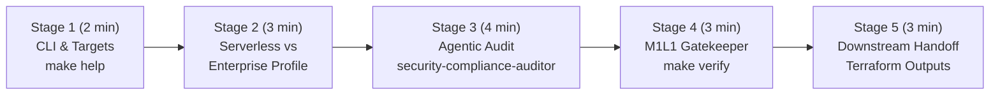

# 🎬 Step-by-Step Demo Playbook — `gcp-ai-foundation-blueprint`

> 🌐 **[Lire ce Guide de Démo en Français 🇫🇷](DEMO_PLAYBOOK.md)** | 🏠 **[Back to Main README](../README-EN.md)** | 🗺️ **[Dendrite v3.3 & Draw.io Diagrams](architecture-gcpdraw.md)**


> 🎨 **Interactive Dendrite v3.3 Architecture (Bento Matrix 16:9)**: You can switch to the **`🗺️ Interactive Dendrite v3.3 Diagram`** tab directly inside the app's **`🏗️ Architecture GCP (X-Ray)`** modal, or open it full-screen in [**Dendrite Studio ↗**](https://dendrite-758054785671.cr.gclb.goog/#code=cmVuZGVyT3JkZXI6IG5vZGVzLWZpcnN0CmRpcmVjdGlvbjogZG93bgoKY29uc3QgR2NwQmx1ZSA9ICIjMWE3M2U4Igpjb25zdCBHY3BHcmVlbiA9ICIjMWU4ZTNlIgpjb25zdCBFbWVyYWxkVGVhbCA9ICIjMGQ5NDg4Igpjb25zdCBEYXJrU2xhdGUgPSAiIzIwMjEyNCIKY29uc3QgU3ViVGV4dCA9ICIjNWY2MzY4Igpjb25zdCBDYXJkQm9yZGVyID0gIiNkYWRjZTAiCmNvbnN0IEJ1c1N0cm9rZSA9ICIjMzM0MTU1Igpjb25zdCBTdXJmYWNlV2hpdGUgPSAiI2ZmZmZmZiIKClN0eWxlIEBHaG9zdCB7CiAgZmlsbDogdHJhbnNwYXJlbnQsIHN0cm9rZVdpZHRoOiAwLCBmb250Q29sb3I6IHRyYW5zcGFyZW50LCBwYWRkaW5nOiAwCn0KU3R5bGUgQEFyY2hpdGVjdHVyZVJvb3QgewogIGZpbGw6ICIjZjhmYWZkIiwgc3Ryb2tlQ29sb3I6ICIjYzJkN2Y1Iiwgc3Ryb2tlV2lkdGg6IDEuNSwgYm9yZGVyUmFkaXVzOiAxNiwKICBwYWRkaW5nOiAyMiwgZ2FwOiAxOCwgZm9udENvbG9yOiAiIzNjNDA0MyIsIGZvbnRTaXplOiAyMiwgbGFiZWxXZWlnaHQ6IGJvbGQsCiAgaWNvbjogIkdvb2dsZUNsb3VkIiwgaWNvblNpemU6IDI4Cn0KU3R5bGUgQFBlcmltZXRlclpvbmUgewogIGZpbGw6ICIjZThmMGZlIiwgc3Ryb2tlQ29sb3I6ICIjOGFiNGY4Iiwgc3Ryb2tlV2lkdGg6IDEuNSwgYm9yZGVyUmFkaXVzOiAxMiwKICBwYWRkaW5nOiAxNiwgZ2FwOiAxNiwgZm9udENvbG9yOiAkRGFya1NsYXRlLCBmb250U2l6ZTogMTUsIGxhYmVsV2VpZ2h0OiBib2xkCn0KU3R5bGUgQEV4ZWN1dGlvblpvbmUgewogIGZpbGw6ICIjZmNlOGU2Iiwgc3Ryb2tlQ29sb3I6ICIjZjZhZWE5Iiwgc3Ryb2tlV2lkdGg6IDEuNSwgYm9yZGVyUmFkaXVzOiAxMiwKICBwYWRkaW5nOiAxNiwgZ2FwOiAxNiwgZm9udENvbG9yOiAkRGFya1NsYXRlLCBmb250U2l6ZTogMTUsIGxhYmVsV2VpZ2h0OiBib2xkCn0KU3R5bGUgQEdvdmVybmFuY2Vab25lIHsKICBmaWxsOiAiI2U2ZjRlYSIsIHN0cm9rZUNvbG9yOiAiIzgxYzk5NSIsIHN0cm9rZVdpZHRoOiAxLjUsIGJvcmRlclJhZGl1czogMTIsCiAgcGFkZGluZzogMTYsIGdhcDogMTQsIGZvbnRDb2xvcjogJERhcmtTbGF0ZSwgZm9udFNpemU6IDE1LCBsYWJlbFdlaWdodDogYm9sZAp9ClN0eWxlIEBSZXNvdXJjZVpvbmUgewogIGZpbGw6ICIjZmVmN2UwIiwgc3Ryb2tlQ29sb3I6ICIjZmRlMjkzIiwgc3Ryb2tlV2lkdGg6IDEuNSwgYm9yZGVyUmFkaXVzOiAxMiwKICBwYWRkaW5nOiAxNiwgZ2FwOiAxNiwgZm9udENvbG9yOiAkRGFya1NsYXRlLCBmb250U2l6ZTogMTUsIGxhYmVsV2VpZ2h0OiBib2xkCn0KU3R5bGUgQFBlYWNoU3ViR3JvdXAgewogIGZpbGw6ICIjZjhkM2M4Iiwgc3Ryb2tlQ29sb3I6IGRhcmtlbigiI2Y4ZDNjOCIsIDEyKSwgc3Ryb2tlV2lkdGg6IDEsIGJvcmRlclJhZGl1czogMTAsCiAgcGFkZGluZzogMTIsIGdhcDogMTAsIGZvbnRDb2xvcjogJERhcmtTbGF0ZSwgZm9udFNpemU6IDEzLCBsYWJlbFdlaWdodDogYm9sZAp9ClN0eWxlIEBHcmVlblN1Ykdyb3VwIHsKICBmaWxsOiAiI2NlZWFkNiIsIHN0cm9rZUNvbG9yOiBkYXJrZW4oIiNjZWVhZDYiLCAxNCksIHN0cm9rZVdpZHRoOiAxLCBib3JkZXJSYWRpdXM6IDEwLAogIHBhZGRpbmc6IDEwLCBnYXA6IDcsIGZvbnRDb2xvcjogJERhcmtTbGF0ZSwgZm9udFNpemU6IDEzLCBsYWJlbFdlaWdodDogYm9sZAp9ClN0eWxlIEBBbWJlclN1Ykdyb3VwIHsKICBmaWxsOiAiI2Y5ZTRhNyIsIHN0cm9rZUNvbG9yOiBkYXJrZW4oIiNmOWU0YTciLCAxNCksIHN0cm9rZVdpZHRoOiAxLCBib3JkZXJSYWRpdXM6IDEwLAogIHBhZGRpbmc6IDEyLCBnYXA6IDEyLCBmb250Q29sb3I6ICREYXJrU2xhdGUsIGZvbnRTaXplOiAxMywgbGFiZWxXZWlnaHQ6IGJvbGQKfQpTdHlsZSBAQWN0b3JDYXJkIHsKICB3aWR0aDogMTgwLCBoZWlnaHQ6IDU2LAogIGZpbGw6ICRTdXJmYWNlV2hpdGUsIHN0cm9rZUNvbG9yOiAkQ2FyZEJvcmRlciwgc3Ryb2tlV2lkdGg6IDEsIGJvcmRlclJhZGl1czogOCwKICBmb250Q29sb3I6ICREYXJrU2xhdGUsIHN1YkZvbnRDb2xvcjogJFN1YlRleHQsCiAgZm9udFNpemU6IDE0LCBzdWJGb250U2l6ZTogMTEsIGxhYmVsV2VpZ2h0OiBib2xkLAogIHRleHRBbGlnbjogImxlZnQiLCB0ZXh0VkFsaWduOiAibWlkZGxlIiwKICBpY29uUG9zaXRpb246ICJsZWZ0IiwgaWNvblNpemU6IDI4LCBwYWRkaW5nOiAxMCwgc2hhZG93OiB0cnVlCn0KU3R5bGUgQFByb2R1Y3RDYXJkIHsKICB3aWR0aDogMTY4LCBoZWlnaHQ6IDU4LAogIGZpbGw6ICRTdXJmYWNlV2hpdGUsIHN0cm9rZUNvbG9yOiAkQ2FyZEJvcmRlciwgc3Ryb2tlV2lkdGg6IDEsIGJvcmRlclJhZGl1czogOCwKICBmb250Q29sb3I6ICREYXJrU2xhdGUsIHN1YkZvbnRDb2xvcjogJFN1YlRleHQsCiAgZm9udFNpemU6IDEzLjUsIHN1YkZvbnRTaXplOiAxMSwgbGFiZWxXZWlnaHQ6IGJvbGQsCiAgdGV4dEFsaWduOiAibGVmdCIsIHRleHRWQWxpZ246ICJtaWRkbGUiLAogIGljb25Qb3NpdGlvbjogImxlZnQiLCBpY29uU2l6ZTogMjgsIHBhZGRpbmc6IDEwLCBzaGFkb3c6IHRydWUKfQpTdHlsZSBAR2F0ZXdheUh1YkNhcmQgewogIGJhc2U6IEBQcm9kdWN0Q2FyZCwKICB3aWR0aDogMTk2LCBoZWlnaHQ6IDY2LCBzdHJva2VDb2xvcjogJEdjcEJsdWUsIHN0cm9rZVdpZHRoOiAyLAogIGZvbnRTaXplOiAxNC41LCBzdWJGb250U2l6ZTogMTEsIGljb25TaXplOiAzMCwgcGFkZGluZzogMTIKfQpTdHlsZSBAUG9saWN5UGlsbCB7CiAgd2lkdGg6IDIyOCwgaGVpZ2h0OiAzMiwKICBmaWxsOiAkU3VyZmFjZVdoaXRlLCBzdHJva2VDb2xvcjogIiM5YWEwYTYiLCBzdHJva2VXaWR0aDogMSwgYm9yZGVyUmFkaXVzOiAxNiwKICBmb250Q29sb3I6ICREYXJrU2xhdGUsIGZvbnRTaXplOiAxMi41LCBsYWJlbFdlaWdodDogYm9sZCwKICB0ZXh0QWxpZ246ICJsZWZ0IiwgdGV4dFZBbGlnbjogIm1pZGRsZSIsCiAgaWNvblBvc2l0aW9uOiAibGVmdCIsIGljb25TaXplOiAxNiwgcGFkZGluZzogMTAsIHNoYWRvdzogdHJ1ZQp9Cgpab25lIEBHQ1BfQUlfRm91bmRhdGlvbl9CbHVlcHJpbnQgewogIHRpdGxlOiAiR0NQIEFJIEZvdW5kYXRpb24gQmx1ZXByaW50IOKAlCBFbnRlcnByaXNlIExhbmRpbmcgWm9uZSAoZXVyb3BlLXdlc3QxKSIKICBzdHlsZTogQEFyY2hpdGVjdHVyZVJvb3QKICBsYXlvdXQ6IG1hdHJpeAogIGFyZWFzOiBbCiAgICAiejEgejEgejEgejEgejEiLAogICAgInozIHozIHoyIHoyIHoyIiwKICAgICJ6NCB6NCB6NCB6NCB6NCIKICBdCiAgc2l6ZXM6IFsiMS4wNWZyIiwgIjEuMDVmciIsICIwLjk2ZnIiLCAiMC45NmZyIiwgIjAuOTZmciJdCiAgZ2FwOiAyMAoKICBab25lIEBab25lMV9QZXJpbWV0ZXIgewogICAgYXJlYTogInoxIgogICAgdGl0bGU6ICIxLiBaZXJvLVRydXN0IEVkZ2UgUGVyaW1ldGVyICYgSW5ncmVzcyAobW9kdWxlcy9zZWN1cml0eS13YWYgJiBuZXR3b3JraW5nKSIKICAgIHN0eWxlOiBAUGVyaW1ldGVyWm9uZQogICAgbGF5b3V0OiByb3csIGdhcDogMTgsIGFsaWduOiBjZW50ZXIsIGp1c3RpZnk6IGNlbnRlcgogICAgW2VudGVycHJpc2VfdXNlcnM6ICJFbnRlcnByaXNlIFVzZXJzIiB8ICJIVFRQUyBDbGllbnRzIl0geyBzdHlsZTogQEFjdG9yQ2FyZCwgaWNvbjogIlVzZXJzIiB9CiAgICBbY2xvdWRfYXJtb3Jfd2FmOiAiQ2xvdWQgQXJtb3IgV0FGIiB8ICJPV0FTUCBUb3AgMTAgJiBERG9TIl0geyBzdHlsZTogQFByb2R1Y3RDYXJkLCB3aWR0aDogMTg2LCBpY29uOiAiQ2xvdWRBcm1vciIgfQogICAgW2dsb2JhbF9sYjogIkdsb2JhbCBIVFRQUyBMQiIgfCAiQW55Y2FzdCAmIE1hbmFnZWQgU1NMIl0geyBzdHlsZTogQFByb2R1Y3RDYXJkLCB3aWR0aDogMTg2LCBpY29uOiAiQ2xvdWRMb2FkQmFsYW5jaW5nIiB9CiAgICBbaWFwX3Byb3h5OiAiSWRlbnRpdHktQXdhcmUgUHJveHkiIHwgIlplcm8tVHJ1c3QgT0lEQyBBdXRoIl0geyBzdHlsZTogQFByb2R1Y3RDYXJkLCB3aWR0aDogMTg4LCBpY29uOiAiR29vZ2xlSWRlbnRpdHkiIH0KICAgIFtpYXBfYmFzdGlvbjogIklBUCBBZG1pbiBCYXN0aW9uIiB8ICJTaGllbGRlZCBWTSAoTm8gUHVibGljIElQKSJdIHsgc3R5bGU6IEBQcm9kdWN0Q2FyZCwgd2lkdGg6IDE5NCwgaWNvbjogIkdjcENvbXB1dGUiIH0KICB9CgogIFpvbmUgQFpvbmUzX0NvbXB1dGUgewogICAgYXJlYTogInozIgogICAgdGl0bGU6ICIyLiBQcml2YXRlIENvbXB1dGUgUnVudGltZXMgKFZQQyBFZ3Jlc3MgJiBXb3JrbG9hZCBJZGVudGl0eSkiCiAgICBzdHlsZTogQEV4ZWN1dGlvblpvbmUKICAgIGxheW91dDogcm93LCBnYXA6IDM2LCBhbGlnbjogY2VudGVyLCBqdXN0aWZ5OiBjZW50ZXIKCiAgICBbdnBjX3JvdXRlcl9uYXQ6ICJQcml2YXRlIEFJIFZQQ1xuJiBDbG91ZCBOQVQiIHwgIkRpcmVjdCBWUEMgRWdyZXNzIC8gUFNBIl0gewogICAgICBzdHlsZTogQEdhdGV3YXlIdWJDYXJkLCBpY29uOiAiVmlydHVhbFByaXZhdGVDbG91ZCIsCiAgICAgIGRlc2NyaXB0aW9uOiAiQ3VzdG9tIFZQQyB3aXRoIFByaXZhdGUgR29vZ2xlIEFjY2VzcywgUHJpdmF0ZSBTZXJ2aWNlIENvbm5lY3QsIGFuZCBDbG91ZCBOQVQiCiAgICB9CgogICAgWm9uZSBAQ29tcHV0ZVByb2ZpbGVzQ29sIHsKICAgICAgc3R5bGU6IEBHaG9zdCwgbGF5b3V0OiBjb2x1bW4sIGdhcDogMTQsIGFsaWduOiBzdHJldGNoCgogICAgICBab25lIEBTZXJ2ZXJsZXNzUHJvZmlsZSB7CiAgICAgICAgdGl0bGU6ICJQcm9maWxlIEE6IFNlcnZlcmxlc3MgQ29tcHV0ZSAoZW5hYmxlX2Nsb3VkcnVuKSIKICAgICAgICBzdHlsZTogQFBlYWNoU3ViR3JvdXAsIHdpZHRoOiAzNDQsIGxheW91dDogcm93LCBnYXA6IDEwLCBhbGlnbjogY2VudGVyLCBqdXN0aWZ5OiBjZW50ZXIKICAgICAgICBbY2xvdWRfcnVuX3YyOiAiQ2xvdWQgUnVuIHYyIiB8ICJEaXJlY3QgVlBDIEVncmVzcyJdIHsgc3R5bGU6IEBQcm9kdWN0Q2FyZCwgd2lkdGg6IDE1NCwgaWNvbjogIkdjcENsb3VkUnVuIiB9CiAgICAgICAgW2FydGlmYWN0X3JlZzogIkFydGlmYWN0IFJlZ2lzdHJ5IiB8ICJDb250YWluZXIgSW1hZ2VzIl0geyBzdHlsZTogQFByb2R1Y3RDYXJkLCB3aWR0aDogMTU0LCBpY29uOiAiQXJ0aWZhY3RSZWdpc3RyeSIgfQogICAgICB9CgogICAgICBab25lIEBLdWJlcm5ldGVzUHJvZmlsZSB7CiAgICAgICAgdGl0bGU6ICJQcm9maWxlIEI6IEVudGVycHJpc2UgSzhzIChlbmFibGVfZ2tlKSIKICAgICAgICBzdHlsZTogQFBlYWNoU3ViR3JvdXAsIGRhc2hlZDogdHJ1ZSwgd2lkdGg6IDM0NCwgbGF5b3V0OiByb3csIGdhcDogMTAsIGFsaWduOiBjZW50ZXIsIGp1c3RpZnk6IGNlbnRlcgogICAgICAgIFtna2VfYXV0b3BpbG90OiAiR0tFIEF1dG9waWxvdCIgfCAiUHJpdmF0ZSBOb2RlcyArIFdJIl0geyBzdHlsZTogQFByb2R1Y3RDYXJkLCB3aWR0aDogMTU0LCBpY29uOiAiR0tFIiB9CiAgICAgICAgW3dvcmtsb2FkX2lkOiAiV29ya2xvYWQgSWRlbnRpdHkiIHwgIktleWxlc3MgT0lEQyBJQU0iXSB7IHN0eWxlOiBAUHJvZHVjdENhcmQsIHdpZHRoOiAxNTQsIGljb246ICJHY3BMb2NrIiB9CiAgICAgIH0KICAgIH0KICB9CgogIFpvbmUgQFpvbmUyX0dvdmVybmFuY2UgewogICAgYXJlYTogInoyIgogICAgdGl0bGU6ICIzLiBTZWN1cml0eSwgRmluT3BzLCBPYnNlcnZhYmlsaXR5ICYgQWdlbnRpYyBHYXRla2VlcGVyIgogICAgc3R5bGU6IEBHb3Zlcm5hbmNlWm9uZQogICAgbGF5b3V0OiByb3csIGdhcDogMjQsIGFsaWduOiBjZW50ZXIsIGp1c3RpZnk6IGNlbnRlcgoKICAgIFpvbmUgQFNyZUFuZEZpbm9wc0NvbCB7CiAgICAgIHN0eWxlOiBAR2hvc3QsIGxheW91dDogY29sdW1uLCBnYXA6IDEyLCBhbGlnbjogY2VudGVyCiAgICAgIFtjbG91ZF9tb25pdG9yaW5nOiAiQ2xvdWQgTW9uaXRvcmluZyIgfCAiU0xPcyAmIExhdGVuY3kgQWxlcnRzIl0geyBzdHlsZTogQFByb2R1Y3RDYXJkLCB3aWR0aDogMTgyLCBpY29uOiAiQ2xvdWRNb25pdG9yaW5nIiB9CiAgICAgIFtjbG91ZF9sb2dnaW5nOiAiQ2xvdWQgTG9nZ2luZyIgfCAiQXVkaXQgU2luayB0byBCaWdRdWVyeSJdIHsgc3R5bGU6IEBQcm9kdWN0Q2FyZCwgd2lkdGg6IDE4MiwgaWNvbjogIkNsb3VkTG9nZ2luZyIgfQogICAgICBbZmlub3BzX2J1ZGdldDogIkNsb3VkIEJpbGxpbmcgRmluT3BzIiB8ICJBbGVydHMgNTAlIC8gOTAlIC8gMTAwJSJdIHsgc3R5bGU6IEBQcm9kdWN0Q2FyZCwgd2lkdGg6IDE4MiwgaWNvbjogIkNsb3VkQmlsbGluZyIgfQogICAgfQoKICAgIFpvbmUgQFNvdmVyZWlnbkd1YXJkcmFpbHMgewogICAgICB0aXRsZTogIlNvdmVyZWlnbiBDb250cm9scyAmIE0xTDEgR2F0ZWtlZXBlciIKICAgICAgc3R5bGU6IEBHcmVlblN1Ykdyb3VwLCBsYXlvdXQ6IGNvbHVtbiwgZ2FwOiA4LCBhbGlnbjogY2VudGVyCiAgICAgIFtndWFyZF9pYW06ICJSZXNvdXJjZS1TY29wZWQgSUFNIE9ubHkiXSB7IHN0eWxlOiBAUG9saWN5UGlsbCwgaWNvbjogIlNoaWVsZENoZWNrIiB9CiAgICAgIFtndWFyZF9jbWVrOiAiQ2xvdWQgS01TIENNRUsgKDkwZCBSb3RhdGlvbikiXSB7IHN0eWxlOiBAUG9saWN5UGlsbCwgaWNvbjogIktNUyIgfQogICAgICBbZ3VhcmRfd29ybTogIldPUk0gQmFja3VwIExvY2sgKGVuZm9yY2U9dHJ1ZSkiXSB7IHN0eWxlOiBAUG9saWN5UGlsbCwgaWNvbjogIkxvY2siIH0KICAgICAgW2d1YXJkX20xbDE6ICJNMUwxIHZlcmlmeS5zaCAmIFN1YmFnZW50cyJdIHsgc3R5bGU6IEBQb2xpY3lQaWxsLCBpY29uOiAiQm90IiB9CiAgICB9CiAgfQoKICBab25lIEBab25lNF9EYXRhQUkgewogICAgYXJlYTogIno0IgogICAgdGl0bGU6ICI0LiBEYXRhIExha2Vob3VzZSwgVmVydGV4IEFJICYgSW1tdXRhYmxlIFJlc2lsaWVuY2UgKG1vZHVsZXMvZGF0YS1haS1mb3VuZGF0aW9uICYgYmFja3VwLWRyKSIKICAgIHN0eWxlOiBAUmVzb3VyY2Vab25lCiAgICBsYXlvdXQ6IG1hdHJpeCwgY29sczogMywgc2l6ZXM6IFsiMS4wNWZyIiwgIjEuMTVmciIsICIwLjk1ZnIiXSwgZ2FwOiAxOCwgYWxpZ246IGNlbnRlcgoKICAgIFpvbmUgQFN0b3JhZ2VBbmRMYWtlaG91c2UgewogICAgICB0aXRsZTogIkVuY3J5cHRlZCBEYXRhICYgQ29ycHVzIFN0b3JhZ2UiCiAgICAgIHN0eWxlOiBAQW1iZXJTdWJHcm91cCwgbGF5b3V0OiByb3csIGdhcDogMTIsIGFsaWduOiBjZW50ZXIsIGp1c3RpZnk6IGNlbnRlcgogICAgICBbZ2NzX3JhZ19idWNrZXQ6ICJDbG91ZCBTdG9yYWdlIiB8ICJVQkxBICsgVmVyc2lvbmluZyJdIHsgc3R5bGU6IEBQcm9kdWN0Q2FyZCwgd2lkdGg6IDE2OCwgaWNvbjogIkdjcFN0b3JhZ2VCdWNrZXQiIH0KICAgICAgW2JpZ3F1ZXJ5X2xha2U6ICJCaWdRdWVyeSBMYWtlaG91c2UiIHwgIlBhcnRpdGlvbmVkIEFuYWx5dGljcyJdIHsgc3R5bGU6IEBQcm9kdWN0Q2FyZCwgd2lkdGg6IDE3NCwgaWNvbjogIkJpZ1F1ZXJ5IiB9CiAgICB9CgogICAgWm9uZSBAVmVydGV4QWlQbGF0Zm9ybSB7CiAgICAgIHRpdGxlOiAiTWFuYWdlZCBHZW5BSSAmIEVtYmVkZGluZ3MgKGV1cm9wZS13ZXN0MSkiCiAgICAgIHN0eWxlOiBAQW1iZXJTdWJHcm91cCwgbGF5b3V0OiByb3csIGdhcDogMTIsIGFsaWduOiBjZW50ZXIsIGp1c3RpZnk6IGNlbnRlcgogICAgICBbdmVydGV4X2dlbWluaTogIlZlcnRleCBBSSBHZW1pbmkiIHwgIkdlbWluaSAzLjUgRmxhc2ggLyBQcm8iXSB7IHN0eWxlOiBAUHJvZHVjdENhcmQsIHdpZHRoOiAxNzYsIGljb246ICJWZXJ0ZXhBSSIgfQogICAgICBbdmVydGV4X2VtYmVkOiAiVmVydGV4IEVtYmVkZGluZ3MiIHwgInRleHQtZW1iZWRkaW5nLTAwNCAoNzY4ZCkiXSB7IHN0eWxlOiBAUHJvZHVjdENhcmQsIHdpZHRoOiAxODQsIGljb246ICJBSVBsYXRmb3JtIiB9CiAgICB9CgogICAgWm9uZSBAUmVzaWxpZW5jZUFuZEttcyB7CiAgICAgIHRpdGxlOiAiQ3J5cHRvICYgRGlzYXN0ZXIgUmVjb3ZlcnkiCiAgICAgIHN0eWxlOiBAQW1iZXJTdWJHcm91cCwgbGF5b3V0OiByb3csIGdhcDogMTIsIGFsaWduOiBjZW50ZXIsIGp1c3RpZnk6IGNlbnRlcgogICAgICBbY2xvdWRfa21zOiAiQ2xvdWQgS01TIENNRUsiIHwgIjkwLURheSBLZXkgUm90YXRpb24iXSB7IHN0eWxlOiBAUHJvZHVjdENhcmQsIHdpZHRoOiAxNjgsIGljb246ICJLTVMiIH0KICAgICAgW2JhY2t1cF9kcl93b3JtOiAiQmFja3VwICYgRFIgVmF1bHQiIHwgIkltbXV0YWJsZSBXT1JNIExvY2siXSB7IHN0eWxlOiBAUHJvZHVjdENhcmQsIHdpZHRoOiAxNzQsIGljb246ICJTZWN1cml0eUNvbW1hbmRDZW50ZXIiIH0KICAgIH0KICB9Cn0KCltlbnRlcnByaXNlX3VzZXJzXSAtLT4gW2Nsb3VkX2FybW9yX3dhZl0geyBjb2xvcjogJEdjcEJsdWUsIHN0cm9rZVdpZHRoOiAyLCBzb3VyY2VBbmNob3I6ICJyaWdodCIsIHRhcmdldEFuY2hvcjogImxlZnQiLCBjdXJ2ZTogInN0ZXAiLCBzZXF1ZW5jZUJhZGdlOiAiMSIsIGJhZGdlRmlsbDogJEdjcEJsdWUsIGJhZGdlRm9udENvbG9yOiAkU3VyZmFjZVdoaXRlIH0KW2Nsb3VkX2FybW9yX3dhZl0gLS0+IFtnbG9iYWxfbGJdIHsgY29sb3I6ICRHY3BCbHVlLCBzdHJva2VXaWR0aDogMiwgc291cmNlQW5jaG9yOiAicmlnaHQiLCB0YXJnZXRBbmNob3I6ICJsZWZ0IiwgY3VydmU6ICJzdGVwIiB9CltnbG9iYWxfbGJdIC0tPiBbaWFwX3Byb3h5XSB7IGNvbG9yOiAkR2NwQmx1ZSwgc3Ryb2tlV2lkdGg6IDIsIHNvdXJjZUFuY2hvcjogInJpZ2h0IiwgdGFyZ2V0QW5jaG9yOiAibGVmdCIsIGN1cnZlOiAic3RlcCIgfQpbWm9uZTFfUGVyaW1ldGVyXSAtLT4gW3ZwY19yb3V0ZXJfbmF0XSB7IGNvbG9yOiAkR2NwQmx1ZSwgc3Ryb2tlV2lkdGg6IDIsIHNvdXJjZUFuY2hvcjogImJvdHRvbSIsIHRhcmdldEFuY2hvcjogInRvcCIsIGN1cnZlOiAic3RlcCIsIGxhYmVsOiAiWmVyby1UcnVzdCIsIHNlcXVlbmNlQmFkZ2U6ICIyIiwgYmFkZ2VGaWxsOiAkR2NwQmx1ZSwgYmFkZ2VGb250Q29sb3I6ICRTdXJmYWNlV2hpdGUgfQpbdnBjX3JvdXRlcl9uYXRdIC0tPiBbU2VydmVybGVzc1Byb2ZpbGVdIHsgY29sb3I6ICRHY3BCbHVlLCBzdHJva2VXaWR0aDogMiwgc291cmNlQW5jaG9yOiAicmlnaHQiLCB0YXJnZXRBbmNob3I6ICJsZWZ0IiwgY3VydmU6ICJzdGVwIiB9Clt2cGNfcm91dGVyX25hdF0gLS0+IFtLdWJlcm5ldGVzUHJvZmlsZV0geyBjb2xvcjogJEdjcEJsdWUsIHN0cm9rZVdpZHRoOiAyLCBzb3VyY2VBbmNob3I6ICJyaWdodCIsIHRhcmdldEFuY2hvcjogImxlZnQiLCBjdXJ2ZTogInN0ZXAiIH0KW0NvbXB1dGVQcm9maWxlc0NvbF0gLS0+IFtTcmVBbmRGaW5vcHNDb2xdIHsgY29sb3I6ICRCdXNTdHJva2UsIHN0cm9rZVdpZHRoOiAxLjgsIGRhc2hlZDogdHJ1ZSwgc291cmNlQW5jaG9yOiAicmlnaHQiLCB0YXJnZXRBbmNob3I6ICJsZWZ0IiwgY3VydmU6ICJzdGVwIiwgbGFiZWw6ICJUZWxlbWV0cnkiIH0KW1NyZUFuZEZpbm9wc0NvbF0gLS0+IFtTb3ZlcmVpZ25HdWFyZHJhaWxzXSB7IGNvbG9yOiAkR2NwR3JlZW4sIHN0cm9rZVdpZHRoOiAxLjgsIHNvdXJjZUFuY2hvcjogInJpZ2h0IiwgdGFyZ2V0QW5jaG9yOiAibGVmdCIsIGN1cnZlOiAic3RlcCIgfQpbWm9uZTNfQ29tcHV0ZV0gLS0+IFtTdG9yYWdlQW5kTGFrZWhvdXNlXSB7IGNvbG9yOiAkRW1lcmFsZFRlYWwsIHN0cm9rZVdpZHRoOiAyLCBzb3VyY2VBbmNob3I6ICJib3R0b20iLCB0YXJnZXRBbmNob3I6ICJ0b3AiLCBjdXJ2ZTogInN0ZXAiLCBsYWJlbDogIlN0b3JhZ2UgQVBJIiwgc2VxdWVuY2VCYWRnZTogIjMiLCBiYWRnZUZpbGw6ICRFbWVyYWxkVGVhbCwgYmFkZ2VGb250Q29sb3I6ICRTdXJmYWNlV2hpdGUgfQpbWm9uZTNfQ29tcHV0ZV0gLS0+IFtWZXJ0ZXhBaVBsYXRmb3JtXSB7IGNvbG9yOiAkR2NwQmx1ZSwgc3Ryb2tlV2lkdGg6IDIsIHNvdXJjZUFuY2hvcjogImJvdHRvbSIsIHRhcmdldEFuY2hvcjogInRvcCIsIGN1cnZlOiAic3RlcCIsIGxhYmVsOiAiVmVydGV4IEFEQyIsIHNlcXVlbmNlQmFkZ2U6ICI0IiwgYmFkZ2VGaWxsOiAkR2NwQmx1ZSwgYmFkZ2VGb250Q29sb3I6ICRTdXJmYWNlV2hpdGUgfQpbWm9uZTJfR292ZXJuYW5jZV0gLS0+IFtSZXNpbGllbmNlQW5kS21zXSB7IGNvbG9yOiAkR2NwR3JlZW4sIHN0cm9rZVdpZHRoOiAxLjgsIGRhc2hlZDogdHJ1ZSwgc291cmNlQW5jaG9yOiAiYm90dG9tIiwgdGFyZ2V0QW5jaG9yOiAidG9wIiwgY3VydmU6ICJzdGVwIiwgbGFiZWw6ICJDTUVLICYgV09STSIgfQo=) ([`.dendrite`](diagrams/foundation_blueprint_v3.dendrite) / [`.drawio`](diagrams/foundation_blueprint_v3.drawio)).
This document is the **step-by-step live demonstration playbook** designed for Cloud Architects, Customer Engineers, and Tech Leads during customer briefings or **Google Cloud Elevate / EMEA SPARK** sessions.

Every stage specifies:
1. **🖱️ Action to Perform** (exact CLI command or IDE / GCP Console action)
2. **🤖 Which Agent / GCP Service Acts Under the Hood**
3. **👀 What to Observe on Screen & 💡 Key Customer Value Pitch (GCP Value)**

---

## ⏱️ Demo Flow Overview (Duration: 10–15 min)



---

## 🔹 Stage 1: Instant Developer Experience (`make help`)

### 1. 🖱️ Action to Perform
Open a terminal at the root of `gcp-ai-foundation-blueprint` and run:
```bash
make help
```

### 2. 🤖 What Happens Under the Hood
The self-documented `Makefile` surfaces standardized targets for formatting, validation, deployment profile simulation (`demo-light`, `demo-enterprise`), and the M1L1 Gatekeeper (`make verify`).

### 3. 👀 What to Observe & 💡 Key Customer Pitch
- **On screen**: Clean, colorized list of all operational commands in under a second.
- **💡 Key Customer Pitch**: *"An enterprise AI foundation on Google Cloud should never be a black box. With a single command, any platform engineer or security auditor can validate all 9 Terraform modules."*

---

## 🔹 Stage 2: Plug-and-Play Modularity — From Serverless PoC to Mission-Critical Production

### 1. 🖱️ Action to Perform
Demonstrate how root **Feature Toggles** (`variables.tf`) adapt the infrastructure to customer budget and maturity without rewriting a single line of HCL:

- **Option A — Simulate the *Lightweight / Serverless Demo* Profile (~$30/month)**:
  ```bash
  make demo-light
  ```
- **Option B — Simulate the *Full Enterprise Production* Profile (Zero-Trust + GKE Autopilot + CMEK + WORM)**:
  ```bash
  make demo-enterprise
  ```

### 2. 🤖 Which GCP Services Act Under the Hood
| Profile | Activated GCP Modules | Deactivated Modules (`count = 0`) |
| :--- | :--- | :--- |
| **Lightweight (`demo-light`)** | VPC + Private Service Connect, Cloud Run v2 (Direct VPC Egress), GCS UBLA, BigQuery, Vertex AI, FinOps Budgets | GKE Autopilot (`enable_gke=false`), Cloud Armor WAF (`enable_waf=false`), IAP Bastion (`enable_bastion=false`), Backup DR (`enable_backup_dr=false`) |
| **Enterprise (`demo-enterprise`)** | **All 9 modules**, including private GKE Autopilot, Cloud Armor OWASP Top 10 WAF, Cloud KMS CMEK (90-day rotation), and WORM Backup Vault | None |

### 3. 👀 What to Observe & 💡 Key Customer Pitch
- **On screen**: `terraform plan` dynamically computes the resource graph without broken dependencies.
- **💡 Key Customer Pitch**: *"Start an AI PoC in 5 minutes with Cloud Run and Vertex AI for ~$30/month. When moving to regulated banking or public-sector production, enable GKE Autopilot, Cloud KMS CMEK, and Cloud Armor WAF by flipping boolean flags."*

---

## 🔹 Stage 3: Live Subagent Invocation (Security & Architecture Audit)

### 1. 🖱️ Action to Perform
In **Jetski / Antigravity / Gemini CLI**, run one of the following prompts live:

- **Prompt 1 — Zero-Trust & Sovereign Compliance Audit (`security-compliance-auditor`)**:
  > `"Invoke security-compliance-auditor to audit modules/data-ai-foundation/ and modules/backup-dr/ for resource-scoped IAM, CMEK rotation, and WORM retention locks."`

- **Prompt 2 — Network & GKE Architecture Review (`cloud-foundation-architect`)**:
  > `"Invoke cloud-foundation-architect to verify that Cloud Run v2 uses Direct VPC Egress and that GKE Autopilot enforces Workload Identity in modules/."`

### 2. 🤖 Which Agent Acts Under the Hood
- The main agent delegates to `.agents/agents/security-compliance-auditor.md` (or `cloud-foundation-architect.md`) in **isolated Read-Only mode**.
- It inspects:
  - `modules/data-ai-foundation/main.tf`: verifies that IAM bindings are scoped to individual buckets/datasets (`google_storage_bucket_iam_member`, `google_bigquery_dataset_iam_member`) rather than project-wide.
  - `modules/backup-dr/main.tf`: verifies immutable **WORM** locks (`enforce_retention = true`) and minimum retention windows (`86400s`).

### 3. 👀 What to Observe & 💡 Key Customer Pitch
- **On screen**: Structured audit report with clickable file/line links.
- **💡 Key Customer Pitch**: *"Our specialized AI engineering subagents enforce Google Cloud Well-Architected and sovereign security rules on every change before deployment."*

---

## 🔹 Stage 4: Running the Automated M1L1 Gatekeeper (`make verify`)

### 1. 🖱️ Action to Perform
Run the `terraform-foundation-validator` verification script:
```bash
make verify
```

### 2. 🤖 Which Skill Acts Under the Hood
The **[`terraform-foundation-validator`](../.agents/skills/terraform-foundation-validator/SKILL.md)** skill executes 3 deterministic checks:
1. `terraform fmt -check -recursive`
2. `terraform validate` across root and all 9 child modules
3. Static security assertions (zero public IAM exposure, mandatory WORM retention locks)

### 3. 👀 What to Observe & 💡 Key Customer Pitch
- **On screen**: All 3 stages pass (`✅ All checks passed`).
- **💡 Key Customer Pitch**: *"Following the Google Cloud Elevate M1L1 pattern, AI assists with authoring, while deterministic scripts ('Code as Gatekeeper') mathematically certify compliance before any commit."*

---

## 🔹 Stage 5: Handoff to Downstream AI Applications (`outputs.tf`)

### 1. 🖱️ Action to Perform
Inspect the Terraform outputs consumed by the two live demo applications:
```bash
terraform output
```

### 2. 🤖 What Happens Under the Hood
[`outputs.tf`](../outputs.tf) exports:
- `cloud_run_service_url` & `rag_docs_bucket_name` ➔ consumed by **[`app-rag-comparison`](https://rag.hoffmannw.demo.altostrat.com)**
- `gke_cluster_name`, `gke_get_credentials_command`, `bigquery_dataset_id` & `workload_identity_pool` ➔ consumed by **[`civiclens`](https://civiclens.hoffmannw.demo.altostrat.com)**
