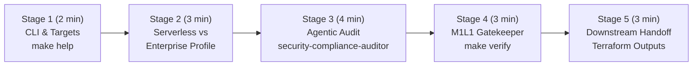

# 🎬 Step-by-Step Demo Playbook — `gcp-ai-foundation-blueprint`

> 🌐 **[Lire ce Guide de Démo en Français 🇫🇷](DEMO_PLAYBOOK.md)** | 🏠 **[Back to Main README](../README-EN.md)**

This document is the **step-by-step live demonstration playbook** designed for Cloud Architects, Customer Engineers, and Tech Leads during customer briefings or **Google Cloud Elevate / EMEA SPARK** sessions.

Every stage specifies:
1. **🖱️ Action to Perform** (exact CLI command or IDE / GCP Console action)
2. **🤖 Which Agent / GCP Service Acts Under the Hood**
3. **👀 What to Observe on Screen & 💡 Key Customer Value Pitch (GCP Value)**

---

## ⏱️ Demo Flow Overview (Duration: 10–15 min)



---

## 🔹 Stage 1: Instant Developer Experience (`make help`)

### 1. 🖱️ Action to Perform
Open a terminal at the root of `gcp-ai-foundation-blueprint` and run:
```bash
make help
```

### 2. 🤖 What Happens Under the Hood
The self-documented `Makefile` surfaces standardized targets for formatting, validation, deployment profile simulation (`demo-light`, `demo-enterprise`), and the M1L1 Gatekeeper (`make verify`).

### 3. 👀 What to Observe & 💡 Key Customer Pitch
- **On screen**: Clean, colorized list of all operational commands in under a second.
- **💡 Key Customer Pitch**: *"An enterprise AI foundation on Google Cloud should never be a black box. With a single command, any platform engineer or security auditor can validate all 9 Terraform modules."*

---

## 🔹 Stage 2: Plug-and-Play Modularity — From Serverless PoC to Mission-Critical Production

### 1. 🖱️ Action to Perform
Demonstrate how root **Feature Toggles** (`variables.tf`) adapt the infrastructure to customer budget and maturity without rewriting a single line of HCL:

- **Option A — Simulate the *Lightweight / Serverless Demo* Profile (~$30/month)**:
  ```bash
  make demo-light
  ```
- **Option B — Simulate the *Full Enterprise Production* Profile (Zero-Trust + GKE Autopilot + CMEK + WORM)**:
  ```bash
  make demo-enterprise
  ```

### 2. 🤖 Which GCP Services Act Under the Hood
| Profile | Activated GCP Modules | Deactivated Modules (`count = 0`) |
| :--- | :--- | :--- |
| **Lightweight (`demo-light`)** | VPC + Private Service Connect, Cloud Run v2 (Direct VPC Egress), GCS UBLA, BigQuery, Vertex AI, FinOps Budgets | GKE Autopilot (`enable_gke=false`), Cloud Armor WAF (`enable_waf=false`), IAP Bastion (`enable_bastion=false`), Backup DR (`enable_backup_dr=false`) |
| **Enterprise (`demo-enterprise`)** | **All 9 modules**, including private GKE Autopilot, Cloud Armor OWASP Top 10 WAF, Cloud KMS CMEK (90-day rotation), and WORM Backup Vault | None |

### 3. 👀 What to Observe & 💡 Key Customer Pitch
- **On screen**: `terraform plan` dynamically computes the resource graph without broken dependencies.
- **💡 Key Customer Pitch**: *"Start an AI PoC in 5 minutes with Cloud Run and Vertex AI for ~$30/month. When moving to regulated banking or public-sector production, enable GKE Autopilot, Cloud KMS CMEK, and Cloud Armor WAF by flipping boolean flags."*

---

## 🔹 Stage 3: Live Subagent Invocation (Security & Architecture Audit)

### 1. 🖱️ Action to Perform
In **Jetski / Antigravity / Gemini CLI**, run one of the following prompts live:

- **Prompt 1 — Zero-Trust & Sovereign Compliance Audit (`security-compliance-auditor`)**:
  > `"Invoke security-compliance-auditor to audit modules/data-ai-foundation/ and modules/backup-dr/ for resource-scoped IAM, CMEK rotation, and WORM retention locks."`

- **Prompt 2 — Network & GKE Architecture Review (`cloud-foundation-architect`)**:
  > `"Invoke cloud-foundation-architect to verify that Cloud Run v2 uses Direct VPC Egress and that GKE Autopilot enforces Workload Identity in modules/."`

### 2. 🤖 Which Agent Acts Under the Hood
- The main agent delegates to `.agents/agents/security-compliance-auditor.md` (or `cloud-foundation-architect.md`) in **isolated Read-Only mode**.
- It inspects:
  - `modules/data-ai-foundation/main.tf`: verifies that IAM bindings are scoped to individual buckets/datasets (`google_storage_bucket_iam_member`, `google_bigquery_dataset_iam_member`) rather than project-wide.
  - `modules/backup-dr/main.tf`: verifies immutable **WORM** locks (`enforce_retention = true`) and minimum retention windows (`86400s`).

### 3. 👀 What to Observe & 💡 Key Customer Pitch
- **On screen**: Structured audit report with clickable file/line links.
- **💡 Key Customer Pitch**: *"Our specialized AI engineering subagents enforce Google Cloud Well-Architected and sovereign security rules on every change before deployment."*

---

## 🔹 Stage 4: Running the Automated M1L1 Gatekeeper (`make verify`)

### 1. 🖱️ Action to Perform
Run the `terraform-foundation-validator` verification script:
```bash
make verify
```

### 2. 🤖 Which Skill Acts Under the Hood
The **[`terraform-foundation-validator`](../.agents/skills/terraform-foundation-validator/SKILL.md)** skill executes 3 deterministic checks:
1. `terraform fmt -check -recursive`
2. `terraform validate` across root and all 9 child modules
3. Static security assertions (zero public IAM exposure, mandatory WORM retention locks)

### 3. 👀 What to Observe & 💡 Key Customer Pitch
- **On screen**: All 3 stages pass (`✅ All checks passed`).
- **💡 Key Customer Pitch**: *"Following the Google Cloud Elevate M1L1 pattern, AI assists with authoring, while deterministic scripts ('Code as Gatekeeper') mathematically certify compliance before any commit."*

---

## 🔹 Stage 5: Handoff to Downstream AI Applications (`outputs.tf`)

### 1. 🖱️ Action to Perform
Inspect the Terraform outputs consumed by the two live demo applications:
```bash
terraform output
```

### 2. 🤖 What Happens Under the Hood
[`outputs.tf`](../outputs.tf) exports:
- `cloud_run_service_url` & `rag_docs_bucket_name` ➔ consumed by **[`app-rag-comparison`](https://rag.hoffmannw.demo.altostrat.com)**
- `gke_cluster_name`, `gke_get_credentials_command`, `bigquery_dataset_id` & `workload_identity_pool` ➔ consumed by **[`civiclens`](https://civiclens.hoffmannw.demo.altostrat.com)**
