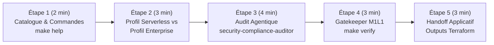

# 🎬 Guide de Démonstration Pas-à-Pas — `gcp-ai-foundation-blueprint`

> 🌐 **[Read this Demo Playbook in English 🇬🇧](DEMO_PLAYBOOK-EN.md)** | 🏠 **[Retour au README Principal](../README.md)**

Ce document est le **conducteur de démonstration pas-à-pas** destiné aux Architectes Cloud, Customer Engineers et Tech Leads lors d'une présentation client ou d'une session **Google Cloud Elevate / EMEA SPARK**.

Chaque étape précise :
1. **🖱️ Action à réaliser** (commande exacte ou action dans l'IDE / Console GCP)
2. **🤖 Quel Agent / Service GCP entre en action** (sous le capot)
3. **👀 Ce qu'il faut observer & 💡 Message clé client (Valeur GCP)**

---

## ⏱️ Vue d'Ensemble du Scénario (Durée : 10 à 15 min)



---

## 🔹 Étape 1 : Découverte Instantanée & Expérience Développeur (`make help`)

### 1. 🖱️ Action à réaliser
Ouvrir un terminal à la racine du dépôt `gcp-ai-foundation-blueprint` et exécuter :
```bash
make help
```

### 2. 🤖 Ce qui se passe sous le capot
Le `Makefile` auto-documenté expose les commandes standardisées d'inspection, de simulation (`demo-light`, `demo-enterprise`) et le Gatekeeper M1L1 (`make verify`).

### 3. 👀 Ce qu'il faut observer & 💡 Message clé client
- **À l'écran** : La liste claire des commandes apparaît en moins d'une seconde.
- **💡 Message clé client** : *« Une fondation IA d'entreprise sur Google Cloud ne doit pas être une boîte noire. En une seule commande, n'importe quel ingénieur plateforme ou auditeur sécurité peut valider l'intégralité des 9 modules Terraform. »*

---

## 🔹 Étape 2 : Modularité « Plug-and-Play » — Du PoC Serverless à la Production Critique

### 1. 🖱️ Action à réaliser
Montrer comment les **Feature Toggles** (`variables.tf`) permettent d'adapter l'infrastructure au budget et à la maturité du client sans réécrire une seule ligne de Terraform :

- **Option A — Simuler le Profil *Lightweight / Serverless Demo* (~30 $/mois)** :
  ```bash
  make demo-light
  ```
- **Option B — Simuler le Profil *Full Enterprise Production* (Zero-Trust + GKE Autopilot + CMEK + WORM)** :
  ```bash
  make demo-enterprise
  ```

### 2. 🤖 Quels Services GCP entrent en action
| Profil | Briques GCP Activées | Briques Désactivées (`count = 0`) |
| :--- | :--- | :--- |
| **Lightweight (`demo-light`)** | VPC + Private Service Connect, Cloud Run v2 (Direct VPC Egress), GCS UBLA, BigQuery, Vertex AI, FinOps Budgets | GKE Autopilot (`enable_gke=false`), Cloud Armor WAF (`enable_waf=false`), Bastion IAP (`enable_bastion=false`), Backup DR (`enable_backup_dr=false`) |
| **Enterprise (`demo-enterprise`)** | **Toutes les 9 briques**, incluant GKE Autopilot privé, Cloud Armor WAF OWASP Top 10, chiffrement Cloud KMS (CMEK 90j) et coffre-fort Backup DR WORM | Aucune |

### 3. 👀 Ce qu'il faut observer & 💡 Message clé client
- **À l'écran** : Le `terraform plan` ajuste dynamiquement le graphe de ressources sans erreur de dépendance.
- **💡 Message clé client** : *« Vous démarrez un PoC IA en 5 minutes avec Cloud Run et Vertex AI pour quelques dizaines d'euros par mois, et le jour où vous passez en production bancaire ou secteur public, vous activez GKE Autopilot, Cloud KMS CMEK et Cloud Armor WAF par un simple booléen. »*

---

## 🔹 Étape 3 : Invocation des Sous-Agents Spécialisés (Audit Sécurité & Architecture)

### 1. 🖱️ Action à réaliser
Dans **Jetski / Antigravity / Gemini CLI**, copier-coller l'un des prompts suivants devant le client :

- **Prompt 1 — Audit Zero-Trust & Conformité Souveraine (`security-compliance-auditor`)** :
  > `"Invoke security-compliance-auditor to audit modules/data-ai-foundation/ and modules/backup-dr/ for resource-scoped IAM, CMEK rotation, and WORM retention locks."`

- **Prompt 2 — Revue d'Architecture Réseau & GKE (`cloud-foundation-architect`)** :
  > `"Invoke cloud-foundation-architect to verify that Cloud Run v2 uses Direct VPC Egress and that GKE Autopilot enforces Workload Identity in modules/."`

### 2. 🤖 Quel Agent entre en action sous le capot
- L'agent principal lit `.agents/agents/security-compliance-auditor.md` (ou `cloud-foundation-architect.md`) en **mode isolé Read-Only**.
- Il inspecte :
  - `modules/data-ai-foundation/main.tf` : vérifie que les permissions IAM sont attachées au niveau ressource (`google_storage_bucket_iam_member`, `google_bigquery_dataset_iam_member`) et jamais au niveau projet global.
  - `modules/backup-dr/main.tf` : vérifie le verrouillage immuable **WORM** (`enforce_retention = true`) et la fenêtre de rétention minimale (`backup_minimum_enforced_retention_duration = "86400s"`).

### 3. 👀 Ce qu'il faut observer & 💡 Message clé client
- **À l'écran** : Le sous-agent produit un rapport d'audit structuré avec des liens cliquables vers les lignes exactes du code Terraform.
- **💡 Message clé client** : *« Nos agents IA d'ingénierie connaissent les exigences ANSSI / SecNumCloud et le Google Cloud Well-Architected Framework. Ils auditent chaque Pull Request avant même le déploiement. »*

---

## 🔹 Étape 4 : Exécution du Gatekeeper Automatisé M1L1 (`make verify`)

### 1. 🖱️ Action à réaliser
Lancer le script de vérification du skill `terraform-foundation-validator` :
```bash
make verify
```
*(ou directement `./.agents/skills/terraform-foundation-validator/scripts/verify.sh`)*

### 2. 🤖 Quel Skill entre en action sous le capot
Le skill **[`terraform-foundation-validator`](../.agents/skills/terraform-foundation-validator/SKILL.md)** exécute 3 contrôles déterministes :
1. `terraform fmt -check -recursive` (conformité du style HCL).
2. `terraform validate` sur la racine et les 9 sous-modules.
3. Un scan de sécurité statique vérifiant l'absence de `allUsers` / `allAuthenticatedUsers` et la présence des verrous WORM.

### 3. 👀 Ce qu'il faut observer & 💡 Message clé client
- **À l'écran** : Les 3 étapes passent au vert (`✅ All checks passed`).
- **💡 Message clé client** : *« Selon le framework Google Cloud Elevate M1L1, l'IA génère ou modifie l'infrastructure, mais c'est un script déterministe ("Code as Gatekeeper") qui certifie mathématiquement la conformité avant tout `git commit`. »*

---

## 🔹 Étape 5 : Passerelle vers les Applications IA (`outputs.tf`)

### 1. 🖱️ Action à réaliser
Afficher les sorties Terraform qui alimentent directement les deux démonstrateurs applicatifs (`app-rag-comparison` et `civiclens`) :
```bash
terraform output
```

### 2. 🤖 Ce qui se passe sous le capot
Le fichier [`outputs.tf`](../outputs.tf) expose :
- `cloud_run_service_url` & `rag_docs_bucket_name` ➔ utilisés par **[`app-rag-comparison`](https://rag.hoffmannw.demo.altostrat.com)**
- `gke_cluster_name`, `gke_get_credentials_command`, `bigquery_dataset_id` & `workload_identity_pool` ➔ utilisés par **[`civiclens`](https://civiclens.hoffmannw.demo.altostrat.com)**

### 3. 👀 Ce qu'il faut observer & 💡 Message clé client
- **💡 Transition vers la suite de la démo** : *« Maintenant que notre fondation réseau, sécurité et Data/IA est posée, voyons comment nos deux applications métiers — le comparateur RAG Agentique sur Cloud Run et l'observatoire des finances publiques CivicLens sur GKE Autopilot — l'exploitent en temps réel. »*
